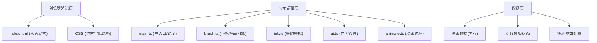

## 1. 架构设计



## 2. 技术选型说明

- **前端框架**：原生 HTML5 + CSS3 + TypeScript（无框架依赖，追求极致性能）
- **构建工具**：Vite@5（快速开发服务器、ES Module原生支持）
- **渲染引擎**：HTML5 Canvas 2D API（高性能像素级墨迹渲染）
- **后端**：无（纯前端应用，数据存储在内存中）
- **数据库**：无

## 3. 文件结构

```
e:\solo\VersionFast\tasks\auto282\
├── index.html              # 入口页面
├── package.json            # 项目配置
├── vite.config.js          # Vite构建配置
├── tsconfig.json           # TypeScript配置
└── src/
    ├── main.ts             # 模块入口，初始化/事件/主循环
    ├── brush.ts            # 毛笔笔画引擎
    ├── ink.ts              # 墨韵模拟模块
    ├── ui.ts               # 工具栏与状态栏管理
    └── animate.ts          # 动画循环控制
```

## 4. 核心数据模型

### 4.1 采样点 (SamplePoint)

```typescript
interface SamplePoint {
  x: number;           // 画布X坐标
  y: number;           // 画布Y坐标
  pressure: number;    // 模拟压力 0-1
  timestamp: number;   // 时间戳(ms)
  velocity: number;    // 移动速度
}
```

### 4.2 笔画段 (StrokeSegment)

```typescript
interface StrokeSegment {
  points: SamplePoint[];        // 采样点序列
  bezierControlPoints: {        // 贝塞尔曲线控制点
    p0: SamplePoint;
    p1: { x: number; y: number };
    p2: { x: number; y: number };
    p3: SamplePoint;
  }[];
  brushSize: number;            // 笔刷大小
  inkDensity: number;           // 墨色浓度 0-1
  inkColor: string;             // 墨色颜色HEX
  startTime: number;            // 开始时间
  endTime: number;              // 结束时间
}
```

### 4.3 墨迹扩散状态 (InkDiffusion)

```typescript
interface InkDiffusion {
  strokeIndex: number;          // 所属笔画索引
  centerX: number;              // 中心点X
  centerY: number;              // 中心点Y
  initialWidth: number;         // 初始笔画宽度
  elapsed: number;              // 已经过时间(ms)
  duration: number;             // 总时长(2000ms)
}
```

### 4.4 点阵模板 (DotMatrixTemplate)

```typescript
interface DotMatrixTemplate {
  grid: boolean[][];            // 7x7 点阵
  targetDots: { x: number; y: number }[];  // 目标点坐标
  coveredDots: Set<string>;     // 已覆盖点
}
```

## 5. 核心算法

### 5.1 贝塞尔曲线平滑

- 输入：采样点序列
- 输出：三次贝塞尔曲线控制点序列
- 算法：Catmull-Rom spline转三次贝塞尔，每段至少5个控制点

### 5.2 墨韵扩散渲染

- 扩散半径：r(t) = 1.5 × initialWidth × (t / 2000)，t∈[0,2000]
- 透明度渐变：使用高斯函数 G(x) = e^(-x²/2σ²) 计算边缘透明度
- 颜色叠加：加权平均 C_final = Σ(C_i × α_i) / Σ(α_i)

### 5.3 覆盖率计算

- 将Canvas坐标映射到7x7点阵坐标
- 每个笔画经过的格子标记为已覆盖
- 覆盖率 = 已覆盖目标点数 / 总目标点数 × 100%

## 6. 性能优化

- 帧率控制：使用 requestAnimationFrame，目标60FPS
- 采样限流：每帧最多60个采样点
- 分层渲染：笔画层 + 扩散层分离，减少重绘区域
- 内存限制：每1000采样点 ≤ 5MB，采样点数据结构精简
- 扩散优化：扩散完成后停止计算，仅保留静态渲染结果
