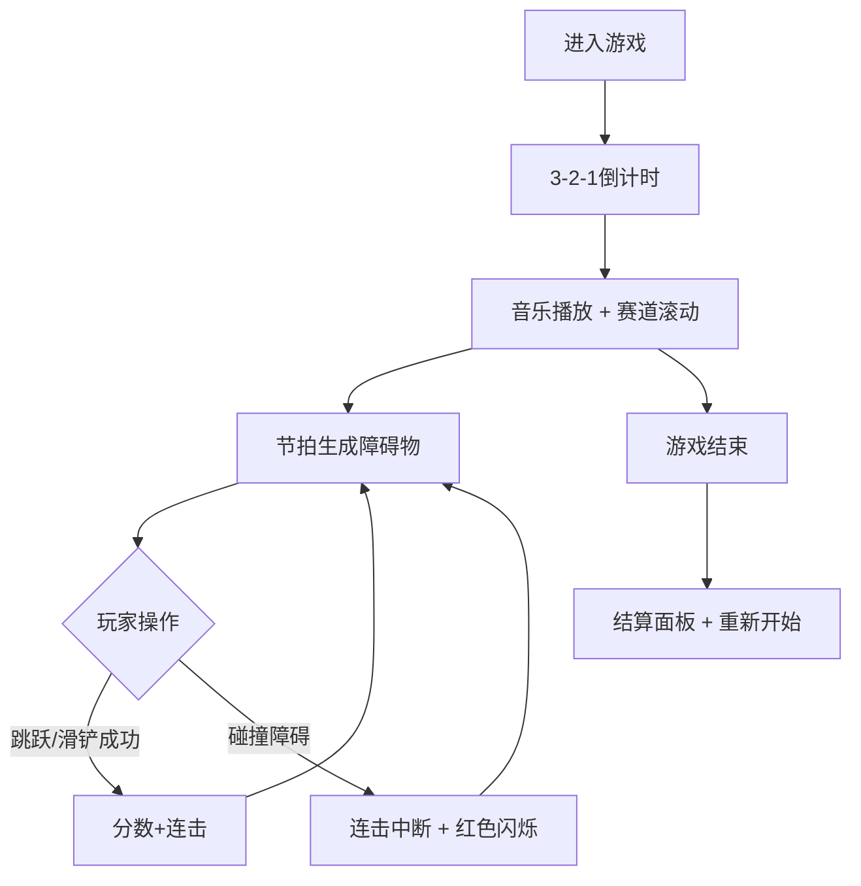

## 1. 产品概述

基于浏览器的像素风格节奏跑酷游戏，玩家控制角色在随音乐节拍生成障碍物的赛道上奔跑，通过跳跃和滑铲躲避障碍获取高分。

- 核心玩法：结合音乐节奏与跑酷操作，考验玩家反应和节奏感
- 目标用户：休闲游戏玩家，音乐游戏爱好者

## 2. 核心功能

### 2.1 功能模块

1. **主游戏场景**：横向滚动2D赛道，动态背景，流动格线
2. **玩家角色系统**：奔跑/跳跃/滑铲三种状态，像素动画，碰撞检测
3. **障碍物系统**：石柱（垂直上升）和尖刺（水平扫过），节拍同步生成，预警闪烁
4. **音乐节拍系统**：8-bit背景音乐，节拍解析，精准定时
5. **分数与连击系统**：基础分数+连击加成，碰撞惩罚，游戏结束界面

### 2.2 页面详情

| 页面名称 | 模块名称 | 功能描述 |
|-----------|-------------|---------------------|
| 游戏主界面 | 赛道渲染 | 600x450px赛道区域，深紫渐变背景，流动格线 |
| 游戏主界面 | HUD显示 | 顶部分数（带滚动动画）、连击数（>10时放大闪烁）、底部进度条 |
| 游戏主界面 | 倒计时 | 开始前3-2-1倒计时，弹跳淡出动画 |
| 游戏主界面 | 角色控制 | 点击/空格跳跃，长按/下键滑铲 |
| 游戏结束界面 | 结算面板 | 显示最终分数，重新开始按钮 |

## 3. 核心流程

玩家进入游戏 → 3-2-1倒计时 → 音乐开始播放 → 赛道滚动、障碍物按节拍生成 → 玩家跳跃/滑铲躲避障碍 → 累计分数与连击 → 碰撞障碍中断连击并闪烁 → 持续游戏直至用户终止 → 显示结算界面与重新开始

## 4. 用户界面设计

### 4.1 设计风格

- **主色调**：深紫色系（#1A0A2E → #2D1B4E）背景，赛博朋克暗色调
- **强调色**：金色#FFD700（角色/连击）、绿色#00FF88（分数）、红色系#FF416C→#FF4B2B（进度条/碰撞）
- **字体**：像素风格等宽字体，数字带滚动动画
- **视觉效果**：黑色光晕侧边装饰、格线流动、预警闪烁、碰撞红色闪烁

### 4.2 页面设计概览

| 页面名称 | 模块名称 | UI元素 |
|-----------|-------------|-------------|
| 游戏主界面 | 赛道区域 | 600x450px居中，深紫渐变背景，流动格线，左右黑色光晕 |
| 游戏主界面 | 顶部HUD | 分数（18px #00FF88 滚动动画）、连击（14px #FFD700 >10放大闪烁） |
| 游戏主界面 | 底部进度条 | 6px高，#FF416C→#FF4B2B渐变，圆角边框 |
| 游戏主界面 | 倒计时 | 48px白色数字，居中，弹跳淡出0.5s |
| 游戏结束界面 | 结算面板 | 最终分数显示，重新开始按钮 |

### 4.3 响应式设计

- 桌面端优先，赛道固定600x450px
- 窗口宽度<600px时，赛道等比缩放保持宽高比
- 触摸设备支持点击跳跃、长按滑铲

## 5. 性能要求

- 帧率稳定60FPS
- 节拍计时误差≤16ms
- 障碍物使用对象池管理，无内存泄漏
