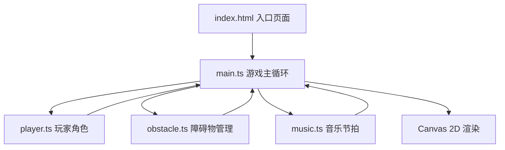

## 1. 架构设计



## 2. 技术说明

- **前端框架**：原生 TypeScript + HTML5 Canvas 2D
- **构建工具**：Vite
- **开发语言**：TypeScript（严格模式，ESNext模块）
- **无后端、无数据库**，纯前端游戏

## 3. 文件结构

| 文件路径 | 用途 |
|----------|------|
| `package.json` | 项目依赖（vite、typescript），启动脚本 |
| `index.html` | 入口页面，Canvas容器，HUD DOM锚点 |
| `vite.config.js` | Vite配置，入口index.html，端口8080 |
| `tsconfig.json` | TypeScript配置，严格模式，ESNext，DOM类型 |
| `src/main.ts` | 主游戏循环，场景初始化，资源加载，帧更新驱动 |
| `src/player.ts` | 玩家角色类，位置更新，碰撞检测，动画状态机 |
| `src/obstacle.ts` | 障碍物生成管理，节拍同步，对象池，生命周期 |
| `src/music.ts` | 音乐加载，节拍解析，Web Audio API定时器 |

## 4. 核心数据结构

### 4.1 玩家状态

```typescript
type PlayerState = 'running' | 'jumping' | 'sliding';

interface Player {
  x: number;
  y: number;
  width: number;
  height: number;
  state: PlayerState;
  velocityY: number;
  stateTimer: number;
  animFrame: number;
}
```

### 4.2 障碍物类型

```typescript
type ObstacleType = 'pillar' | 'spike';

interface Obstacle {
  type: ObstacleType;
  x: number;
  y: number;
  width: number;
  height: number;
  active: boolean;
  warning: boolean;
  warningTimer: number;
}
```

### 4.3 节拍系统

```typescript
interface BeatManager {
  bpm: number;
  beatInterval: number;
  beatTimes: number[];
  currentBeatIndex: number;
  audioContext: AudioContext | null;
  sourceNode: AudioBufferSourceNode | null;
  startTime: number;
}
```

## 5. 关键技术方案

### 5.1 节拍同步
- 使用 Web Audio API 的 AudioContext.currentTime 作为高精度时钟
- 提前计算所有节拍点时间戳存入数组
- 每帧比对当前时间与节拍点，误差控制在16ms内

### 5.2 对象池
- 障碍物预分配固定数量对象存入池
- 激活时从池取出，销毁时回收重置
- 避免频繁GC导致的卡顿

### 5.3 碰撞检测
- AABB轴对齐包围盒检测
- 滑铲状态碰撞箱缩小为8x8px
- 跳跃状态根据位置动态计算

### 5.4 主循环
- requestAnimationFrame 驱动60FPS渲染
- 固定时间步长更新游戏逻辑
- deltaTime 处理帧率波动
