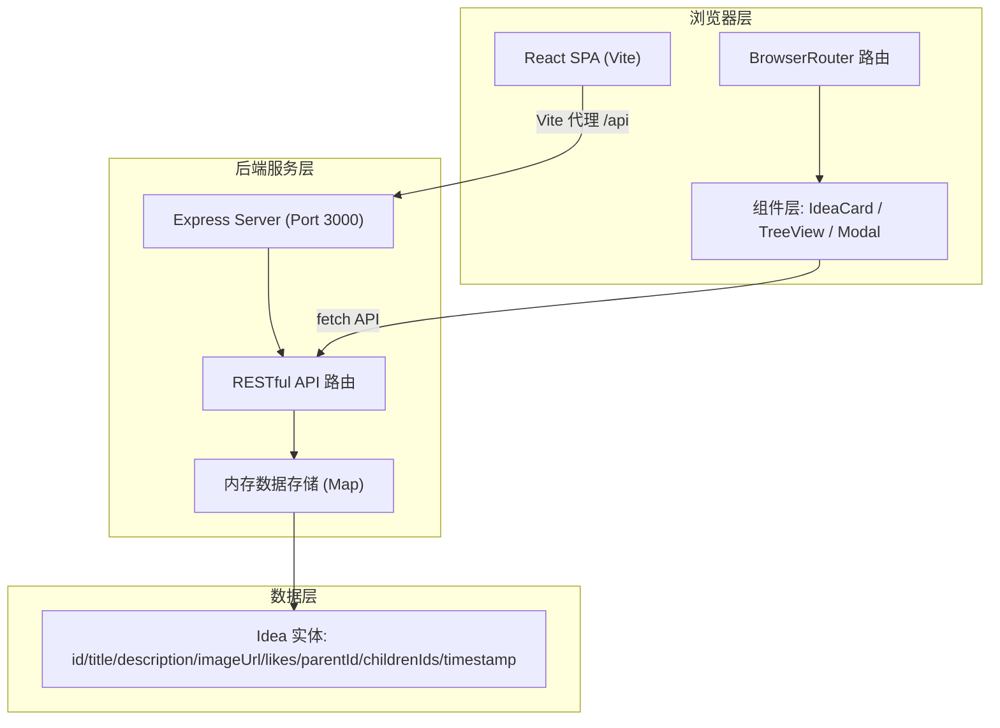
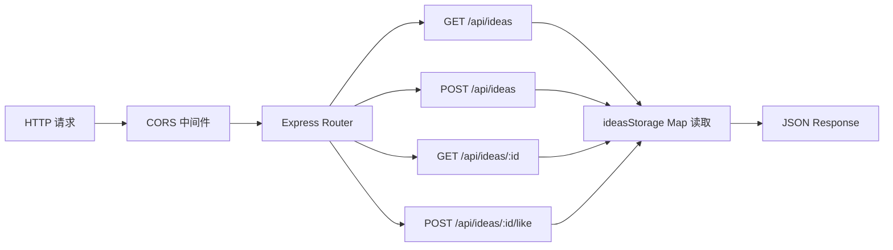
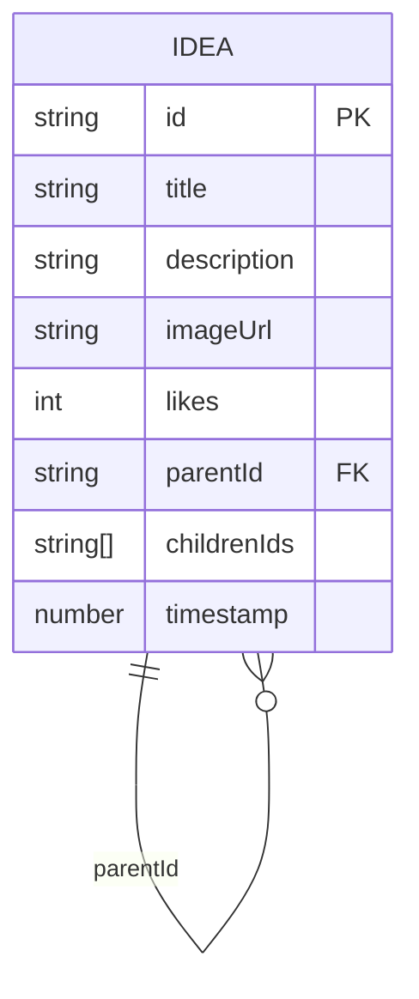

## 1. 架构设计



## 2. 技术描述

- **前端**：React 18 + TypeScript + Vite
  - 路由：react-router-dom v6 (BrowserRouter)
  - 样式：原生 CSS（无 Tailwind，按需求自定义复古暖色调）
  - 状态管理：React Hooks (useState, useEffect)，无额外状态库
  - 图标：lucide-react（爱心、菜单等图标）
- **构建工具**：Vite 5 + @vitejs/plugin-react
- **后端**：Express 4 + TypeScript + ts-node
  - CORS：cors 中间件
  - 数据存储：内存 Map（演示用途，无需数据库）
  - ID 生成：uuid
- **初始化工具**：Vite 官方脚手架
- **数据库**：无（内存 Map 存储）

## 3. 路由定义

| 前端路由 | 后端 API | 用途 |
|----------|----------|------|
| `/` | - | 创意列表页（瀑布流展示） |
| `/idea/:id` | - | 创意详情与变体树页面 |
| - | `GET /api/ideas` | 获取所有创意列表（支持排序） |
| - | `POST /api/ideas` | 提交新创意（可携带 parentId 作为变体） |
| - | `GET /api/ideas/:id` | 获取单个创意详情及其子变体树（递归嵌套） |
| - | `POST /api/ideas/:id/like` | 对创意进行点亮（likes+1） |

## 4. API 定义

### 4.1 数据类型

```typescript
interface Idea {
  id: string;
  title: string;
  description: string;
  imageUrl: string;
  likes: number;
  parentId: string | null;
  childrenIds: string[];
  timestamp: number;
}

interface IdeaTreeNode extends Idea {
  children: IdeaTreeNode[];
}
```

### 4.2 GET /api/ideas
- **Query**: `sort` = `"latest"` | `"hottest"`（默认 latest）
- **Response**: `Idea[]`

### 4.3 POST /api/ideas
- **Request Body**:
```typescript
{
  title: string;
  description: string;
  imageUrl: string;
  parentId?: string; // 可选，变体时携带
}
```
- **Response**: `Idea`（新创建的创意对象）

### 4.4 GET /api/ideas/:id
- **Response**: `IdeaTreeNode`（递归嵌套子节点的树形结构）

### 4.5 POST /api/ideas/:id/like
- **Response**: `{ id: string; likes: number }`

## 5. 服务器架构图



## 6. 数据模型

### 6.1 实体关系



### 6.2 存储结构说明
- 使用 `Map<string, Idea>` 存储所有创意实体
- 自引用关系：通过 `parentId` 指向父创意，`childrenIds` 维护子创意 ID 列表
- 获取详情树时递归构建嵌套结构 `IdeaTreeNode`

## 7. 文件结构与调用关系

```
项目根目录/
├── package.json              # 统一管理前后端依赖与脚本
├── index.html                # Vite 入口 HTML，挂载 #root
├── vite.config.ts            # Vite 配置：React 插件 + /api 代理到 :3000
├── tsconfig.json             # TS 严格模式，esnext 模块，jsx: react-jsx
├── server/
│   └── index.ts              # Express 服务端：API 路由 + 内存存储
└── src/
    ├── main.tsx              # React 入口：BrowserRouter + 全局 CSS
    ├── App.tsx               # 根组件：路由定义 + 导航栏
    ├── index.css             # 全局样式：主题变量、纸张背景、响应式
    ├── pages/
    │   ├── IdeaListPage.tsx  # 创意列表页：瀑布流 + 排序 + 发布模态框
    │   └── IdeaDetailPage.tsx# 创意详情页：详情 + 点亮 + TreeView + 变体提交
    ├── components/
    │   ├── IdeaCard.tsx      # 创意卡片组件
    │   ├── TreeView.tsx      # 树形图谱组件（递归）
    │   ├── IdeaModal.tsx     # 发布创意模态框
    │   └── LikeButton.tsx    # 点亮按钮（浮动心跳动画）
    ├── types/
    │   └── index.ts          # Idea 与 IdeaTreeNode 类型定义
    └── utils/
        └── api.ts            # fetch API 封装函数
```

### 调用关系
- `src/main.tsx` → 渲染 `App.tsx`
- `App.tsx` → 路由匹配渲染 `IdeaListPage.tsx` / `IdeaDetailPage.tsx`
- `IdeaListPage.tsx` → 使用 `IdeaCard.tsx`、`IdeaModal.tsx` → 调用 `utils/api.ts`
- `IdeaDetailPage.tsx` → 使用 `TreeView.tsx`、`LikeButton.tsx` → 调用 `utils/api.ts`
- `TreeView.tsx` → 递归渲染自身子节点
- `utils/api.ts` → 通过 Vite 代理请求 `server/index.ts`
