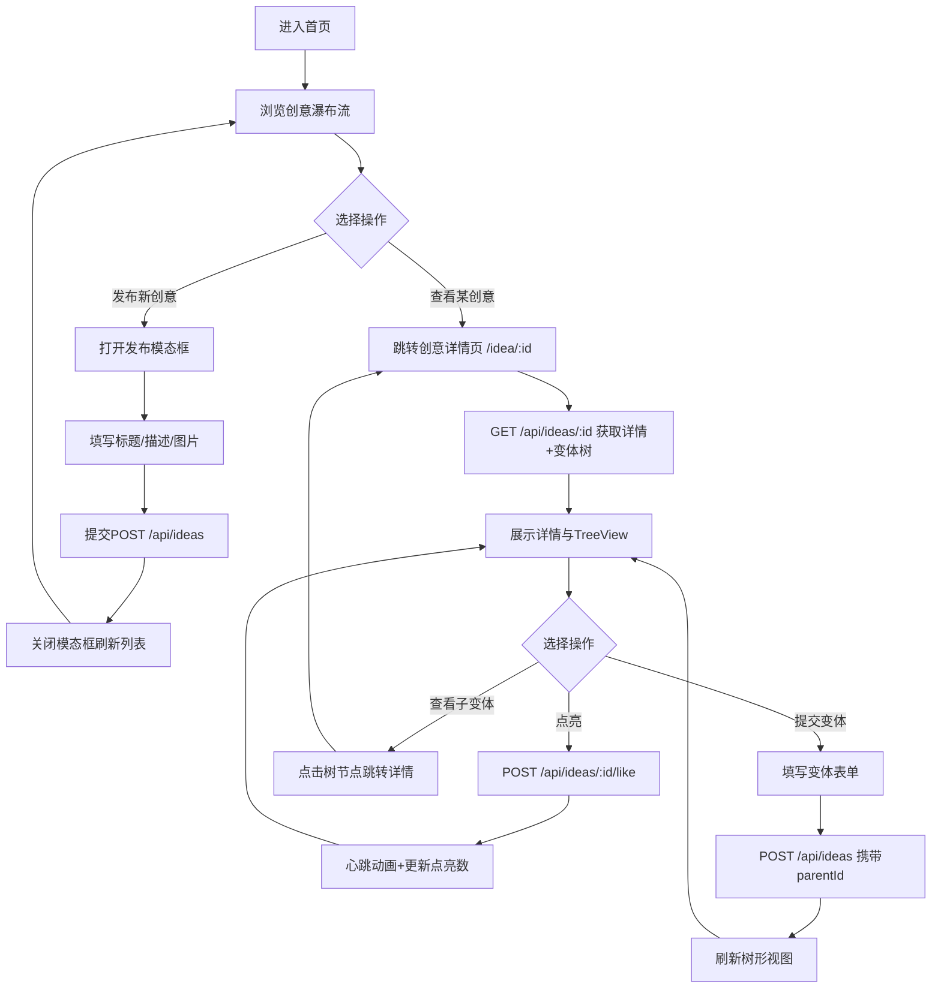

## 1. 产品概述

"旧物灵感"是一个面向旧物改造爱好者的线上创意交换社区平台。用户可以发布旧物改造方案，通过点亮（点赞）表达认可，并提交创意变体形成迭代的树形图谱，激发更多改造灵感。

- 目标用户：旧物改造爱好者、手工匠人、环保生活践行者
- 核心价值：通过创意共享与迭代，降低旧物改造门槛，延续物品生命

## 2. 核心功能

### 2.1 用户角色
| 角色 | 注册方式 | 核心权限 |
|------|----------|----------|
| 访客 | 无需注册 | 浏览创意列表、查看详情与变体树 |
| 成员 | 直接使用（演示版无鉴权） | 发布创意、点亮、提交变体 |

### 2.2 功能模块
1. **创意列表页**：瀑布流展示所有创意方案，支持排序切换
2. **创意详情页**：展示完整创意信息、点亮按钮、变体树形图谱
3. **创意发布模块**：模态框表单提交新创意
4. **变体提交模块**：在详情页提交基于现有创意的变体方案
5. **点亮互动模块**：浮动点赞按钮带动画反馈

### 2.3 页面详情
| 页面名称 | 模块名称 | 功能描述 |
|-----------|-------------|---------------------|
| 创意列表页 | 顶部导航栏 | 品牌标题、发布灵感按钮、路由导航 |
| 创意列表页 | 排序筛选栏 | 按最新/最热排序切换下拉菜单 |
| 创意列表页 | 瀑布流卡片墙 | 多列瀑布流展示创意卡片 |
| 创意列表页 | 发布模态框 | 标题、描述、图片URL输入表单 |
| 创意详情页 | 创意详情区 | 完整图文、时间、点亮数展示 |
| 创意详情页 | 浮动点亮按钮 | 带动画的心形点赞按钮 |
| 创意详情页 | 变体树形图谱 | SVG曲线连接的递归树形可视化 |
| 创意详情页 | 变体提交面板 | 基于当前创意提交变体方案 |

## 3. 核心流程

### 3.1 主用户流程描述
用户进入首页浏览瀑布流创意卡片 → 可选择排序方式 → 点击卡片进入详情页查看完整内容与变体树 → 可点亮创意或查看某一变体 → 在详情页提交新创意变体 → 返回首页或通过模态框发布全新创意

### 3.2 流程图

## 4. 用户界面设计

### 4.1 设计风格
- **主色调**：米白 #FFF8E7（背景与卡片底色）
- **主要辅助色**：暖棕 #8D6E63（按钮、边框）、深棕 #6D4C41（强调按钮）
- **点缀色**：红粉 #E57373（点亮按钮、爱心图标）
- **边框与分割**：浅灰棕 #D7CCC8、#C4B6A6、#A1887F、#BDBDBD
- **文字色**：深棕 #3A2E28（标题）、中棕 #5C4F42（正文）、浅棕 #A1887F（占位符）
- **按钮风格**：圆角矩形 6px-16px，悬停颜色加深10%（0.2s ease），点击缩放 0.95（0.1s）
- **字体**：标题 Georgia 衬线体，正文系统无衬线
- **布局风格**：Flex 居中布局，卡片化设计，瀑布流多列展示
- **背景质感**：CSS 径向渐变模拟细微噪点纸张纹理
- **图标风格**：简洁线条型图标（爱心、菜单汉堡）

### 4.2 页面设计概述
| 页面名称 | 模块名称 | UI 元素 |
|-----------|-------------|-------------|
| 创意列表页 | 顶部导航栏 | 固定顶部、Georgia 24px 品牌名、#6B5B4D 链接色、移动端汉堡菜单 |
| 创意列表页 | 瀑布流卡片墙 | 列最小宽度 280px、列间距 24px、行间距 24px、卡片圆角 12px、上浮动画 |
| 创意列表页 | 排序下拉菜单 | 背景 #F5F0EB、边框 #C4B6A6、圆角 6px、自定义样式 |
| 创意列表页 | 创意卡片 | 200x150 圆角图片、18px 标题、14px 描述、点亮数+红色爱心、查看变体按钮 |
| 创意列表页 | 发布模态框 | 半透明遮罩 #00000050、#FFF8E7 面板、圆角 16px、三输入框+提交按钮 |
| 创意详情页 | 创意详情区 | 大尺寸图片、完整描述、时间戳、点亮数展示 |
| 创意详情页 | 浮动点亮按钮 | 圆形 48px、#E57373 背景、阴影、悬停放大至 52px、心跳动画 |
| 创意详情页 | 变体树形图谱 | Flex 递归布局、圆角矩形节点、SVG 贝塞尔曲线连接、stroke 动画 |
| 创意详情页 | 变体提交面板 | 440px 宽、#F5F0EB 背景、圆角 12px、内边距 20px、深棕按钮 |

### 4.3 响应式设计
- **桌面优先**：默认适配桌面端，瀑布流多列展示
- **移动端断点**：760px 以下
  - 卡片宽度 100%，单列布局
  - 导航栏变为汉堡菜单图标
  - 变体提交面板宽度自适应 100%
- **触摸优化**：按钮最小触控区域 44px，增大点击热区

### 4.4 性能设计
- **首屏加载**：Fast 3G 模拟 ≤ 1.5 秒
- **树形渲染**：超过 50 节点时采用分层加载，保证帧率 ≥ 30fps
- **动画**：优先使用 CSS transform/opacity，启用 GPU 加速
