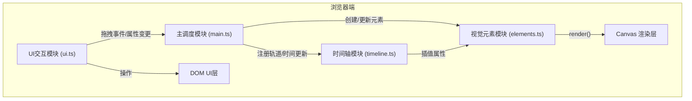

## 1. 架构设计



## 2. 技术选型

- **前端框架**：原生HTML/CSS + TypeScript（用户明确指定）
- **构建工具**：Vite 5.x
- **渲染方案**：HTML5 Canvas 2D API
- **状态管理**：自定义事件总线（EventEmitter模式）
- **开发语言**：TypeScript (strict模式)

## 3. 文件结构

```
auto288/
├── package.json
├── index.html
├── vite.config.js
├── tsconfig.json
└── src/
    ├── main.ts          # 沙盘初始化、事件总线、元素管理、渲染调度
    ├── elements.ts      # 视觉元素接口与实现类
    ├── timeline.ts      # 时间轴UI交互与播放逻辑
    └── ui.ts            # UI交互逻辑（拖拽、属性面板、响应式）
```

## 4. 核心数据模型

### 4.1 视觉元素接口

```typescript
interface IVisualElement {
  id: string;
  type: 'flame' | 'pulseRing' | 'noiseWave';
  name: string;
  x: number;
  y: number;
  rotation: number;    // 0-360度
  scale: number;       // 0.5-3倍
  opacity: number;     // 0-100%
  startTime: number;   // 入场时间(秒)
  endTime: number;     // 退场时间(秒)
  keyframes: Keyframe[];
  render(ctx: CanvasRenderingContext2D, time: number): void;
  updateProps(props: Partial<ElementProps>): void;
}

interface Keyframe {
  time: number;
  x?: number;
  y?: number;
  rotation?: number;
  scale?: number;
  opacity?: number;
}
```

### 4.2 数据流

1. **素材库 → 元素创建**：`ui.ts` 监听拖拽结束 → 调用 `main.ts` 创建元素实例 → 注册到 `elements` 数组和 `timeline.ts`
2. **时间轴 → 属性插值**：`timeline.ts` 每帧根据当前时间计算插值属性 → 调用各元素 `updateProps()`
3. **渲染循环**：`main.ts` requestAnimationFrame 驱动 → 遍历活跃元素调用 `render(ctx, time)`

## 5. 渲染性能优化策略

- 使用 `requestAnimationFrame` 实现稳定60fps渲染循环
- 元素级脏标记机制，仅更新属性变化的元素
- Canvas 离屏缓存静态元素
- 粒子系统使用对象池避免频繁GC
- 时间轴插值计算预计算，避免每帧重复计算

## 6. Vite 构建配置

- 入口：`index.html`
- 输出目录：`dist`
- esbuild 目标：`es2020`
- 开发端口：`8080`
