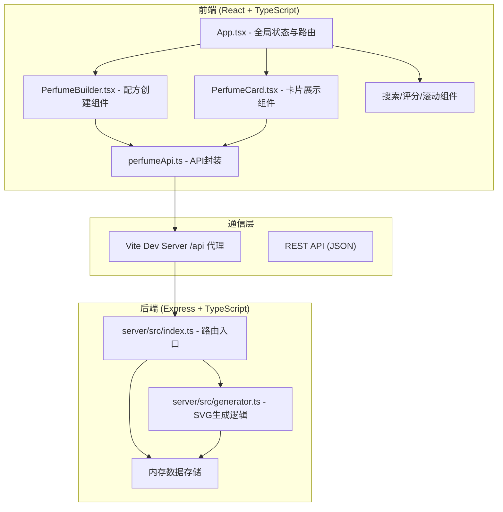
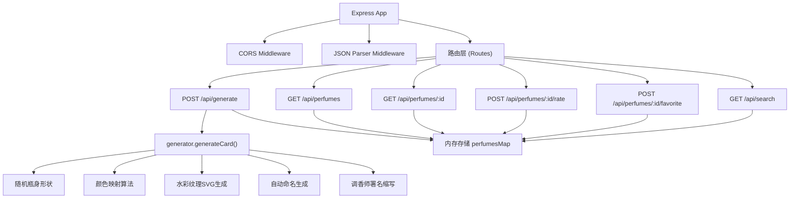
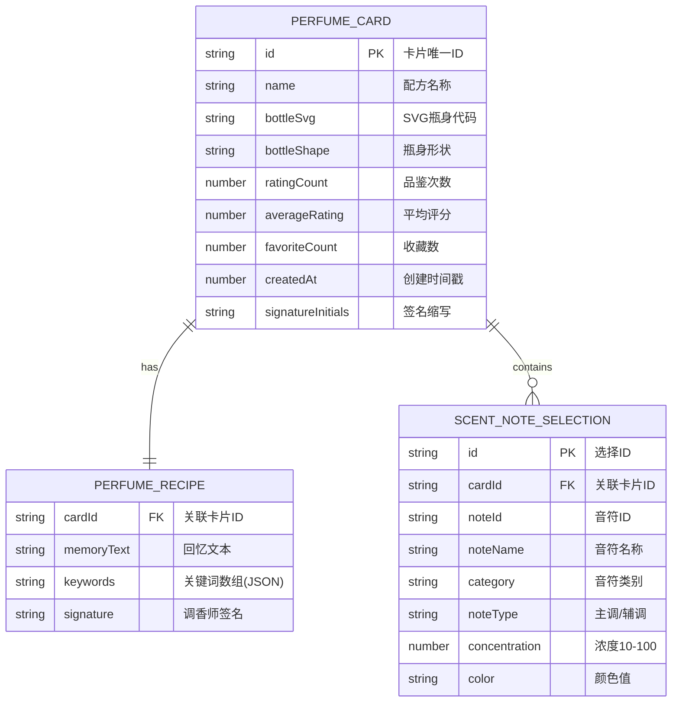

## 1. 架构设计



## 2. 技术描述

- **前端**：React 18 + TypeScript + Vite，使用React状态管理全局数据
- **初始化工具**：vite-init
- **后端**：Express 4 + TypeScript，运行在3001端口
- **数据库**：内存存储（JavaScript Map/Array），无需外部数据库
- **样式**：原生CSS，使用CSS变量统一设计系统
- **HTTP客户端**：原生fetch API

## 3. 路由定义

| 前端路由 | 用途 |
|----------|------|
| / | 首页（配方创建 + 卡片画廊） |
| /perfume/:id | 卡片详情页 |

| API路由 | 方法 | 用途 |
|---------|------|------|
| /api/generate | POST | 提交配方生成新卡片 |
| /api/perfumes | GET | 获取卡片列表（分页） |
| /api/perfumes/:id | GET | 获取单个卡片详情 |
| /api/perfumes/:id/rate | POST | 提交品鉴评分 |
| /api/perfumes/:id/favorite | POST | 收藏/取消收藏 |
| /api/search | GET | 搜索卡片（名称+关键词） |

## 4. API定义

### 4.1 TypeScript类型定义

```typescript
interface ScentNote {
  id: string;
  name: string;
  category: 'citrus' | 'floral' | 'woody' | 'leather';
  color: string;
  rgb: [number, number, number];
}

interface PerfumeRecipe {
  mainNotes: ScentNote[];
  supportNotes: ScentNote[];
  concentrations: Record<string, number>;
  memoryText: string;
  keywords: string[];
  signature: string;
}

interface PerfumeCard {
  id: string;
  name: string;
  recipe: PerfumeRecipe;
  bottleSvg: string;
  bottleShape: 'drop' | 'rectangle' | 'cone';
  ratingCount: number;
  averageRating: number;
  favoriteCount: number;
  createdAt: number;
  signatureInitials: string;
}

interface RatingPayload {
  rating: number; // 1-5
}

interface SearchResult {
  cards: PerfumeCard[];
  highlightedTerms: string[];
}
```

### 4.2 请求/响应示例

**POST /api/generate**
```json
// 请求
{
  "mainNotes": [{ "id": "citrus-1", "name": "柠檬", "category": "citrus", "color": "#FFD700", "rgb": [255, 215, 0] }],
  "supportNotes": [...],
  "concentrations": { "citrus-1": 80 },
  "memoryText": "夏日午后的海边，阳光洒在金色沙滩上",
  "keywords": ["夏日", "海边", "阳光"],
  "signature": "小明"
}

// 响应
{
  "success": true,
  "data": {
    "id": "perf_abc123",
    "name": "夏日海岸之梦",
    "bottleSvg": "<svg>...</svg>",
    "bottleShape": "drop",
    "ratingCount": 0,
    "averageRating": 0,
    "signatureInitials": "XM"
  }
}
```

## 5. 服务器架构图



## 6. 数据模型

### 6.1 数据模型定义



### 6.2 内存数据结构

```typescript
// server/src/index.ts 中的内存存储
const perfumes: Map<string, PerfumeCard> = new Map();
let perfumeIdCounter = 0;

// 气味音符预设数据
const SCENT_CATEGORIES = {
  citrus: [
    { id: 'citrus-1', name: '柠檬', color: '#FFD700', rgb: [255, 215, 0] },
    { id: 'citrus-2', name: '橙子', color: '#FFA500', rgb: [255, 165, 0] },
    { id: 'citrus-3', name: '葡萄柚', color: '#FF6B6B', rgb: [255, 107, 107] },
    { id: 'citrus-4', name: '佛手柑', color: '#FFE4B5', rgb: [255, 228, 181] },
    { id: 'citrus-5', name: '青柠', color: '#9ACD32', rgb: [154, 205, 50] },
  ],
  floral: [
    { id: 'floral-1', name: '玫瑰', color: '#FF69B4', rgb: [255, 105, 180] },
    { id: 'floral-2', name: '茉莉', color: '#FFF8DC', rgb: [255, 248, 220] },
    { id: 'floral-3', name: '薰衣草', color: '#E6E6FA', rgb: [230, 230, 250] },
    { id: 'floral-4', name: '紫罗兰', color: '#EE82EE', rgb: [238, 130, 238] },
    { id: 'floral-5', name: '牡丹', color: '#FFB6C1', rgb: [255, 182, 193] },
  ],
  woody: [
    { id: 'woody-1', name: '雪松', color: '#8B4513', rgb: [139, 69, 19] },
    { id: 'woody-2', name: '檀香', color: '#D2691E', rgb: [210, 105, 30] },
    { id: 'woody-3', name: '橡木', color: '#A0522D', rgb: [160, 82, 45] },
    { id: 'woody-4', name: '广藿香', color: '#556B2F', rgb: [85, 107, 47] },
    { id: 'woody-5', name: '香根草', color: '#6B8E23', rgb: [107, 142, 35] },
  ],
  leather: [
    { id: 'leather-1', name: '小羊皮', color: '#8B7355', rgb: [139, 115, 85] },
    { id: 'leather-2', name: '麂皮', color: '#BC8F8F', rgb: [188, 143, 143] },
    { id: 'leather-3', name: '复古皮革', color: '#654321', rgb: [101, 67, 33] },
    { id: 'leather-4', name: '马鞍皮', color: '#8B0000', rgb: [139, 0, 0] },
    { id: 'leather-5', name: '绒面革', color: '#A52A2A', rgb: [165, 42, 42] },
  ],
};
```

## 7. 项目文件结构

```
auto292/
├── package.json
├── index.html
├── vite.config.js
├── tsconfig.json
├── src/
│   ├── App.tsx
│   ├── component/
│   │   ├── PerfumeBuilder.tsx
│   │   └── PerfumeCard.tsx
│   └── api/
│       └── perfumeApi.ts
└── server/
    └── src/
        ├── index.ts
        └── generator.ts
```
