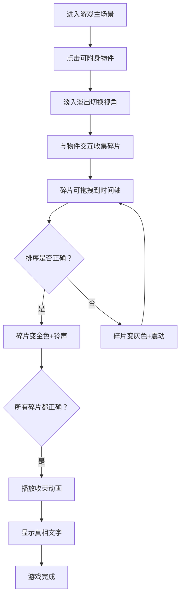

## 1. 产品概述
"灵魂共生"是一款叙事解谜游戏，玩家扮演通灵者附身到荒废古宅的物件上，通过读取记忆碎片还原宅邸女主人失踪前的最后24小时。

- 核心玩法：附身物件 → 读取记忆碎片 → 时间轴排序 → 还原真相
- 目标用户：喜欢悬疑叙事解谜游戏的玩家

## 2. 核心功能

### 2.1 功能模块
1. **主场景**：3D透视古宅房间线稿背景，4个可附身物件交互热点
2. **物件视角**：4个独特视角（座钟/相册/梳子/信纸），各有专属交互和动画
3. **记忆碎片收集**：从各物件获取文本/动画形式的记忆碎片
4. **时间轴系统**：底部24小时制时间轴，拖拽碎片排序，正确变金色错误震动
5. **真相揭示动画**：完成排序后播放壁炉粒子火焰和手写体真相文字

### 2.2 页面详情
| 页面名称 | 模块名称 | 功能描述 |
|----------|----------|----------|
| 主游戏界面 | 假3D场景背景 | CSS绘制透视线条古宅房间线稿 |
| 主游戏界面 | 附身物件交互区 | 4个高亮可点击物件，悬停放大1.1倍+白色光晕 |
| 主游戏界面 | 座钟视角 | Canvas齿轮指针动画，滴答背景音，显示时间记忆碎片 |
| 主游戏界面 | 相册视角 | CSS翻页动画，泛黄照片局部显示，拖拽查看全貌 |
| 主游戏界面 | 梳子视角 | 梳齿间发丝，拖动梳子发丝随动并散发微光 |
| 主游戏界面 | 信纸视角 | 散落撕碎纸片，拖拽到右侧拼接区组合，拼合闪光提示 |
| 主游戏界面 | 底部时间轴 | 24个等宽小时格，拖放排序，正确金色+铃声，错误灰色+震动 |
| 主游戏界面 | 收束动画 | Canvas粒子壁炉火焰，手写真相文字渐显渐出 |

## 3. 核心流程

玩家进入古宅主场景 → 点击高亮物件 → 淡入淡出切换到物件视角 → 与物件交互收集记忆碎片 → 将碎片拖拽到时间轴对应小时格 → 验证排序正确/错误 → 全部正确放置 → 播放5秒收束动画（粒子火焰+真相文字）→ 游戏完成

## 4. 用户界面设计

### 4.1 设计风格
- **主色调**：#1A1410（暗调古旧深褐）
- **辅色调**：#C4A882（米黄辅色）
- **强调色**：#D4AF37（金色）
- **透视线条色**：#3A2E28，粗细 1.5px
- **整体氛围**：幽暗、神秘、古旧、悬疑
- **字体**：Google Fonts 'Caveat' 手写体用于真相文字，常规字体用于界面

### 4.2 页面设计概述
| 页面名称 | 模块名称 | UI 元素 |
|----------|----------|---------|
| 主游戏界面 | 假3D场景 | CSS透视线条，房间线稿，固定视角 |
| 主游戏界面 | 附身物件 | 金色渐变边框，悬停1.1倍放大，白色光晕 |
| 主游戏界面 | 座钟视角 | Canvas旋转齿轮+指针，滴答声效 |
| 主游戏界面 | 相册视角 | CSS翻页动画，泛黄照片纹理 |
| 主游戏界面 | 梳子视角 | 骨瓷梳子，发丝动画，微光粒子 |
| 主游戏界面 | 信纸视角 | 撕碎纸片散落，拼接区，闪光提示 |
| 主游戏界面 | 时间轴 | 背景#2C1E16半透明，圆角12px，弹性缩放格子 |
| 主游戏界面 | 收束动画 | Canvas粒子壁炉，橙色#FF4500到#FF6347渐变，手写真相文字 |

### 4.3 响应式设计
- 桌面优先：适配1920x1080分辨率
- 窗口宽度<1200px时：主体场景缩放至80%并居中
- 所有交互元素可点击区域≥44x44px
- 物件视角切换响应时间<200ms
- 碎片拼合检测频率≥60fps

### 4.4 动画与过渡
- 视角切换：淡入到黑再淡出，0.8s
- 物件悬停：1.1倍放大+白色光晕
- 时间轴格子：拖入时弹性缩放
- 正确放置：金色+悦耳铃声
- 错误放置：灰色+300ms震动CSS动画
- 收束动画：5秒粒子火焰增强+真相文字渐显渐出
