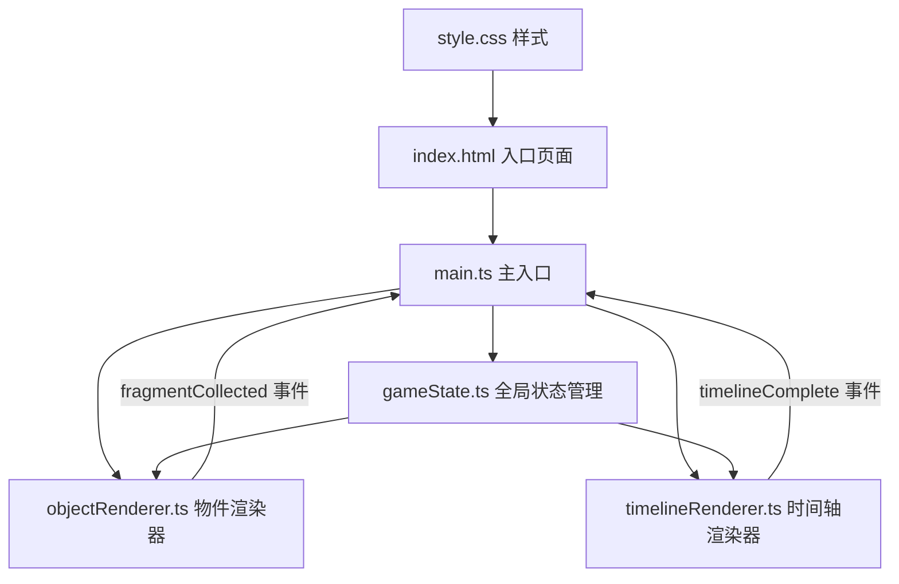

## 1. 架构设计



## 2. 技术描述
- **前端框架**：原生 HTML/CSS + TypeScript
- **构建工具**：Vite
- **开发语言**：TypeScript (严格模式, target ES2020, module ESNext)
- **样式方案**：原生 CSS + CSS 模块化 (Vite 配置开启)
- **Canvas 2D**：用于齿轮动画、粒子火焰效果
- **字体**：Google Fonts 'Caveat'
- **无后端、无数据库**：纯前端单页应用

## 3. 文件组织结构

| 文件/目录 | 用途说明 |
|-----------|----------|
| `package.json` | 项目配置，vite + typescript 依赖，dev 端口 8080 |
| `index.html` | 入口页面，包含场景容器、时间轴锚点、音频标签 |
| `vite.config.js` | Vite 构建配置，入口 index.html，输出 dist，CSS 模块化 |
| `tsconfig.json` | TypeScript 配置，严格模式，ES2020，ESNext 模块 |
| `src/main.ts` | 主入口，初始化状态、渲染场景、事件监听、收束动画 |
| `src/gameState.ts` | 全局游戏状态管理（附身索引、碎片列表、时间轴、完成状态） |
| `src/objectRenderer.ts` | 4个附身物件的视角渲染与交互逻辑 |
| `src/timelineRenderer.ts` | 底部24小时时间轴渲染与拖放验证逻辑 |
| `src/style.css` | 全局样式、假3D场景、动画、响应式 |

## 4. 核心数据模型

### 4.1 Fragment（记忆碎片）
```typescript
interface Fragment {
  id: string;
  objectIndex: number;  // 来源物件索引 0-3
  timeIndex: number;    // 正确时间位置 0-23
  content: string;      // 碎片文本/描述
}
```

### 4.2 GameState（游戏状态）
```typescript
class GameState {
  currentObjectIndex: number;     // 当前附身物件索引 -1=主场景, 0-3=物件
  collectedFragments: Fragment[]; // 已收集碎片列表
  timelineSlots: number[];        // 24个格子, -1表示空, 否则为fragment id
  isTransitioning: boolean;       // 视角切换过渡中标识
  isGameComplete: boolean;        // 游戏是否完成
  addFragment(fragment: Fragment): void;
  isTimelineCorrect(): boolean;
}
```

## 5. 事件通信

| 事件名称 | 触发位置 | 携带数据 | 监听位置 |
|----------|----------|----------|----------|
| `fragmentCollected` | objectRenderer.ts | `{ fragmentId, objectIndex, timeIndex, content }` | main.ts |
| `timelineComplete` | timelineRenderer.ts | 无 | main.ts |

## 6. 性能与交互约束
- 物件视角切换响应 < 200ms
- 碎片拼合检测 ≥ 60fps（requestAnimationFrame）
- 响应式：<1200px 宽度时场景缩放 80% 居中
- 可点击区域 ≥ 44x44px
- 粒子系统：80个粒子，颜色渐变 #FF4500 → #FF6347
