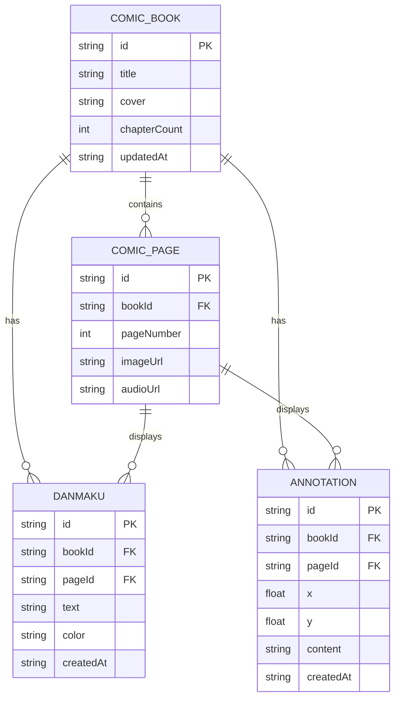

## 1. 架构设计

```mermaid
flowchart TB
    "A[浏览器客户端 React]" --> "B[Vite Dev Server]"
    "A" --> "C[Express API Server :3001]"
    "C" --> "D[JSON 文件存储]"
    "C" --> "E[静态文件服务 (语音/图片)]"
    
    subgraph "前端 React"
        "F[App.tsx 路由+全局状态]"
        "G[Home.tsx 连环画列表]"
        "H[Reader.tsx 阅读器]"
        "I[styles.css 全局样式]"
        "J[services/ API 服务层]"
    end
    
    subgraph "后端 Express"
        "K[src/server/index.ts]"
        "L[连环画 CRUD]"
        "M[语音上传/获取]"
        "N[弹幕 CRUD]"
        "O[批注 CRUD]"
    end
    
    "F" --> "G"
    "F" --> "H"
    "H" --> "J"
    "J" --> "C"
    "K" --> "L"
    "K" --> "M"
    "K" --> "N"
    "K" --> "O"
```

## 2. 技术栈说明

- **前端框架**：React 18 + TypeScript
- **构建工具**：Vite + @vitejs/plugin-react
- **后端框架**：Express 4 + TypeScript
- **音频播放**：howler.js
- **状态管理**：React useState/useContext（轻量级）
- **路由**：简单条件渲染（2个页面）
- **数据存储**：JSON 文件（data/*.json）
- **ID生成**：uuid
- **跨域**：cors 中间件
- **语音录制**：浏览器原生 MediaRecorder API
- **弹幕渲染**：HTML5 Canvas

## 3. 前端路由

| 路由 | 页面组件 | 说明 |
|------|----------|------|
| / | Home | 连环画列表首页 |
| /reader/:bookId | Reader | 阅读器页面 |

## 4. API 接口定义

```typescript
// 类型定义
interface ComicBook {
  id: string;
  title: string;
  cover: string;
  chapterCount: number;
  updatedAt: string;
  pages: ComicPage[];
}

interface ComicPage {
  id: string;
  bookId: string;
  pageNumber: number;
  imageUrl: string;
  audioUrl?: string;
}

interface Danmaku {
  id: string;
  bookId: string;
  pageId: string;
  text: string;
  color: string;
  createdAt: string;
}

interface Annotation {
  id: string;
  bookId: string;
  pageId: string;
  x: number;
  y: number;
  content: string;
  createdAt: string;
}
```

| 方法 | 路径 | 说明 | 请求/响应 |
|------|------|------|----------|
| GET | /api/books | 获取连环画列表 | Resp: ComicBook[] |
| GET | /api/books/:id | 获取单本详情 | Resp: ComicBook |
| GET | /api/books/:id/pages/:pageId/image | 获取页面图片 | Resp: 图片流 |
| POST | /api/audio/upload | 上传语音文件 | Req: FormData(pageId, audio) |
| GET | /api/audio/:pageId | 获取页面语音 | Resp: 音频流 |
| GET | /api/danmaku?bookId&pageId | 获取弹幕列表 | Resp: Danmaku[] |
| POST | /api/danmaku | 发送弹幕 | Req: Danmaku |
| GET | /api/annotations?bookId&pageId | 获取批注列表 | Resp: Annotation[] |
| POST | /api/annotations | 添加批注 | Req: Annotation |
| PUT | /api/annotations/:id | 更新批注 | Req: { content } |
| DELETE | /api/annotations/:id | 删除批注 | Resp: { success: true } |

## 5. 后端架构

```mermaid
flowchart LR
    "A[Express App]" --> "B[CORS Middleware]"
    "B" --> "C[JSON Body Parser]"
    "C" --> "D[Static File Middleware]"
    "D" --> "E[Multer Upload Middleware]"
    "E" --> "F[路由处理器]"
    "F" --> "G[JSON 文件读写]"
    "G" --> "H[data/books.json]"
    "G" --> "I[data/danmaku.json]"
    "G" --> "J[data/annotations.json]"
```

## 6. 数据模型

### 6.1 ER 图



### 6.2 JSON 文件结构

data/books.json:
```json
{
  "books": [
    {
      "id": "book-001",
      "title": "三国演义",
      "cover": "/images/book001/cover.jpg",
      "chapterCount": 120,
      "updatedAt": "2026-01-15",
      "pages": [
        {
          "id": "page-001-001",
          "bookId": "book-001",
          "pageNumber": 1,
          "imageUrl": "/images/book001/page001.jpg",
          "audioUrl": null
        }
      ]
    }
  ]
}
```

data/danmaku.json:
```json
{
  "danmaku": [
    {
      "id": "dm-001",
      "bookId": "book-001",
      "pageId": "page-001-001",
      "text": "经典！",
      "color": "#FFD700",
      "createdAt": "2026-01-15T10:30:00Z"
    }
  ]
}
```

data/annotations.json:
```json
{
  "annotations": [
    {
      "id": "ann-001",
      "bookId": "book-001",
      "pageId": "page-001-001",
      "x": 0.35,
      "y": 0.62,
      "content": "这一段是桃园三结义",
      "createdAt": "2026-01-15T10:35:00Z"
    }
  ]
}
```

## 7. 项目文件结构

```
auto296/
├── .trae/documents/
│   ├── PRD.md
│   └── ARCHITECTURE.md
├── data/                          # JSON 数据存储
│   ├── books.json
│   ├── danmaku.json
│   └── annotations.json
├── uploads/                       # 语音文件上传目录
├── public/
│   └── images/                    # 示例连环画图片
├── src/
│   ├── server/
│   │   └── index.ts              # Express 后端
│   └── client/
│       ├── App.tsx               # React 主组件
│       ├── pages/
│       │   ├── Home.tsx          # 首页列表
│       │   └── Reader.tsx        # 阅读器
│       ├── services/
│       │   └── api.ts            # API 调用封装
│       ├── types/
│       │   └── index.ts          # 类型定义
│       └── styles.css            # 全局样式
├── index.html
├── vite.config.js
├── tsconfig.json
├── package.json
└── README.md
```

## 8. 数据流向

1. **首页加载**：App.tsx → services/api.ts → GET /api/books → Express → data/books.json → 返回 ComicBook[] → 渲染 Home.tsx 网格
2. **进入阅读器**：点击卡片 → App.tsx 更新状态 → 渲染 Reader.tsx → GET /api/books/:id 获取详情 + GET /api/danmaku + GET /api/annotations
3. **翻页**：键盘/触摸事件 → Reader.tsx 更新 currentPage → 重新加载弹幕和批注 → 触发翻页 CSS 动画
4. **发送弹幕**：输入框 → POST /api/danmaku → Express → data/danmaku.json → 实时添加到 Canvas 渲染队列
5. **添加批注**：长按页面 → 显示标记和输入框 → 输入内容 → POST /api/annotations → Express → data/annotations.json → 持久化存储
6. **录制语音**：MediaRecorder → Blob → FormData → POST /api/audio/upload → Express → 保存到 uploads/ → 更新 page.audioUrl
