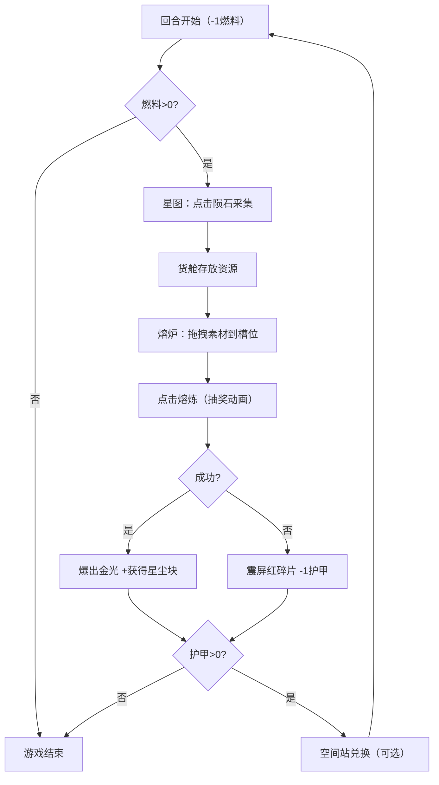

## 1. 产品概述

星尘熔炉是一款回合制资源管理与赌运气网页游戏，玩家扮演星际矿工在陨石带采集资源并熔炼高价值星尘块。
- 目标用户：休闲游戏爱好者、策略游戏玩家
- 产品价值：结合资源采集、配方熔炼、风险决策的沉浸式太空题材游戏体验

## 2. 核心功能

### 2.1 功能模块
1. **飞船面板**：显示燃料、货舱、护甲状态（圆环进度条）
2. **星图系统**：400x400 画布，随机陨石、飞船飞行动画、粒子尾迹
3. **熔炉操作区**：拖拽资源到熔炼槽、熔炼动画（火焰/金光/爆炸）、配方成功率判定
4. **空间站商店**：使用星尘块兑换升级和道具
5. **日志系统**：记录最近 20 条操作

### 2.2 页面详情
| 页面名称 | 模块名称 | 功能描述 |
|-----------|-------------|---------------------|
| 主游戏页 | 飞船面板 | 圆环进度条显示燃料/货舱/护甲，配色 #00E5FF→#B2EBF2 |
| 主游戏页 | 星图区域 | 400x400 Canvas，8-12 随机陨石，点击飞行 0.5s，粒子尾迹 |
| 主游戏页 | 熔炉操作区 | 3 个熔炼槽拖拽，老虎机抽奖动画 1.2s，成功金光/失败震屏 |
| 主游戏页 | 日志面板 | 右侧滚动显示 20 条操作记录，时间戳 #A0A0A0 |
| 空间站页 | 商店面板 | 燃料、护甲、高级分解器兑换 |

## 3. 核心流程

玩家每回合开始消耗 1 燃料 → 在星图点击陨石采集资源（金属/晶体/气体）→ 拖拽资源到熔炉槽按配方熔炼 → 判定成功获得星尘块或失败损失护甲 → 使用星尘块在空间站兑换升级 → 循环直至燃料或护甲耗尽。

## 4. 用户界面设计

### 4.1 设计风格
- 主色调：深蓝紫 #0A0E27→#1A1A3E 径向渐变背景
- 强调色：青绿 #00D4AA→#009B8A（按钮边框）、橙黄（资源图标/成功闪光）
- 按钮：发光边框渐变，hover 放大 1.05 倍 + 白色光晕，active scale 0.95
- 字体：采用独特的科幻风格显示字体 + 易读正文字体
- 视觉：深空宇宙风，背景闪烁星星粒子 1-2px，周期 2-4s

### 4.2 页面设计概览
| 页面名称 | 模块名称 | UI 元素 |
|-----------|-------------|-------------|
| 主游戏页 | 布局 | 三栏自适应：左 20% 飞船面板（毛玻璃 blur(4px)）、中游戏区、右 15% 日志 |
| 主游戏页 | 星图 | 400x400 Canvas，占中区 60%，下方熔炉占 40% |
| 主游戏页 | 熔炉 | 三个拖拽槽，老虎机动画，火焰/金光粒子 |
| 主游戏页 | 响应式 | <768px 时左右栏折叠为上下固定条 |

### 4.3 响应式
- 桌面优先（Desktop-first）
- <768px 折叠左右面板为顶部/底部固定条
- 触摸设备优化点击区域

### 4.4 性能要求
- 动画帧率 ≥ 55FPS
- 星图更新响应 < 100ms
- Canvas 粒子效果优化
