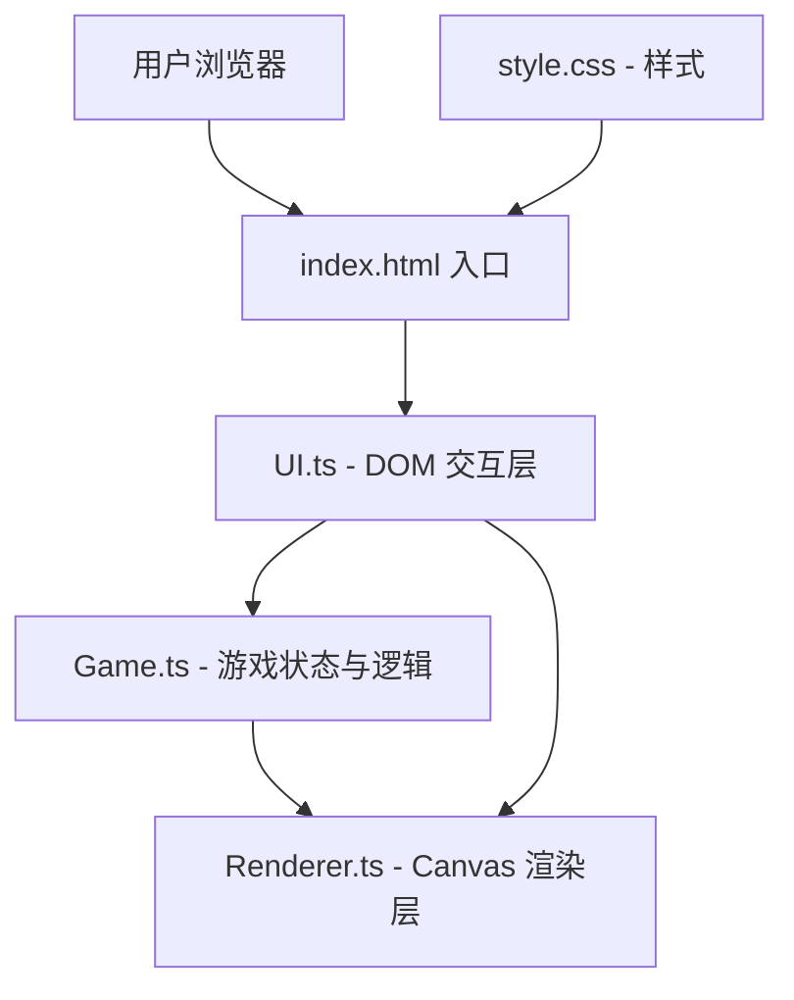

## 1. 架构设计



## 2. 技术栈说明

- 前端框架：**原生 HTML/CSS/TypeScript**（用户指定，不使用 React/Vue）
- 构建工具：Vite 5.x
- 语言：TypeScript 5.x（strict 模式）
- 渲染：Canvas 2D API（星图、粒子、熔炉动画）
- 无后端、无数据库，纯前端运行

## 3. 项目文件结构

```
.
├── package.json            # 依赖与脚本（vite、typescript，dev 端口 8080）
├── index.html              # 入口页面，包含 #game-container 与所有 UI 锚点
├── vite.config.js          # Vite 构建配置
├── tsconfig.json           # TS 配置（strict、esnext、dom）
├── src/
│   ├── main.ts             # 入口文件，初始化各模块
│   ├── Game.ts             # 游戏主控类：回合流程、资源池、熔炉状态
│   ├── Renderer.ts         # Canvas 渲染：星图、陨石、熔炉动画、粒子
│   ├── UI.ts               # DOM 层：面板显示、按钮事件、拖拽、日志
│   └── types.ts            # 共享类型定义
└── styles/
    └── main.css            # 全局样式、布局、动画
```

## 4. 核心数据模型与类型

```typescript
// 资源类型
type ResourceType = 'metal' | 'crystal' | 'gas';

// 资源物品
interface Resource {
  id: string;
  type: ResourceType;
}

// 陨石
interface Asteroid {
  id: string;
  x: number;
  y: number;
  radius: number;
  yields: { metal: number; crystal: number; gas: number };
}

// 熔炉配方
interface Recipe {
  id: string;
  name: string;
  inputs: Partial<Record<ResourceType, number>>;
  output: number; // 星尘块数量
  successRate: number; // 0~1
}

// 熔炼槽
interface SmeltSlot {
  resource: Resource | null;
}

// 飞船状态
interface ShipState {
  fuel: number;       // 当前燃料
  maxFuel: number;    // 燃料上限
  armor: number;      // 当前护甲
  maxArmor: number;   // 护甲上限
  cargo: Resource[];  // 货舱资源
  cargoMax: number;   // 货舱上限
  stardust: number;   // 星尘块
  x: number;          // 飞船星图坐标 X
  y: number;          // 飞船星图坐标 Y
  hasDecomposer: boolean; // 高级分解器
}

// 游戏状态
type GamePhase = 'playing' | 'smelting' | 'flying' | 'gameover';

// 日志条目
interface LogEntry {
  id: string;
  timestamp: number;
  message: string;
}
```

## 5. 模块职责

### Game.ts
- `startTurn()` — 回合开始，消耗燃料
- `collectAsteroid(asteroidId)` — 采集陨石资源
- `flyTo(targetX, targetY, onComplete)` — 飞行动画调度
- `smelt()` — 执行熔炼，按配方匹配与成功率判定
- `exchange(shopItemId)` — 空间站兑换

### Renderer.ts
- `render(state)` — 每帧渲染：星空背景、陨石、飞船、尾迹、熔炉粒子
- `startSmeltAnimation(result, onComplete)` — 熔炉抽奖/火焰/爆炸动画
- `startShake()` — 失败震屏效果
- `spawnParticles(type, x, y)` — 发射粒子（尾迹、金光、碎片）

### UI.ts
- `bindEvents(game, renderer)` — 绑定所有 DOM 事件
- `updatePanels(state)` — 更新圆环进度条、数字、货舱图标
- `appendLog(message)` — 追加日志
- `setupDragDrop()` — 拖拽资源到熔炼槽
- `openStation()` / `closeStation()` — 空间站弹窗
