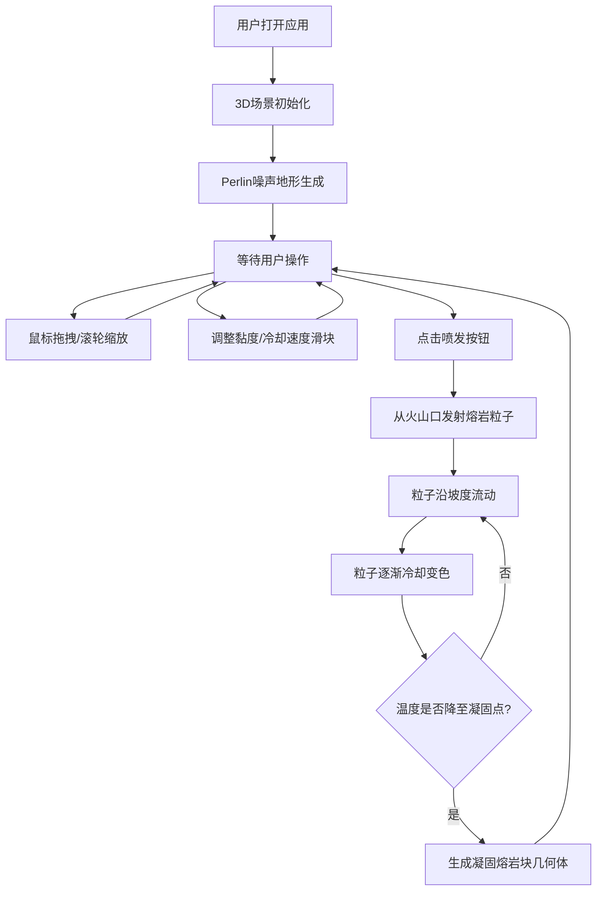

## 1. 产品概述

本项目是一个基于Three.js的3D交互可视化应用，用于模拟火山熔岩流在地表扩散与冷却凝固的过程。主要面向地质爱好者和学生，帮助他们直观理解火山熔岩流动的动力学特性，包括黏度、坡度影响、冷却速度与凝固形态变化等。

## 2. 核心功能

### 2.1 功能模块

1. **3D地形场景**：基于Perlin噪声生成500x500单位的起伏地形，包含丘陵和谷地
2. **熔岩喷发系统**：从中央火山口发射至少2000个熔岩粒子，沿地形坡度流动
3. **参数控制面板**：提供黏度和冷却速度两个滑块，实时调整熔岩行为
4. **冷却凝固系统**：粒子颜色随温度渐变，凝固后形成不规则几何体保留流路痕迹
5. **视角控制系统**：鼠标拖拽旋转视角，滚轮缩放，支持全景和局部观察

### 2.2 页面详情

| 页面名称 | 模块名称 | 功能描述 |
|---------|---------|---------|
| 主页面 | 3D渲染区域 | 全屏Canvas展示3D地形和熔岩粒子模拟 |
| 主页面 | 左侧控制面板 | 喷发按钮、黏度滑块、冷却速度滑块、参数说明 |
| 主页面 | 火星特效 | 喷发时黄色小点粒子随机飘散 |
| 主页面 | 凝固熔岩块 | 粒子冷却后生成的不规则几何体累积展示流路 |

## 3. 核心流程

用户打开应用后，看到预设的3D地形场景。用户可以通过鼠标拖拽旋转视角、滚轮缩放观察地形。点击"喷发"按钮后，熔岩从中央火山口开始喷发，粒子沿地形向下流动，同时逐渐冷却变色。用户可以在喷发过程中或喷发前调整黏度和冷却速度参数，下一次喷发将应用新参数。凝固的熔岩块永久保留在场景中，用户可观察整个熔岩流的扩展历史。

## 4. 用户界面设计

### 4.1 设计风格

- **主色调**：深空黑色(#0A0A0A)作为背景
- **熔岩色彩**：亮红色(#FF4500)→暗红色(#8B0000)→灰黑色(#2F2F2F)渐变
- **面板风格**：磨砂玻璃效果，背景rgba(20,20,20,0.8)，白色边框20%透明度，圆角
- **交互效果**：控件悬停放大、点击脉冲动画

### 4.2 页面设计概述

| 页面名称 | 模块名称 | UI元素 |
|---------|---------|--------|
| 主页面 | 3D渲染区 | 全屏Canvas、低多边形半透明网格地形、发光熔岩粒子、拖尾光晕、火星特效 |
| 主页面 | 控制面板 | 固定宽度280px、左侧悬浮、喷发按钮(熔岩红色调)、两个滑块、参数标签、数值显示 |

### 4.3 响应式设计

- 桌面端优先，适配1280x720及以上分辨率
- 控制面板固定宽度，使用鼠标交互
- Canvas自适应窗口大小

### 4.4 3D场景指导

- **环境**：深空黑色背景，营造科幻氛围
- **光照**：环境光+方向光，突出地形起伏和熔岩发光效果
- **相机**：PerspectiveCamera，配合OrbitControls实现自由视角
- **材质**：地形使用低多边形半透明网格材质，粒子使用自定义发光材质
- **特效**：粒子拖尾光晕使用Points配合动态透明度实现
