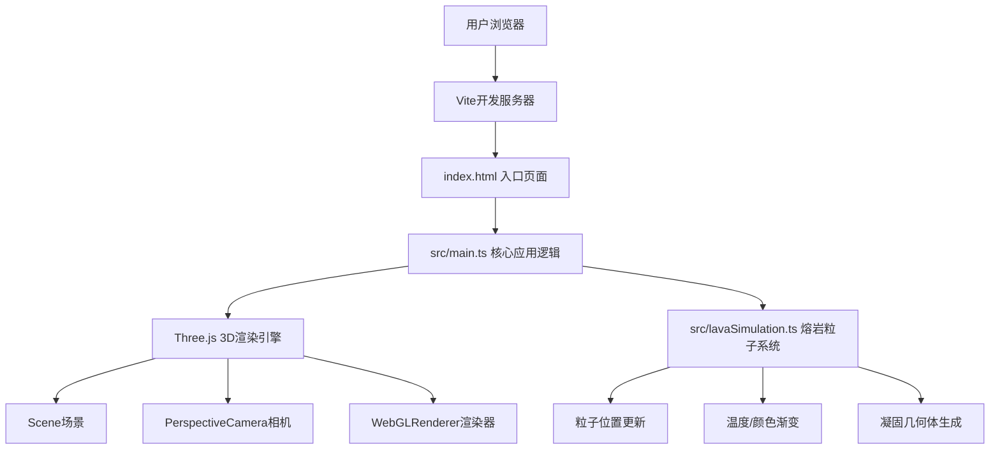

## 1. 架构设计



## 2. 技术选型说明

- **前端框架**：原生TypeScript + Three.js (用户明确指定不使用React/Vue)
- **构建工具**：Vite 5.x，提供快速的开发服务器和构建能力
- **3D引擎**：Three.js 0.160+，包含OrbitControls控制器
- **类型支持**：TypeScript严格模式，@types/three提供类型定义
- **UI实现**：原生HTML + CSS3实现磨砂玻璃面板和控件

## 3. 文件结构定义

| 文件路径 | 用途 |
|---------|------|
| package.json | 项目依赖和脚本配置 |
| vite.config.js | Vite构建配置 |
| tsconfig.json | TypeScript编译配置(严格模式，ESNext模块) |
| index.html | 入口页面，包含Canvas容器和UI面板 |
| src/main.ts | 核心逻辑：场景初始化、地形生成、UI绑定、喷发控制 |
| src/lavaSimulation.ts | 熔岩粒子系统：粒子管理、物理模拟、冷却凝固 |

## 4. 核心模块设计

### 4.1 LavaSimulation 类

```typescript
interface LavaParticle {
  position: THREE.Vector3;
  velocity: THREE.Vector3;
  temperature: number; // 0.0 (凝固) - 1.0 (最高温)
  viscosity: number;
  active: boolean;
  solidified: boolean;
}

class LavaSimulation {
  constructor(scene: THREE.Scene, terrain: TerrainData);
  setViscosity(value: number): void;
  setCoolingRate(value: number): void;
  erupt(count: number): void;
  update(deltaTime: number): void;
  dispose(): void;
}
```

### 4.2 地形生成模块

- Perlin噪声算法实现平滑起伏地形
- 500x500单位尺寸，高度采样分辨率64x64或更高
- 中央20单位半径的圆形火山口凹陷
- 提供高度查询函数：`getHeight(x: number, z: number): number`
- 提供坡度查询函数：`getSlope(x: number, z: number): THREE.Vector3`

## 5. 性能优化策略

1. **粒子系统优化**：使用BufferGeometry存储所有粒子数据，单次Draw Call渲染
2. **帧率保障**：目标30fps+，粒子数2000时稳定运行
3. **凝固几何体合并**：可考虑使用InstancedMesh减少Draw Call
4. **物理模拟降频**：粒子位置更新可按固定时间步长执行
5. **视锥体剔除**：Three.js内置优化
