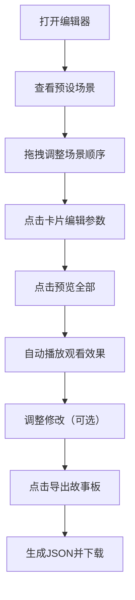

## 1. 产品概述

短视频故事板编辑器是一款面向内容创作者的可视化工具，让用户能够像导演剪片一样，通过拖拽时间线上的场景卡片来编排短视频叙事流程。产品解决了传统视频剪辑工具学习成本高、操作复杂的问题，提供直观的拖拽式交互体验。

- 目标用户：短视频创作者、自媒体运营者、影视前期策划人员
- 核心价值：降低故事板制作门槛，提升创意编排效率

## 2. 核心功能

### 2.1 用户角色

| 角色 | 注册方式 | 核心权限 |
|------|----------|----------|
| 创作者 | 无需注册，本地使用 | 创建、编辑、预览、导出故事板 |

### 2.2 功能模块

1. **主编辑器页面**：视频预览区、时间线拖拽区、场景编辑面板
2. **预览播放系统**：顺序自动播放、过渡动画、进度高亮
3. **场景编辑系统**：标题修改、过渡选择、时长设置、封面上传
4. **导出报告系统**：JSON格式报告生成、文件下载、模态框展示

### 2.3 页面详情

| 页面名称 | 模块名称 | 功能描述 |
|----------|----------|----------|
| 主编辑器 | 预览区 | 16:9比例深色预览区，展示当前场景，支持交叉淡入淡出过渡 |
| 主编辑器 | 时间线 | 水平时间线，场景卡片拖拽排序，SVG连接线动画，滚轮滚动，拖拽平移 |
| 主编辑器 | 编辑面板 | 右侧滑入面板，编辑场景标题、过渡效果、时长、封面图 |
| 主编辑器 | 控制区 | 预览全部按钮、导出故事板按钮 |
| 导出模态框 | 报告展示 | 遮罩层居中动画，JSON摘要展示，自动下载文件 |

## 3. 核心流程

用户打开编辑器后，默认展示6个预设场景卡片。用户可通过拖拽调整场景顺序，点击卡片打开编辑面板修改参数，点击预览全部按钮观看自动播放效果，最后导出JSON格式的故事板报告。

## 4. 用户界面设计

### 4.1 设计风格

- 主色调：#1A1A2E（深紫蓝），辅色：#16213E（深海军蓝）
- 强调色：#E8A87C（暖金色）、#F5F5F5（浅灰白）
- 按钮样式：圆角矩形，悬停时放大1.05倍并加深阴影
- 字体：现代无衬线字体，标题加粗，正文常规
- 布局：顶部预览区 + 中部时间线 + 右侧滑入编辑面板
- 图标风格：简洁线性图标，与过渡效果一一对应

### 4.2 页面设计概述

| 页面名称 | 模块名称 | UI元素 |
|----------|----------|----------|
| 主编辑器 | 预览区 | 16:9容器、深色背景、场景标题、过渡动画层、播放状态指示 |
| 主编辑器 | 时间线 | 水平滚动容器、场景卡片（缩略图+标题+时长+色标）、灰色连接线、拖拽半透明效果 |
| 主编辑器 | 编辑面板 | 右侧滑入（0.3s淡入）、标题输入框、过渡选择器（4种带图标）、时长滑块（1-10s）、封面上传区 |
| 主编辑器 | 控制按钮 | 预览全部按钮、导出按钮、金色/浅灰配色、悬停放大效果 |
| 导出模态框 | 报告窗口 | 半透明遮罩、居中弹出动画、JSON代码展示区、确认按钮 |

### 4.3 响应式设计

- 桌面优先设计，断点768px
- 移动端：单列布局，预览区在上，时间线在中间，编辑面板改为底部全屏滑出
- 触摸优化：增大触摸区域，支持触摸拖拽

### 4.4 动画与交互

- 卡片拖拽：半透明跟随鼠标，释放弹性动画（cubic-bezier(0.34, 1.56, 0.64, 1)）
- 连接线：SVG路径插值流畅动画
- 场景切换：0.5秒交叉淡入淡出
- 面板滑入：0.3秒淡入+位移动画
- 模态框：遮罩淡入+内容缩放居中
- 所有可交互元素悬停：scale(1.05) + 阴影加深
