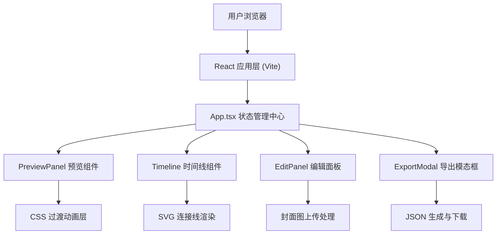

## 1. 架构设计



## 2. 技术描述

- 前端框架：React 18 + TypeScript 5
- 构建工具：Vite 5
- 样式方案：原生 CSS（使用 CSS 变量管理主题色）
- 动画方案：CSS Transitions + Animations + 自定义 requestAnimationFrame
- 拖拽实现：原生 HTML5 Drag & Drop API + Mouse 事件模拟
- 状态管理：React useState/useReducer（轻量级，无需额外状态库）
- 后端：无（纯前端应用，数据保存在内存中）
- 数据库：无（导出为本地 JSON 文件）

## 3. 路由定义

| 路由 | 用途 |
|------|------|
| / | 主编辑器页面（单页应用，唯一页面） |

## 4. 数据模型

### 4.1 TypeScript 类型定义

```typescript
type TransitionType = 'fade' | 'slide' | 'scale' | 'rotate';

interface Scene {
  id: string;
  title: string;
  duration: number; // 1-10秒
  transition: TransitionType;
  coverImage: string | null; // base64或null
  colorTag: string; // 卡片色标
}

interface StoryboardExport {
  version: string;
  exportTime: string;
  totalScenes: number;
  totalDuration: number;
  scenes: {
    order: number;
    title: string;
    duration: number;
    transition: TransitionType;
    hasCoverImage: boolean;
  }[];
}
```

### 4.2 初始数据

应用启动时预设6个场景卡片，每个场景包含：
- 唯一ID（uuid v4 简化版）
- 默认标题（场景1-场景6）
- 默认时长（3秒）
- 默认过渡效果（fade淡入）
- 预设色标标签（6种不同颜色）

## 5. 文件结构

```
auto31/
├── package.json
├── vite.config.js
├── tsconfig.json
├── index.html
└── src/
    ├── App.tsx              # 主组件，状态管理，整体布局
    ├── types.ts             # TypeScript 类型定义
    └── components/
        ├── Timeline.tsx     # 时间线：卡片渲染、拖拽排序、SVG连接线
        ├── PreviewPanel.tsx # 预览区：场景展示、播放控制、过渡动画
        ├── EditPanel.tsx    # 编辑面板：标题、过渡、时长、封面上传
        └── ExportModal.tsx  # 导出模态框：JSON报告、下载
```

## 6. 核心技术实现要点

### 6.1 拖拽排序
- 使用 Mouse 事件（mousedown/mousemove/mouseup）实现更精细的拖拽控制
- 拖拽元素使用 fixed 定位跟随鼠标，设置 opacity: 0.8
- 实时计算拖拽位置与其他卡片的碰撞检测，确定插入位置
- 释放时使用 CSS cubic-bezier(0.34, 1.56, 0.64, 1) 弹性动画归位

### 6.2 SVG 连接线动画
- 使用 SVG `<path>` 绘制卡片之间的贝塞尔曲线
- 卡片位置变化时，通过 requestAnimationFrame 插值更新路径 d 属性
- 路径动画时长 300ms，使用线性插值平滑过渡

### 6.3 预览播放
- 使用 setInterval 驱动场景切换计时器
- 当前场景索引状态驱动预览区内容更新
- 切换时通过两个绝对定位的叠加层实现交叉淡入淡出（opacity 0→1 / 1→0）
- 时间线高亮当前卡片：自动 scrollIntoView({ behavior: 'smooth', block: 'nearest' })

### 6.4 响应式布局
- CSS 媒体查询 @media (max-width: 768px)
- 桌面：flex 横向布局（预览区+时间线垂直堆叠，编辑面板绝对定位右侧）
- 移动端：单列布局，编辑面板改为 fixed bottom 全屏滑出

### 6.5 性能优化
- 拖拽过程中使用 will-change: transform 提升渲染性能
- requestAnimationFrame 节流处理高频事件
- React.memo 包装子组件避免不必要的重渲染
- 封面图压缩处理（canvas 缩放到合理尺寸后转 base64）
