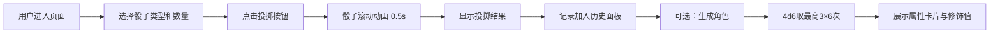

## 1. 产品概述

龙与地下城（D&D）虚拟骰子系统与角色生成器，为桌面角色扮演游戏玩家提供浏览器端的骰子投掷和角色属性自动生成工具。

- 核心功能：支持6种标准多面骰子（d4/d6/d8/d10/d12/d20）的动画投掷、4d6取最高3规则的6项角色属性生成、投掷历史记录管理
- 目标用户：D&D及其他TRPG玩家、地下城主（DM）
- 产品价值：替代实体骰子，提供便捷、公正、可视化的随机数生成体验

## 2. 核心功能

### 2.1 用户角色

| 角色 | 注册方式 | 核心权限 |
|------|----------|----------|
| 玩家 | 无需注册，直接使用 | 投掷骰子、生成角色、查看和管理历史记录 |

### 2.2 功能模块

1. **骰子投掷区**：6种骰子类型按钮、数量选择、动画投掷、结果展示
2. **角色生成区**：一键生成6项属性、属性值颜色渐变显示、修饰值计算
3. **历史记录面板**：最近20次投掷记录、时间倒序排列、单条删除功能
4. **顶部信息栏**：应用标题、总投掷次数统计

### 2.3 页面详情

| 页面名称 | 模块名称 | 功能描述 |
|----------|----------|----------|
| 主页面 | 顶部信息栏 | 展示奇幻风格标题"命运骰子"，显示累计投掷次数 |
| 主页面 | 骰子选择区 | 6个骰子按钮（d4/d6/d8/d10/d12/d20），数量选择器（1-10），投掷按钮 |
| 主页面 | 结果展示区 | 骰子滚动弹跳动画（0.5秒），最终点数红色大字显示，当前投掷明细 |
| 主页面 | 角色生成区 | "生成角色"按钮，6项属性卡片网格（力量/敏捷/体质/智力/感知/魅力），属性分布图 |
| 主页面 | 历史记录面板 | 可滚动列表，每条记录显示时间、骰子类型、结果明细，删除按钮 |

## 3. 核心流程

用户进入页面 → 选择骰子类型和数量 → 点击投掷按钮 → 骰子动画播放（0.5秒）→ 显示结果并记录到历史 → 可选：点击生成角色 → 4d6规则生成6项属性 → 展示属性卡片和修饰值

## 4. 用户界面设计

### 4.1 设计风格

- **主色调**：羊皮纸米色 #F5E6C8（背景）、深棕色 #3E2C1C（文字）、木纹深棕 #3D2817（页面外层背景）
- **点缀色**：金色 #D4AF37（高亮、高属性值）、蓝色 #4A6FA5（中等属性值）、灰色 #808080（低属性值）、红色 #C41E3A（骰子点数）
- **按钮风格**：古朴圆角矩形，羊皮纸质感，悬停时上浮+阴影增强+从左到右的白色高光扫过动画
- **字体**：标题和按钮使用 Google Fonts 的 Almendra（奇幻衬线字体），正文使用 Georgia 衬线字体
- **布局风格**：三段式布局（顶部信息栏 / 中部左右分栏 / 底部历史面板），桌面端横向布局，移动端（<768px）纵向单列
- **视觉效果**：羊皮纸区域带阴影和卷边阴影、木质纹理背景（CSS渐变模拟）、骰子按钮悬停上浮、属性卡片悬停 scale 1.02

### 4.2 页面设计概览

| 页面名称 | 模块名称 | UI元素 |
|----------|----------|---------|
| 主页面 | 顶部信息栏 | Almendra大标题、投掷计数器数字、古朴分割线 |
| 主页面 | 骰子选择区 | 6个骰子按钮（各显示骰子面数）、数量加减控件、投掷主按钮 |
| 主页面 | 结果展示区 | 大型骰子视觉展示、红色大字点数、投掷明细列表 |
| 主页面 | 角色生成区 | 生成按钮、2×3属性卡片网格、每个卡片含属性名（金色描边）、数值（背景渐变）、修饰值 |
| 主页面 | 历史记录面板 | 带滚动条容器、每条记录含彩色骰子图标、时间戳、类型/数量、结果明细、删除按钮 |

### 4.3 响应式设计

- **桌面端（≥768px）**：三段式布局，中部左右分栏（骰子区左/结果区右），各占50%宽度
- **移动端（<768px）**：单列纵向布局，所有模块宽度100%自适应，字号适当缩小，触摸目标尺寸≥44px

### 4.4 动效规范

- 骰子滚动动画：0.5秒，包含旋转（360°+）、上下弹跳、左右晃动，使用CSS keyframes实现，保持30fps以上
- 按钮悬停效果：transition 0.2s ease，translateY(-2px)，box-shadow增强
- 高光扫过效果：伪元素从左到右平移，0.6秒完成，opacity 0→0.4→0
- 属性卡片悬停：transform scale(1.02)，transition 0.2s ease
