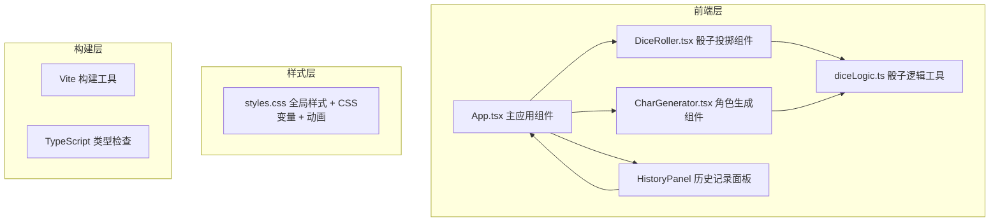
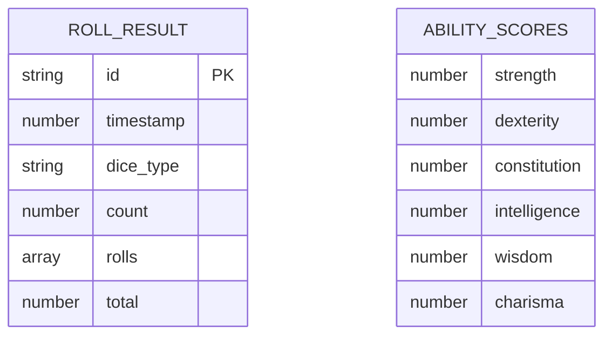

## 1. 架构设计



## 2. 技术说明

- **前端框架**：React 18 + TypeScript
- **构建工具**：Vite 5
- **状态管理**：React useState/useReducer（轻量场景，无需额外状态库）
- **样式方案**：原生CSS + CSS变量，不引入Tailwind（用户指定styles.css）
- **字体**：Google Fonts Almendra（通过index.html引入）
- **后端**：无，纯前端应用
- **数据库**：无，历史记录保存在React状态中（内存存储）

## 3. 路由定义

| 路由 | 用途 |
|------|------|
| / | 单页应用，无路由 |

本项目为单页应用（SPA），不涉及路由跳转。

## 4. API定义

无后端API。所有逻辑在前端完成：

```typescript
// diceLogic.ts 导出类型
export type DiceType = 'd4' | 'd6' | 'd8' | 'd10' | 'd12' | 'd20';

export interface DiceRoll {
  type: DiceType;
  sides: number;
  value: number;
}

export interface RollResult {
  id: string;
  timestamp: number;
  type: DiceType;
  count: number;
  rolls: DiceRoll[];
  total: number;
}

export interface AbilityScores {
  strength: number;
  dexterity: number;
  constitution: number;
  intelligence: number;
  wisdom: number;
  charisma: number;
}

// 工具函数签名
export function rollDice(sides: number): number;
export function rollMultiple(type: DiceType, count: number): DiceRoll[];
export function rollAbilityScore(): number; // 4d6 drop lowest
export function generateAbilityScores(): AbilityScores;
export function getModifier(score: number): number;
export function getDiceSides(type: DiceType): number;
```

## 5. 数据模型

### 5.1 数据模型定义



### 5.2 状态管理

应用使用React Hooks管理以下状态（在App.tsx中）：

- `rollHistory: RollResult[]` - 投掷历史记录（最多20条）
- `currentRoll: RollResult | null` - 当前正在展示的投掷结果
- `isRolling: boolean` - 骰子动画播放状态
- `abilityScores: AbilityScores | null` - 当前生成的角色属性
- `rollCount: number` - 总投掷次数

## 6. 文件结构

```
auto32/
├── .trae/documents/          # 文档目录
│   ├── PRD.md
│   └── TECHNICAL_ARCHITECTURE.md
├── index.html                 # 入口HTML，引入Almendra字体
├── package.json               # 项目依赖和脚本
├── tsconfig.json              # TypeScript严格模式配置
├── vite.config.js             # Vite构建配置
└── src/
    ├── App.tsx                # 主应用组件（布局+状态协调）
    ├── styles.css             # 全局样式、主题变量、动画
    ├── components/
    │   ├── DiceRoller.tsx     # 骰子投掷组件
    │   └── CharGenerator.tsx  # 角色生成组件
    └── utils/
        └── diceLogic.ts       # 骰子逻辑工具函数
```

## 7. 性能要求

- 骰子滚动动画：使用CSS transforms和opacity实现，避免重排重绘，确保30fps以上
- 角色属性生成：纯同步计算，目标<10ms（远低于100ms要求）
- 历史记录渲染：固定20条，使用标准React列表渲染，无虚拟滚动需求
- 构建产物：单页应用，Vite原生Tree Shaking，目标gzip后<100KB
