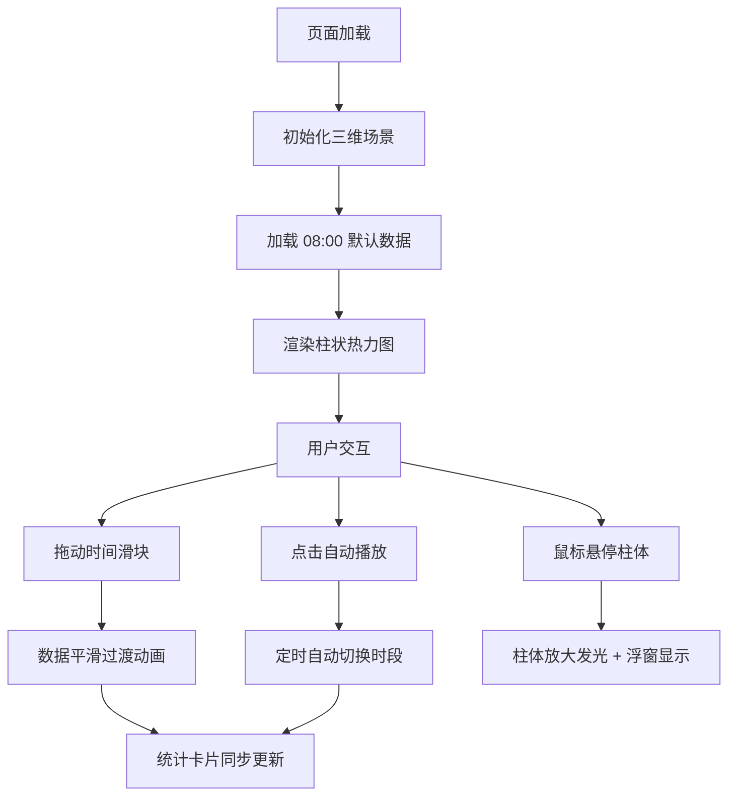

## 1. 产品概述

本项目是一个基于 Three.js 的三维热力图室内人流密度分析可视化系统，模拟大型商场内不同功能区域（入口、电梯、收银台、休息区等）在一天中不同时段的人流密度变化趋势。通过 3D 柱状热力图直观展示人流分布，帮助商场运营方进行客流分析和资源调配。

## 2. 核心功能

### 2.1 功能模块

1. **三维场景主视图**：20x20 单位商场俯视平面图，包含 6 个以上功能区域，3D 柱状热力图
2. **时间交互模块**：底部时间滑块（08:00-22:00，步长1小时）、自动播放功能
3. **实时统计模块**：左上角总人流量卡片、右下角区域排名 Top3 卡片
4. **悬停交互模块**：柱体放大发光、信息浮窗显示详情

### 2.2 页面详情

| 页面名称 | 模块名称 | 功能描述 |
|-----------|-------------|---------------------|
| 主页面 | 三维场景 | 20x20 商场平面，6+ 功能区半透明标识，3D 柱状体展示人流密度 |
| 主页面 | 时间滑块 | 范围 08:00-22:00，步长1小时，平滑过渡动画 |
| 主页面 | 统计卡片 | 左上角总人流量，右下角 Top3 区域排名 |
| 主页面 | 图例面板 | 左侧固定面板，密度区间颜色图例 + 自动播放按钮 |
| 主页面 | 悬停浮窗 | 毛玻璃效果，显示区域名称、时段、人流量、环比变化 |

## 3. 核心流程

用户进入页面后，默认展示 08:00 的人流密度数据。用户可通过以下方式交互：
1. 拖动底部时间滑块切换时段 → 柱体高度、颜色平滑动画过渡 → 统计卡片实时更新
2. 点击左侧"自动播放"按钮 → 滑块自动从 08:00 滚动到 22:00，每 2 秒切换一次
3. 鼠标悬停任意柱体 → 柱体放大 1.2 倍 + 白色发光 + 弹出信息浮窗

## 4. 用户界面设计

### 4.1 设计风格
- **整体色调**：暗色科技风，背景 `#0B0C10`
- **柱体渐变色**：低密度蓝色 `#00BFFF` → 中密度黄色 `#FFD700` → 高密度红色 `#FF4500`
- **字体效果**：顶部标题微光 `text-shadow` 效果
- **面板样式**：深灰半透明背景，圆角边框，毛玻璃效果 `backdrop-filter: blur(10px)`
- **交互反馈**：悬停缩放 1.2 倍，点击变色，弹性缓动动画 0.6 秒

### 4.2 页面设计

| 模块名称 | UI 元素 | 布局描述 |
|-----------|-------------|-------------|
| 顶部标题 | 微光字体标题 | 页面顶部居中，text-shadow 发光效果 |
| 左侧图例面板 | 颜色图例 + 自动播放按钮 | 左侧固定，深灰半透明，悬停缩放 |
| 三维场景 | Three.js Canvas | 全屏背景，z-index: 0 |
| 统计卡片（左上） | 总人流量数据 | 半透明毛玻璃卡片，圆角 |
| 统计卡片（右下） | Top3 区域排名 | 半透明毛玻璃卡片，圆角 |
| 底部时间滑块 | range 滑块 + 时间刻度 | 页面底部居中，跨页宽度 80% |
| 悬停浮窗 | 区域详情信息 | 跟随鼠标，毛玻璃背景，圆角边框 |

### 4.3 响应式设计
- Desktop-first 设计，全屏布局
- 三维场景自适应窗口大小
- UI 面板使用固定定位和百分比宽度

### 4.4 3D 场景设计
- **环境氛围**：暗色背景，轻微雾效增加空间感
- **光照配置**：环境光 + 方向光 + 点光源，突出柱体立体感
- **相机设置**：PerspectiveCamera，45° 俯视角度，OrbitControls 可旋转缩放
- **柱体效果**：圆角顶部，MeshPhongMaterial，高光反射
- **动画系统**：柱体高度、颜色弹性缓动（elastic easing），悬停放大发光
