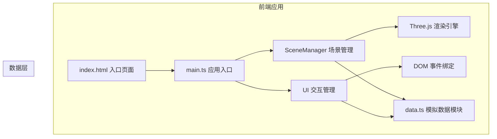

## 1. 架构设计



## 2. 技术选型

- **前端框架**：原生 TypeScript + Three.js（无需 React/Vue，用户指定纯 Three.js 方案）
- **构建工具**：Vite 5.x
- **3D 引擎**：Three.js 最新版
- **类型定义**：@types/three
- **开发语言**：TypeScript（严格模式）

## 3. 文件结构

```
.
├── package.json
├── vite.config.js
├── tsconfig.json
├── index.html
└── src/
    ├── main.ts          # 应用入口，组装各模块
    ├── data.ts          # 模拟人流密度数据
    ├── sceneManager.ts  # Three.js 场景管理
    └── UI.ts            # DOM UI 交互管理
```

## 4. 模块接口定义

### 4.1 data.ts

```typescript
// 区域定义
interface Zone {
  id: string;
  name: string;
  position: { x: number; z: number };
  size: { width: number; depth: number };
  color: string;
}

// 单时段单区域数据
interface ZoneDensity {
  zoneId: string;
  density: number; // 0-100
}

// 时段数据
interface HourData {
  hour: number; // 8-22
  zones: ZoneDensity[];
}

// 导出接口
export const ZONES: Zone[];
export function getDataByHour(hour: number): HourData | undefined;
export function getAllData(): HourData[];
export function getDensityColor(density: number): string;
```

### 4.2 sceneManager.ts

```typescript
export class SceneManager {
  constructor(container: HTMLElement);
  public init(): void;
  public updateByHour(hour: number, animate?: boolean): void;
  public onHover(callback: (zone: Zone | null, screenPos: { x: number; y: number } | null) => void): void;
  public resize(): void;
  public dispose(): void;
}
```

### 4.3 UI.ts

```typescript
export class UIManager {
  constructor(options: {
    onHourChange: (hour: number) => void;
    onAutoPlayToggle: (playing: boolean) => void;
  });
  public init(): void;
  public updateStats(hour: number, data: HourData): void;
  public showTooltip(info: TooltipInfo | null, pos?: { x: number; y: number }): void;
  public setAutoPlayState(playing: boolean): void;
}
```

## 5. 性能优化策略

- 柱体几何体复用，避免重复创建
- 颜色、高度通过 material 和 scale 动画更新，而非重建 mesh
- 使用 requestAnimationFrame 统一动画循环
- Raycaster 只在鼠标移动时触发检测
- 场景中控制光源数量，减少渲染开销
- 目标帧率 ≥ 45fps
