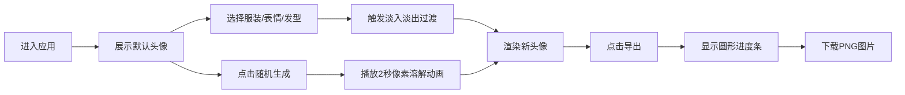

## 1. 产品概述
AI辅助的手绘风格人物头像生成器，面向插画师、社交媒体用户和角色设计师，提供快速批量生成多样化人物肖像变体的工具。
- 核心价值：将手绘风格头像通过参数化方式快速生成不同服装、表情、发型的组合，用于社交媒体头像、角色设定集等场景
- 目标用户：插画师、内容创作者、社交媒体运营者、游戏/动画角色设计师

## 2. 核心功能

### 2.1 用户角色
无需用户注册登录，单页面Web应用，所有用户直接使用全部功能。

### 2.2 功能模块
1. **头像预览区**：300×300 Canvas画布，实时渲染手绘风格头像，支持过渡动画
2. **控制面板**：特征选择下拉菜单、随机生成、导出、颜色自定义
3. **导出系统**：PNG图片导出，带进度指示器

### 2.3 页面详情
| 页面名称 | 模块名称 | 功能描述 |
|---------|---------|---------|
| 主页 | 头像预览区 | 300×300像素Canvas绘制手绘风格人脸肖像，正面无性别倾向，肤色、眼睛、眉毛、鼻子、嘴巴、头发、服装按参数绘制 |
| 主页 | 控制面板-特征选择 | 服装下拉菜单（衬衫/T恤/卫衣/连衣裙）、表情下拉菜单（微笑/惊讶/撇嘴/眨眼）、发型下拉菜单（短发/马尾/卷发/光头） |
| 主页 | 控制面板-随机生成 | 一键随机选取所有特征组合，播放2秒像素溶解动画 |
| 主页 | 控制面板-颜色选择器 | 肤色渐变选择、头发预设色选择，实时更新预览 |
| 主页 | 控制面板-导出 | 导出300×300 PNG图片，显示圆形进度条（1秒内完成0-100%） |

## 3. 核心流程
用户进入应用后，默认展示一张基础手绘头像。通过右侧控制面板选择服装、表情、发型或颜色，左侧预览区实时更新（0.5秒淡入淡出过渡）。点击随机生成按钮触发像素溶解动画并生成全新组合。满意后点击导出按钮下载PNG图片。

## 4. 用户界面设计
### 4.1 设计风格
- **主色调**：深色主题，背景#2C3E50，面板#34495E，文字#ECF0F1，描边#7F8C8D
- **强调色**：肤色#F5D0B5、头发棕色#8B4513、服装浅蓝#87CEEB、嘴唇#C0392B、眼睛深棕#2C1810
- **按钮风格**：圆角矩形，悬停0.3秒缩放进阶动画
- **颜色选择器**：圆形色块（20px直径），点击时0.1秒脉冲闪烁
- **动画效果**：0.5秒淡入淡出过渡、2秒像素溶解动画、1秒圆形进度条
- **手绘风格**：所有Canvas绘制采用手绘线条（贝塞尔曲线模拟笔触抖动）和柔和阴影

### 4.2 页面设计概览
| 页面名称 | 模块名称 | UI元素 |
|---------|---------|--------|
| 主页 | 布局容器 | 左右两栏（左60%预览区，右40%控制面板），移动端自动切换上下布局 |
| 主页 | 头像预览区 | Canvas 300×300居中，浅色描边边框，头像居中绘制 |
| 主页 | 控制面板 | 分组标题+下拉菜单+随机按钮+颜色选择器+导出按钮，滑动动画入场 |
| 主页 | 圆形进度条 | 导出时覆盖在Canvas上，SVG绘制 |

### 4.3 响应式设计
- 桌面端（≥768px）：左右两栏布局，左侧60%预览区，右侧40%控制面板
- 移动端（<768px）：上下布局，预览区在上，控制面板在下，所有元素自适应宽度不溢出
- 触控优化：按钮最小44px触控区域，下拉菜单适配移动端选择器

### 4.4 性能指标
- 特征切换到Canvas重绘完成响应时间 ≤ 100ms（不含动画过渡）
- 随机生成动画帧率 ≥ 20fps，页面不卡顿
- 所有动画使用requestAnimationFrame确保流畅性
