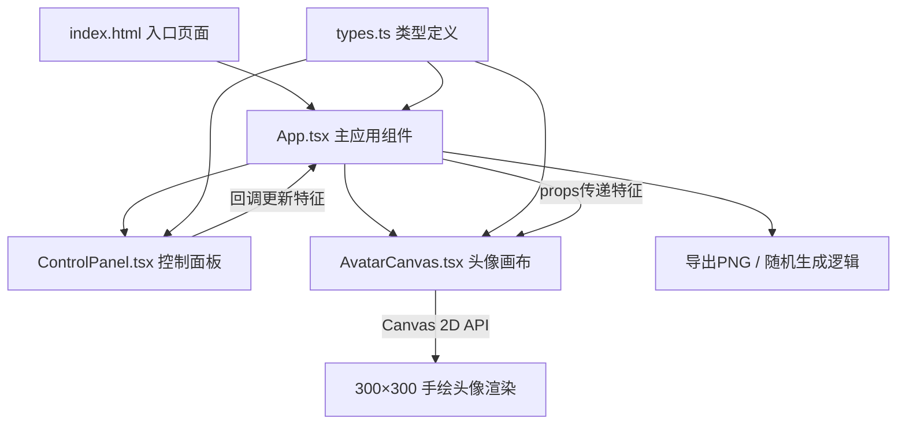

## 1. 架构设计



## 2. 技术描述
- **前端**：React@18 + TypeScript@5 + Vite@5
- **UI 方案**：原生 CSS（使用 CSS Variables 管理主题色），不引入额外 UI 库以保持轻量
- **状态管理**：React useState/useReducer（单页面应用无需额外状态库）
- **动画方案**：requestAnimationFrame + Canvas 像素操作 + CSS transition
- **构建工具**：Vite 5，入口 index.html
- **无后端**：纯前端单页应用，所有逻辑在浏览器端执行

### 依赖列表
```json
{
  "react": "^18.2.0",
  "react-dom": "^18.2.0",
  "typescript": "^5.3.0",
  "@types/react": "^18.2.0",
  "@types/react-dom": "^18.2.0",
  "vite": "^5.0.0",
  "@vitejs/plugin-react": "^4.2.0"
}
```

## 3. 路由定义
单页面应用，无需路由。
| 路由 | 用途 |
|------|------|
| / | 主应用页面 |

## 4. 文件结构与调用关系

```
project-root/
├── index.html              # 入口页面，挂载点 #root，深色背景全屏容器
├── package.json            # 依赖与脚本（npm run dev）
├── vite.config.js          # Vite 基础配置，入口 index.html
├── tsconfig.json           # TypeScript 严格模式，module: ESNext
└── src/
    ├── types.ts            # [基础层] 枚举/类型定义 → 被 App.tsx、AvatarCanvas.tsx、ControlPanel.tsx 引用
    ├── App.tsx             # [业务层] 全局状态管理 → 引用 types.ts，渲染 AvatarCanvas + ControlPanel
    └── components/
        ├── AvatarCanvas.tsx    # [渲染层] Canvas 绘制 → 引用 types.ts，接收 props: AvatarFeatures
        └── ControlPanel.tsx    # [交互层] 用户控制面板 → 引用 types.ts，触发回调 onFeaturesChange
```

**数据流向**：
1. 用户操作 ControlPanel → 触发回调函数 → App.tsx 更新 useState
2. App.tsx 将最新 AvatarFeatures 作为 props 传递给 AvatarCanvas
3. AvatarCanvas 检测 props 变化 → 调用 drawAvatar() 重新绘制 Canvas
4. 随机生成/导出由 App.tsx 统一管理，操作 AvatarCanvas 的 ref

## 5. 核心数据模型（types.ts）

```typescript
// 服装类型
export type ClothingType = 'shirt' | 'tshirt' | 'hoodie' | 'dress';

// 表情类型
export type ExpressionType = 'smile' | 'surprised' | 'pout' | 'wink';

// 发型类型
export type HairStyleType = 'short' | 'ponytail' | 'curly' | 'bald';

// 头发预设颜色
export const HAIR_COLORS = [
  '#8B4513', // 棕色（默认）
  '#1a1a1a', // 黑色
  '#D4A574', // 金色
  '#8B0000', // 深红
  '#696969', // 灰白
  '#9932CC', // 紫色
] as const;

// 肤色范围（用于渐变选择器）
export const SKIN_COLOR_RANGE = {
  start: '#F5D0B5', // 浅肤色（默认）
  end: '#8B5A2B',   // 深肤色
} as const;

// 头像完整特征
export interface AvatarFeatures {
  clothing: ClothingType;
  expression: ExpressionType;
  hairStyle: HairStyleType;
  skinColor: string;
  hairColor: string;
}

// 服装配置（颜色、纹理）
export interface ClothingConfig {
  baseColor: string;
  accentColor: string;
  pattern?: 'stripes' | 'dots' | 'solid';
}

export const CLOTHING_CONFIGS: Record<ClothingType, ClothingConfig> = {
  shirt:   { baseColor: '#87CEEB', accentColor: '#5DA8C9', pattern: 'solid' },
  tshirt:  { baseColor: '#E74C3C', accentColor: '#C0392B', pattern: 'solid' },
  hoodie:  { baseColor: '#2C3E50', accentColor: '#1A252F', pattern: 'solid' },
  dress:   { baseColor: '#9B59B6', accentColor: '#7D3C98', pattern: 'dots' },
};
```

## 6. 性能保证方案
- **Canvas 重绘优化**：仅在 AvatarFeatures 引用变化时重绘，使用 useMemo 缓存绘制参数
- **像素溶解动画**：离屏双 Canvas 缓冲，旧图像 ImageData 与新图像 ImageData 逐帧混合，requestAnimationFrame 调度
- **过渡动画**：CSS opacity 过渡处理淡入淡出，避免阻塞主线程
- **响应时间**：所有绘制逻辑同步执行，单帧绘制控制在 16ms 以内以达 60fps
