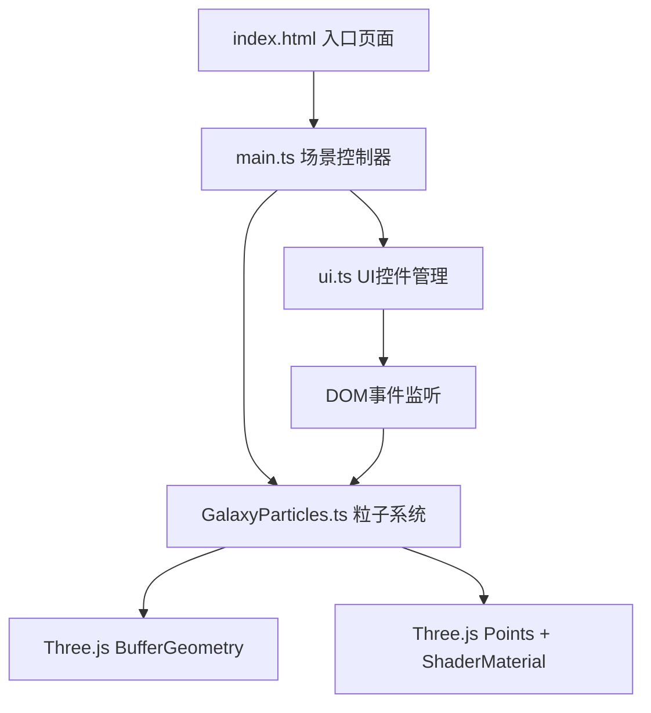

## 1. 架构设计



## 2. 技术描述
- **前端框架**：原生 TypeScript + Three.js（无React/Vue，按用户需求）
- **构建工具**：Vite 5.x
- **3D引擎**：Three.js r160+
- **类型定义**：@types/three
- **核心优化**：
  - BufferGeometry存储所有粒子属性（position, color, size, opacity, seed）
  - 自定义ShaderMaterial实现GPU级别的粒子动画
  - AdditiveBlending实现粒子发光叠加效果
  - 单Points对象渲染3000+粒子，保证30FPS以上

## 3. 文件结构

```
e:\solo\VersionFast\tasks\auto4\
├── package.json              # 项目依赖和脚本
├── vite.config.js            # Vite配置
├── tsconfig.json             # TypeScript配置
├── index.html                # 入口HTML
└── src/
    ├── main.ts               # 场景初始化、相机、渲染器、交互
    ├── GalaxyParticles.ts    # 粒子系统核心类
    └── ui.ts                 # UI控件创建与管理
```

## 4. 核心类定义

### 4.1 GalaxyParticles 类

```typescript
// 粒子形态枚举
enum GalaxyShape {
  SPIRAL = 'spiral',      // 旋涡星系
  GLOBULAR = 'globular',  // 球状星团
  RING = 'ring',          // 光环
  IRREGULAR = 'irregular' // 不规则星云
}

class GalaxyParticles {
  // 粒子数量
  public particleCount: number = 4000;
  
  // Three.js对象
  public points: THREE.Points;
  private geometry: THREE.BufferGeometry;
  private material: THREE.ShaderMaterial;
  
  // 动画状态
  private time: number = 0;
  private speedMultiplier: number = 1;
  private currentShape: GalaxyShape = GalaxyShape.SPIRAL;
  private isTransitioning: boolean = false;
  
  // 过渡动画
  private transitionProgress: number = 1;
  private transitionDuration: number = 1000; // ms
  
  // 位置数据（当前形态和目标形态）
  private currentPositions: Float32Array;
  private targetPositions: Float32Array;
  
  // 核心方法
  constructor(scene: THREE.Scene);
  public setShape(shape: GalaxyShape): void;
  public setSpeed(multiplier: number): void;
  public update(deltaTime: number): void;
  public dispose(): void;
  
  // 形态生成方法
  private generateSpiralPositions(): Float32Array;
  private generateGlobularPositions(): Float32Array;
  private generateRingPositions(): Float32Array;
  private generateIrregularPositions(): Float32Array;
  private lerp(a: number, b: number, t: number): number;
}
```

### 4.2 UI 管理

```typescript
// UI控件类
class GalaxyUI {
  private galaxyParticles: GalaxyParticles;
  private fpsElement: HTMLElement;
  private speedSlider: HTMLInputElement;
  private shapeButtons: HTMLButtonElement[];
  private toastElement: HTMLElement;
  
  private frameCount: number = 0;
  private lastFpsUpdate: number = 0;
  
  constructor(galaxyParticles: GalaxyParticles);
  private createShapeButtons(): void;
  private createSpeedSlider(): void;
  private createFpsCounter(): void;
  private createToast(): void;
  public showToast(message: string): void;
  public updateFps(currentTime: number): void;
}
```

## 5. 性能优化策略

1. **BufferGeometry**：使用单个BufferGeometry存储所有4000粒子，属性interleaved或分离存储
2. **ShaderMaterial**：将粒子动画、闪烁、颜色渐变逻辑放在GPU端执行
3. **AdditiveBlending**：使用加法混合实现发光效果，减少绘制开销
4. **圆形精灵贴图**：使用Canvas生成圆形粒子纹理，避免默认方形
5. **帧率自适应**：使用deltaTime计算动画，保证不同帧率下速度一致
6. **平滑过渡**：使用lerp线性插值实现形态切换，GPU端计算更高效
