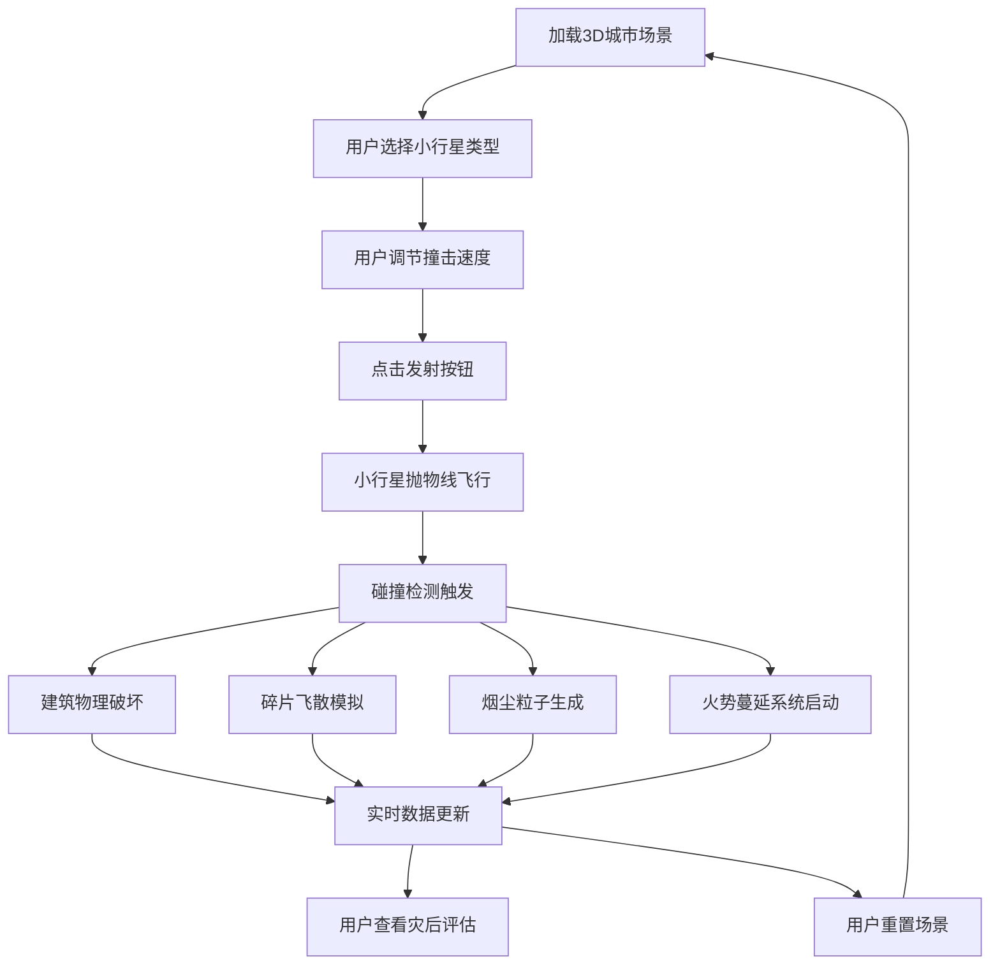

## 1. 产品概述

本项目是一个基于 Web 的 3D 小行星撞击城市灾难模拟应用，旨在帮助灾难电影爱好者和教育工作者直观理解不同参数的小行星撞击对建筑结构造成的破坏效果。通过实时物理模拟、粒子特效和数据可视化，用户可以交互式地探索撞击能量、碎片飞散范围及次生灾害的演化过程。

- 核心价值：将抽象的物理概念转化为可视化、可交互的沉浸式体验
- 目标用户：灾难电影爱好者、科普教育工作者、学生

## 2. 核心功能

### 2.1 功能模块

1. **3D 城市场景**：12+ 栋不同高度/颜色的建筑组成的街区，深灰网格地面，支持自由旋转缩放
2. **小行星发射系统**：3 种预设小行星（岩石灰、金属银、冰晶蓝），速度可调（100-500 单位/秒），抛物线轨迹飞行
3. **实时物理破坏**：碰撞区域建筑体块分裂成 20+ 碎片，碎片沿动量飞散并受空气阻力影响；冲击波引发周边建筑摇晃和玻璃碎裂
4. **粒子系统特效**：500+ 烟尘粒子云团扩散，200+ 火焰粒子簇从撞击点蔓延，建筑材质影响火势蔓延速度
5. **数据可视化面板**：撞击能量（MJ）缓动动画、碎片计数、建筑完好百分比、灾后评估条形图
6. **侧边控制面板**：行星选择、速度滑块、发射/重置按钮，毛玻璃风格 UI

### 2.2 页面详情

| 页面名称 | 模块名称 | 功能描述 |
|---------|---------|---------|
| 主模拟页 | 3D 场景渲染 | 城市街区、小行星飞行、建筑破坏、粒子特效的实时渲染 |
| 主模拟页 | 侧边控制面板 | 小行星选择下拉菜单、速度滑块（带数值和渐变条）、红色脉冲发射按钮、灰色重置按钮 |
| 主模拟页 | 数据统计区 | 左下角实时显示撞击能量、碎片数、完好建筑百分比 |
| 主模拟页 | 灾后评估面板 | 右侧半透明弹出面板，条形图展示每栋建筑损坏程度 |

## 3. 核心流程

用户进入应用后默认加载完整城市场景。用户通过侧边面板选择小行星类型和撞击速度，点击"发射"按钮后小行星沿抛物线飞向城市，发生碰撞后触发建筑破坏、碎片飞散、烟尘扩散和火势蔓延，整个过程 5-8 秒完成。用户可随时查看实时数据统计，或点击"灾后评估"查看各建筑损坏详情，也可点击"重置场景"恢复初始状态。

## 4. 用户界面设计

### 4.1 设计风格

- **主色调**：深灰蓝背景 `#0F172A`，建筑配色浅灰 `#C0C0C0`、米白 `#F5F5DC`、砖红 `#B22222`、玻璃蓝 `#87CEEB`，地面网格 `#334155`
- **按钮风格**：圆角 8px，发射按钮为红色带悬停脉冲放大效果，重置按钮为灰色
- **字体**：无衬线体（system-ui / sans-serif），数值动画采用等宽数字
- **布局风格**：侧边面板左边缘吸附，数据统计区左下角悬浮，灾后评估面板右侧弹出
- **视觉风格**：灾难大片风格，毛玻璃效果（背景模糊 10px，1px 半透明白色边框），半透明面板层次分明

### 4.2 页面设计概述

| 页面名称 | 模块名称 | UI 元素 |
|---------|---------|---------|
| 主模拟页 | 3D 场景 | 全屏 Three.js 画布，深灰蓝背景，支持鼠标拖拽旋转/滚轮缩放 |
| 主模拟页 | 侧边控制面板 | 深色半透明背景，毛玻璃效果，下拉菜单、渐变滑块、脉冲按钮、平滑过渡动画 |
| 主模拟页 | 数据统计区 | 左下角浮动卡片，数值带缓动动画，灾后评估按钮 |
| 主模拟页 | 灾后评估面板 | 右侧滑入半透明面板，12+ 条形图，每栋建筑损坏百分比 |

### 4.3 响应式

- 桌面端优先，支持最小宽度 1024px
- 3D 场景自适应全屏
- 控制面板和统计区使用固定定位，不随场景缩放

### 4.4 3D 场景引导

- **环境氛围**：深灰蓝夜空，微弱环境光 + 方向光模拟月光
- **光照设置**：AmbientLight(0x404060, 0.4) + DirectionalLight(0xffffff, 0.8) 带阴影
- **相机设置**：PerspectiveCamera(60, aspect, 0.1, 2000)，初始位置俯瞰全城
- **交互控制**：OrbitControls，支持拖拽旋转、滚轮缩放（俯视全貌到局部特写）、右键平移
- **后期处理**：轻微 Bloom 效果增强火焰和烟尘视觉层次
- **性能预算**：动态物体（碎片+粒子）≤ 3000 个，帧率 ≥ 30fps，首次加载 ≤ 3 秒
