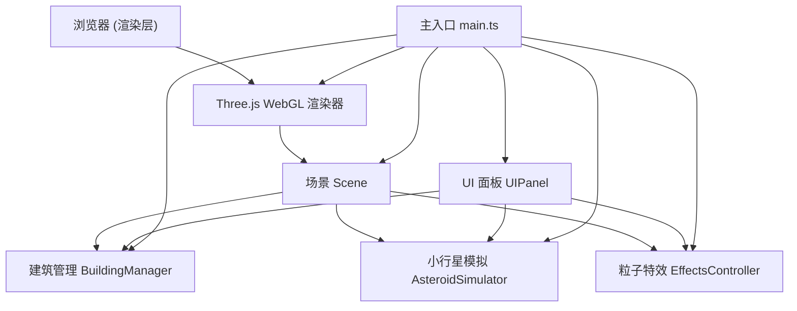

## 1. 架构设计



## 2. 技术描述

- **前端框架**：Three.js@0.160 + TypeScript@5 + Vite@5
- **构建工具**：Vite（ESNext module，热更新）
- **类型系统**：TypeScript 严格模式
- **无后端**：纯前端 WebGL 应用，所有逻辑在浏览器端执行

## 3. 目录结构

```
/
├── package.json
├── vite.config.js
├── tsconfig.json
├── index.html
└── src/
    ├── main.ts              # 场景初始化、相机、渲染器、OrbitControls、主循环
    ├── BuildingManager.ts   # 建筑生成、破坏逻辑、空间哈希碰撞
    ├── AsteroidSimulator.ts # 小行星创建、抛物线运动、碰撞检测
    ├── EffectsController.ts # 烟尘/火焰/玻璃碎片粒子系统
    └── UIPanel.ts           # 侧边控制面板、统计数据、灾后评估 UI
```

## 4. 核心模块职责

### 4.1 main.ts
- 创建 THREE.Scene、PerspectiveCamera、WebGLRenderer
- 初始化 OrbitControls（拖拽旋转、滚轮缩放、右键平移）
- 配置灯光（环境光 + 方向光 + 阴影）
- 创建地面网格
- 实例化 BuildingManager、AsteroidSimulator、EffectsController、UIPanel
- 主 requestAnimationFrame 循环，协调各模块 update

### 4.2 BuildingManager.ts
- 生成 12+ 栋建筑（高度 20-80 单位随机，4 种配色随机，均匀间距 + 随机偏移）
- 存储每栋建筑的初始状态（位置、高度、颜色、材质类型）
- `damageBuilding(buildingId, hitPoint, energy)`：根据撞击点和能量将建筑体块分裂成 20+ 碎片
- 碎片对象：大小 1-5 单位随机，随机旋转，含速度向量、角速度、空气阻力系数
- 空间哈希优化碰撞检测：`getBuildingsInRadius(point, radius)`
- `getBuildingDamagePercentages()`：返回每栋建筑 0-100% 的损坏程度
- `reset()`：恢复所有建筑初始状态，清除碎片

### 4.3 AsteroidSimulator.ts
- 3 种小行星预设：
  - 岩石灰：直径 25，密度 2.7，颜色 0x808080
  - 金属银：直径 15，密度 7.8，颜色 0xC0C0C0
  - 冰晶蓝：直径 30，密度 0.9，颜色 0x87CEEB
- `launch(type, speed)`：创建小行星网格，设置抛物线初始速度向量
- 抛物线运动：每帧应用重力加速度（g = 9.8）
- 碰撞检测：使用空间哈希查询建筑，球-盒相交检测
- 碰撞时触发：BuildingManager.damageBuilding + EffectsController.spawnSmoke + EffectsController.spawnFire
- `calculateEnergy()`：E = 0.5 × m × v²，转换为 MJ
- `reset()`：移除小行星

### 4.4 EffectsController.ts
- 烟尘粒子系统：500+ 半透明灰色粒子，大小 1-8 单位，向上扩散 + 随机漂移，alpha 随时间衰减
- 火焰粒子系统：每栋着火建筑 200+ 橙红粒子，向上飘动，大小脉动，生命周期循环
- 玻璃碎片：半透明闪烁小片，受冲击波向外飞散
- 火势蔓延：每帧根据相邻建筑距离和材质（木/混凝土）计算蔓延概率
- `update(dt)`：更新所有粒子位置和生命周期
- `reset()`：清除所有粒子

### 4.5 UIPanel.ts
- 创建 HTML DOM 元素（侧边面板、统计区、灾后评估面板）
- CSS：毛玻璃 `backdrop-filter: blur(10px)`，1px 半透明白色边框，圆角 8px
- 小行星选择下拉菜单（3 选项）
- 速度滑块 `<input type="range">`（100-500），实时数值显示，渐变背景条
- 红色发射按钮：CSS `@keyframes pulse` 悬停放大动画
- 灰色重置按钮：点击调用各模块 reset
- 统计数据：使用 `requestAnimationFrame` 驱动数值缓动动画（从 0 线性/指数缓动到目标值）
- 灾后评估按钮：点击后右侧滑出半透明面板，使用 Canvas 或纯 CSS 条形图展示 12+ 栋建筑损坏百分比

## 5. 性能优化策略

- **空间哈希**：建筑和碎片按网格分桶，碰撞检测只检查相邻桶
- **对象池**：碎片和粒子复用 Mesh 对象，避免频繁 GC
- **实例化渲染**：粒子使用 InstancedMesh 减少 draw call
- **帧率控制**：主循环使用 deltaTime，保证物理模拟速率稳定
- **动态 LOD**：远距离建筑使用简化几何体
- **粒子上限**：总动态物体 ≤ 3000，超出时淘汰最早生成的粒子
