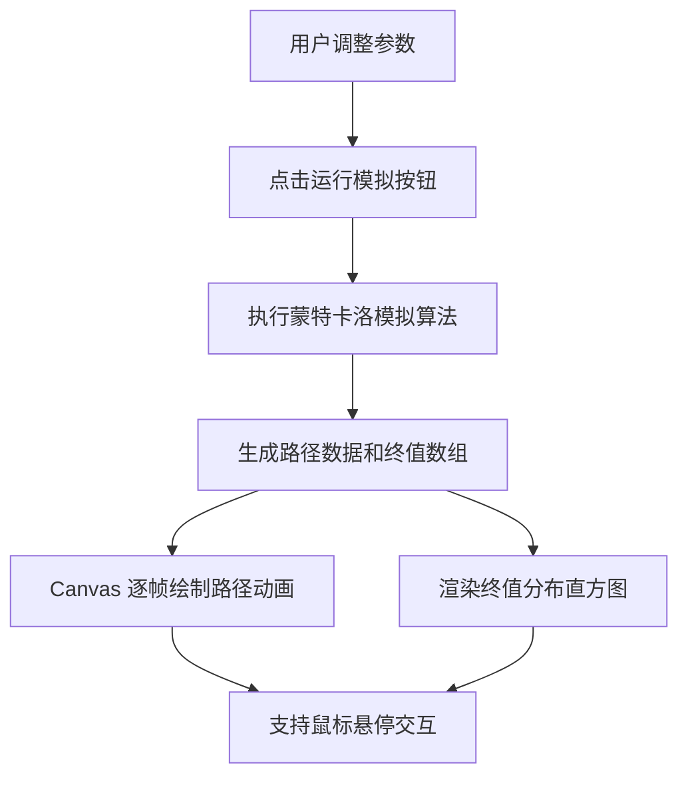

## 1. 产品概述

基于蒙特卡洛模拟的股票价格路径交互可视化工具，用于直观展示股票价格在不同波动率和时间跨度下的随机演变过程，帮助金融学习者、投资者理解风险与收益的概率分布。

- 核心价值：将抽象的随机过程数学模型转化为动态可交互的视觉体验
- 目标用户：金融学习者、量化交易初学者、投资研究人员

## 2. 核心功能

### 2.1 功能模块

1. **参数控制面板**：初始价格、年化波动率、模拟天数、模拟路径数
2. **动态路径图**：Canvas 实时绘制所有模拟路径的演变动画
3. **终值分布直方图**：展示所有路径终点价格的频率分布

### 2.3 页面详情

| 页面名称 | 模块名称 | 功能描述 |
|---------|---------|---------|
| 主页面 | 参数控制区 | 四个滑块控件，实时显示数值，亮蓝色滑动条，运行模拟按钮含加载动画 |
| 主页面 | 路径图区域 | Canvas 绘制半透明渐变折线，红色加粗均值线，动画 2 秒内完成 |
| 主页面 | 直方分布图 | 终值频率柱状图，渐变柱体，均值线标记，标准差范围高亮，悬停浮窗 |

## 3. 核心流程

用户通过滑块调整参数 → 点击"运行模拟"按钮 → 系统执行蒙特卡洛算法生成价格路径 → 路径图以动画形式逐帧绘制所有路径 → 直方图同步展示终值分布 → 支持鼠标悬停查看具体数值。

## 4. 用户界面设计

### 4.1 设计风格

- **主色调**：深色背景 #1F2937，控制区背景 #111827，卡片背景 #374151
- **强调色**：亮蓝色 #3B82F6（滑块、路径起始色），红色 #EF4444（均值线），绿色 #10B981（均值标记）
- **路径渐变色**：#3B82F6 → #F43F5E，透明度 0.3
- **直方图渐变色**：#FCA5A5 → #EF4444（从低到高）
- **文字颜色**：#F9FAFB（浅色文字），浅灰色标签
- **按钮**：圆角设计，0.5 秒加载动画（旋转圆环 + 文字提示）
- **布局**：桌面端左右分栏（路径图 | 直方图），移动端（<768px）上下堆叠
- **字体**：现代无衬线字体，层级分明

### 4.2 页面设计概览

| 页面名称 | 模块名称 | UI 元素 |
|---------|---------|---------|
| 主页面 | 参数控制区 | 深色卡片 #111827，4 组滑块（亮蓝色 #3B82F6），浅灰色标签，数值右侧实时显示，运行按钮 |
| 主页面 | 路径图 | Canvas 画布，半透明细线 1px，红色加粗均值线 3px，深色背景 |
| 主页面 | 直方图 | 渐变柱体，绿色虚线均值标记，浅灰色标准差区域，黑底白字悬停浮窗 |

### 4.3 响应式设计

- Desktop-first 设计
- 窗口宽度 < 768px 时，图表区域自动切换为上下布局
- 控件触摸优化，滑块支持移动端操作

## 5. 性能要求

- 500 条路径 × 252 天的模拟计算 + 绘图总耗时 ≤ 3 秒
- 动画帧率 ≥ 30fps
- 路径数超过 100 条时随机抽取 100 条显示以避免视觉过载
