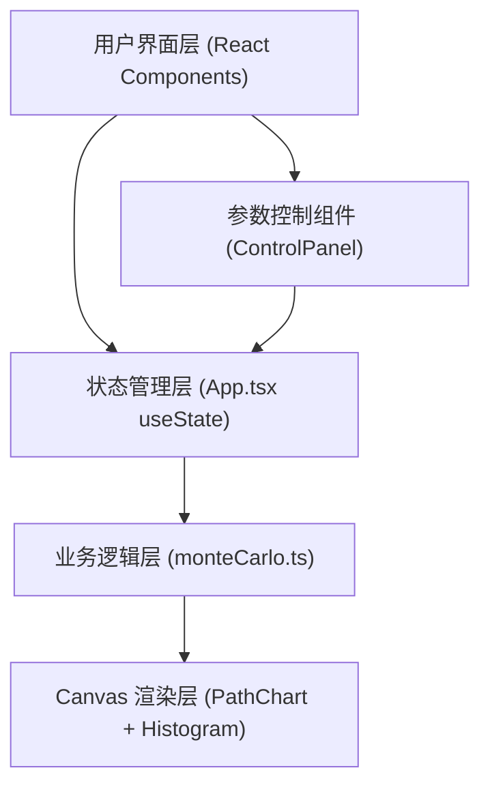

## 1. 架构设计



## 2. 技术描述

- **前端框架**：React@18 + TypeScript@5
- **构建工具**：Vite@5 + @vitejs/plugin-react
- **渲染方式**：纯 Canvas 2D API 绑定（无第三方图表库，保证性能）
- **状态管理**：React useState Hooks（轻量级，单页应用无需全局状态库）
- **样式方案**：原生 CSS + CSS 变量（无需 Tailwind，用户未指定）
- **初始化方式**：vite-init react-ts 模板

## 3. 文件结构

```
e:\solo\VersionFast\tasks\auto45\
├── package.json
├── vite.config.ts
├── tsconfig.json
├── index.html
└── src\
    ├── index.tsx
    ├── App.tsx
    ├── components\
    │   ├── ControlPanel.tsx
    │   ├── PathChart.tsx
    │   └── Histogram.tsx
    └── utils\
        └── monteCarlo.ts
```

## 4. 模块与职责

| 文件 | 职责 |
|-----|-----|
| `src/utils/monteCarlo.ts` | 蒙特卡洛模拟核心算法，使用几何布朗运动模型（GBM），导出 `runMonteCarloSimulation()` 函数 |
| `src/components/ControlPanel.tsx` | 参数控制 UI，4 个滑块 + 运行按钮，Props: 参数值 + onChange + onRun + isLoading |
| `src/components/PathChart.tsx` | Canvas 绘制路径动画，支持动态渐进渲染，Props: paths 二维数组 + animation 控制 |
| `src/components/Histogram.tsx` | Canvas 绘制终值分布直方图，支持鼠标悬停交互，Props: endValues 数组 |
| `src/App.tsx` | 主应用，参数状态管理、模拟触发、布局控制（响应式）、数据分发 |
| `src/index.tsx` | React 根渲染入口 |

## 5. 核心算法

### 5.1 蒙特卡洛模拟（几何布朗运动 GBM）

```
dS = μ * S * dt + σ * S * dW
S(t+dt) = S(t) * exp((μ - 0.5σ²)dt + σ√dt * Z)
```

其中：
- μ = 0（无漂移中性假设）
- σ = 年化波动率 / 100 / √252（日波动率）
- Z = 标准正态分布随机数（Box-Muller 变换生成）
- dt = 1/252（每日时间步长）

### 5.2 性能优化策略

1. **预计算所有随机数**：一次性生成避免每帧重复计算
2. **分层动画渲染**：使用 requestAnimationFrame，每帧绘制 N 天进度，总时长控制在 2 秒内
3. **路径采样**：路径数 > 100 时，使用 Fisher-Yates 洗牌随机抽取 100 条显示
4. **离屏计算**：Canvas 双缓冲或批量路径绘制减少重绘开销

## 6. 类型定义

```typescript
interface SimulationParams {
  initialPrice: number;     // 10-200, default 100
  volatility: number;       // 5-80, default 20 (%)
  days: number;             // 30-365, default 252
  numPaths: number;         // 10-500, default 100
}

interface SimulationResult {
  paths: number[][];        // [pathIndex][dayIndex] => price
  endValues: number[];      // [pathIndex] => final price
}
```
