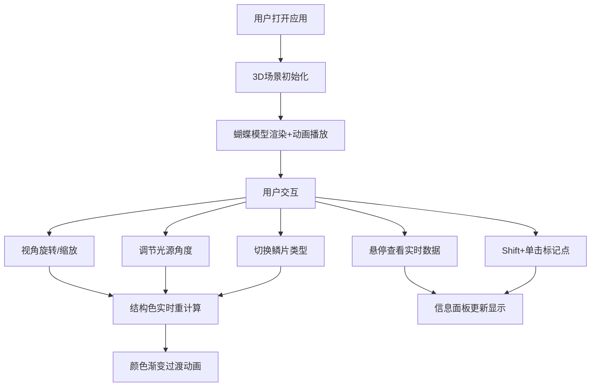

## 1. 产品概述

蝴蝶翅膀结构色3D交互可视化应用，帮助昆虫学爱好者和艺术设计学生直观理解蝴蝶翅膀鳞片通过薄膜干涉、多层反射等物理光学机制产生随角度变化虹彩色泽的原理。

- **目标用户**：昆虫学爱好者、艺术设计学生、科普教育工作者
- **核心价值**：通过沉浸式3D交互体验，将抽象的物理光学原理具象化、可视化

## 2. 核心功能

### 2.1 功能模块

1. **3D蝴蝶场景模块**：完整蝴蝶模型（4片翅膀）、视角旋转/缩放控制、浮动与扇动动画
2. **结构色计算引擎**：薄膜干涉、光栅衍射、多层反射三种物理模型，实时计算颜色
3. **控制面板模块**：光源角度调节、鳞片类型切换、渐变过渡动画
4. **信息面板模块**：实时法线方向显示、波长估算、多点标记跟踪
5. **交互反馈模块**：十字准星光标、跟随效果圈、悬停高亮

### 2.2 页面详情

| 页面名称 | 模块名称 | 功能描述 |
|-----------|-------------|---------------------|
| 主页面 | 3D场景区域 | Three.js渲染蝴蝶模型，OrbitControls交互，浮动/扇动动画 |
| 主页面 | 左侧控制面板 | 光源角度滑块（0-360度），鳞片类型下拉选择器（薄膜干涉/光栅衍射/多层反射） |
| 主页面 | 右侧信息面板 | 法线方向欧拉角显示、反射波长估算（380-780nm）、最多3个标记点跟踪 |
| 主页面 | 光标交互 | 悬停时十字准星光标+跟随效果圈，Shift+单击添加标记点 |
| 主页面 | 响应式布局 | <1024px时左右面板折叠为浮动按钮 |

## 3. 核心流程

用户打开应用 → 3D蝴蝶场景加载完成并自动播放浮动/扇动动画 → 用户通过鼠标拖拽旋转视角/滚轮缩放观察 → 拖动光源滑块观察虹彩变化 → 切换鳞片类型体验不同物理模型 → 将鼠标悬停在翅膀上查看实时法线和波长数据 → Shift+单击翅膀标记关键点进行持续跟踪。

## 4. 用户界面设计

### 4.1 设计风格

- **主色调**：蓝紫渐变（#6366F1 → #8B5CF6）
- **背景色**：深色半透明（#1E293B/80）配合毛玻璃效果
- **面板样式**：圆角12px，浅色边框（1px solid rgba(255,255,255,0.1)）
- **字体**：无衬线体 'Inter', sans-serif
- **翅膀基色**：深棕 #4A3728，垂直视角高饱和蓝色 #00BFFF，掠射角紫-银灰渐变（#8B5CF6 → #C0C0C0）
- **光标效果**：十字准星 + 半透明跟随圈（#38BDF8，半径15px）
- **标记点**：淡黄色半透明圆圈（直径5px）

### 4.2 页面设计概览

| 页面区域 | 模块名称 | UI元素 |
|-----------|-------------|-------------|
| 左侧（280px） | 控制面板 | 标题、光源角度滑块（带刻度）、鳞片类型下拉选择器、渐变动画效果 |
| 中间（自适应） | 3D场景 | 蝴蝶模型居中（占视口高度60%）、浮动动画、扇动动画、平行光可视化 |
| 右侧（240px） | 信息面板 | 法线方向（X/Y/Z欧拉角）、反射波长（nm）、标记点列表（最多3个） |
| 覆盖层 | 交互反馈 | 十字准星光标、跟随效果圈、标记点圆圈 |

### 4.3 响应式

- **桌面端（≥1024px）**：左-中-右三栏布局，面板固定宽度
- **移动端/平板（<1024px）**：左右面板折叠为可展开浮动按钮，点击展开侧边栏

### 4.4 3D场景指导

- **环境**：深色背景，营造沉浸感，配合柔和环境光
- **光照**：环境光（基础照明）+ 方向光（随滑块旋转，用半透明锥体可视化）
- **相机**：PerspectiveCamera，初始距离适中，OrbitControls限制合理范围
- **构图**：蝴蝶居中，翅膀张开呈飞行姿态
- **交互**：OrbitControls（拖拽旋转、滚轮缩放）、鼠标悬停检测、射线拾取
- **动画**：整体上下浮动（幅度5单位，周期3秒）、翅膀扇动（幅度30度，周期0.5秒）、颜色渐变过渡（0.5秒）
- **性能**：帧率稳定30fps以上，交互延迟≤150ms，每片翅膀20×20分段网格
