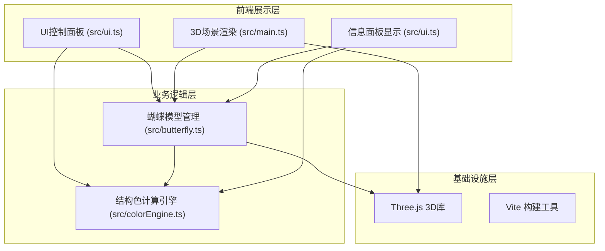

## 1. 架构设计



## 2. 技术说明

- **前端框架**：原生 TypeScript + Three.js（非React，因用户明确指定文件结构）
- **构建工具**：Vite
- **3D引擎**：Three.js @latest + @types/three
- **UI控件**：dat.gui（用户指定依赖）+ 原生DOM实现面板
- **状态管理**：模块间通过回调函数和直接引用进行通信

## 3. 模块划分与文件结构

```
project-root/
├── package.json            # 项目依赖与脚本
├── vite.config.js          # Vite构建配置
├── tsconfig.json           # TypeScript严格模式配置
├── index.html              # 入口HTML
└── src/
    ├── main.ts             # 入口：场景/相机/控制器初始化，主循环
    ├── butterfly.ts        # 蝴蝶模型：4片翅膀网格、扇动动画、顶点颜色更新
    ├── colorEngine.ts      # 结构色引擎：三种物理模型，波长→RGB转换
    └── ui.ts               # 界面：控制面板、信息面板、光标效果、标记点管理
```

### 3.1 colorEngine.ts - 结构色计算引擎

**核心职责**：根据视线方向、法线方向、光源角度、物理模型类型计算颜色。

**导出接口**：
```typescript
export type ScaleModel = 'thinFilm' | 'grating' | 'multilayer';

export interface ColorInput {
  normal: THREE.Vector3;       // 表面法线（世界空间）
  viewDir: THREE.Vector3;      // 视线方向（指向相机）
  lightAngle: number;          // 光源角度（度，0-360）
  model: ScaleModel;           // 物理模型类型
  progress?: number;           // 模型切换过渡进度（0-1）
  prevModel?: ScaleModel;      // 上一个模型类型
}

export interface ColorOutput {
  rgb: { r: number; g: number; b: number };  // 0-1范围
  wavelength: number;                         // 估算波长（380-780nm）
}

export function computeStructuralColor(input: ColorInput): ColorOutput;
export function wavelengthToRGB(wavelength: number): { r: number; g: number; b: number };
```

**物理模型算法**：
- **薄膜干涉**：基于入射角计算光程差 → 干涉相长波长 → 波长转RGB
- **光栅衍射**：基于光栅方程计算衍射角 → 对应波长
- **多层反射**：简化的多层薄膜叠加干涉，使用加权平均

### 3.2 butterfly.ts - 蝴蝶模型

**核心职责**：创建4片翅膀的细分网格，管理浮动和扇动动画，更新顶点颜色。

**导出接口**：
```typescript
export interface WingMesh extends THREE.Mesh {
  wingIndex: number;  // 0=左前,1=右前,2=左后,3=右后
}

export interface ButterflyOptions {
  segments?: number;          // 每片翅膀分段数（默认20）
  baseColor?: THREE.Color;    // 基色（默认#4A3728）
}

export class Butterfly {
  group: THREE.Group;
  wings: WingMesh[];
  constructor(options?: ButterflyOptions);
  updateAnimation(time: number): void;  // 更新浮动+扇动
  updateColors(camera: THREE.Camera, lightAngle: number, model: ScaleModel, transition: number, prevModel?: ScaleModel): void;
  getWingAtPoint(intersect: THREE.Intersection): { normal: THREE.Vector3; barycentric?: THREE.Vector3 };
}
```

**翅膀几何**：每片翅膀使用PlaneGeometry（20×20分段），通过顶点位移塑造自然曲线，翅膀扇动绕身体轴旋转。

### 3.3 ui.ts - 界面管理

**核心职责**：创建DOM面板、绑定事件、光标效果、标记点管理、信息更新。

**导出接口**：
```typescript
export interface UIState {
  lightAngle: number;            // 0-360
  scaleModel: ScaleModel;        // 当前模型
  markedPoints: MarkedPoint[];   // 最多3个
  hoveredPoint: HoverInfo | null;
}

export interface MarkedPoint {
  id: string;
  position: THREE.Vector3;
  wingIndex: number;
}

export interface HoverInfo {
  normal: THREE.Vector3;
  wavelength: number;
  position: THREE.Vector3;
}

export type UICallback = (state: Partial<UIState>) => void;

export class UI {
  constructor(container: HTMLElement, onChange: UICallback);
  updateHover(info: HoverInfo | null): void;
  updateMarkedPoints(points: MarkedPoint[]): void;
  getLightAngle(): number;
  getScaleModel(): ScaleModel;
}
```

### 3.4 main.ts - 入口与主循环

**核心职责**：初始化Three.js场景、相机、OrbitControls、渲染器；创建Butterfly和UI实例；驱动动画循环与事件分发。

**关键流程**：
1. 创建WebGLRenderer、Scene、PerspectiveCamera、OrbitControls
2. 创建Butterfly实例并加入场景
3. 创建平行光可视化（半透明锥体）
4. 创建UI实例，绑定事件回调
5. 注册Raycaster进行鼠标悬停检测
6. animation loop：更新时间 → butterfly.updateAnimation → butterfly.updateColors → UI更新 → render
7. Shift+单击事件处理 → 标记点管理

## 4. 性能优化策略

1. **顶点颜色而非片元**：使用vertexColors，在CPU端计算每顶点颜色后一次性更新BufferAttribute
2. **避免每帧重建几何**：只更新color属性数组，不重建Geometry
3. **射线检测优化**：只在鼠标移动时进行Raycaster检测，而非每帧
4. **矩阵更新优化**：关闭matrixAutoUpdate，手动控制翅膀扇动的矩阵更新
5. **合理的分段数**：20×20=400顶点/翅膀，4片共1600顶点，完全满足30fps
6. **CSS硬件加速**：面板使用transform和will-change优化
