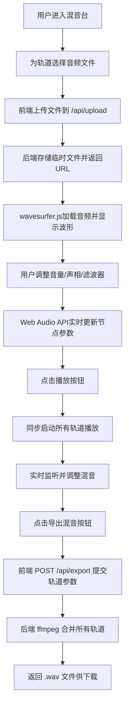

## 1. 产品概述

面向独立音乐制作人的在线多轨音频混音工作台，支持同时加载多条音轨进行实时混音处理，最终导出完整混音成果。
- 解决独立音乐人无需安装专业 DAW 软件即可完成基础混音工作的需求，降低创作门槛
- 提供浏览器端实时音频处理能力，结合云端混音导出，服务全球音乐创作者

## 2. 核心功能

### 2.1 用户角色

| 角色 | 注册方式 | 核心权限 |
|------|----------|----------|
| 音乐创作者 | 无需注册，直接使用 | 导入音轨、调整混音参数、实时试听、导出成品 |

### 2.2 功能模块

1. **混音主面板**：8-16条音轨轨道列表、波形可视化、全局播放控制
2. **音轨控制模块**：音量滑块、声相旋钮、低通滤波器、静音/独奏、名称编辑、删除
3. **音频导入模块**：本地文件上传（.wav/.mp3）、后端存储、URL返回
4. **播放控制模块**：播放/暂停、停止、全局音量、进度显示
5. **混音导出模块**：调用后端 ffmpeg 合并轨道、下载 .wav 文件

### 2.3 页面详情

| 页面名称 | 模块名称 | 功能描述 |
|----------|----------|----------|
| 混音台主页 | 主控条 | 全局播放/暂停/停止按钮、全局音量滑块、导出混音按钮 |
| 混音台主页 | 音轨列表 | 默认8条空轨，支持最多16条，每条含波形显示+控制区 |
| 混音台主页 | 单轨控制区 | 音量滑块(0-100)、声相旋钮(L100-R100)、滤波器频率(20-20000Hz对数)、静音/独奏按钮、文件选择、名称编辑、删除 |
| 混音台主页 | 波形显示区 | wavesurfer.js 渲染波形，渐变染色(#6366F1→#A78BFA)，播放进度渐变条(#22D3EE→#6366F1)，白色走针 |

## 3. 核心流程

用户进入混音台 → 为各轨道选择本地音频文件 → 前端上传至后端获取播放URL → wavesurfer加载并显示波形 → 通过Web Audio API实时调整各轨道的GainNode/StereoPannerNode/BiquadFilterNode → 点击播放同步启动所有音轨 → 调整参数获得理想混音 → 点击导出混音 → 后端接收参数并调用ffmpeg合并所有轨道 → 前端下载最终.wav文件

## 4. 用户界面设计

### 4.1 设计风格

- **主色**：#6366F1（靛蓝），悬停 #818CF8，按下 #4F46E5
- **背景色**：#0F0F1A（深靛黑）
- **面板色**：#1E1E2E（深紫灰）
- **控制区背景**：#28284A（深紫蓝）
- **分隔线**：#2A2A3E
- **波形渐变**：线性渐变 #6366F1 → #A78BFA
- **进度条渐变**：线性渐变 #22D3EE → #6366F1
- **按钮圆角**：6px
- **字体**：深色主题下采用等宽+现代无衬线组合，标题使用 JetBrains Mono，正文使用 Inter（注意：避免与通用AI设计趋同，此处等宽字体体现专业音频工作台气质）

### 4.2 页面设计概述

| 页面名称 | 模块名称 | UI元素 |
|----------|----------|--------|
| 混音台主页 | 主控条 | 固定顶部、深色背景、圆角按钮组、水平排列全局控件、右侧突出导出按钮 |
| 混音台主页 | 音轨列表 | 垂直堆叠、每条轨道间以浅色分隔线隔开、左固定名称+波形、右控制区 |
| 混音台主页 | 单轨控制区 | #28284A 背景、音量滑块圆形轨道+发光刻度、声相旋钮旋转动效、滤波器滑块对数刻度、静音/独奏按钮按下态颜色反转、删除按钮红色悬停 |
| 混音台主页 | 波形区 | 高度100px、渐变填充波形、播放时走针滑动动画（ease-out 200ms）、静音时整体变灰、独奏时其他轨道显示虚线边框 |

### 4.3 响应式

- **桌面端 (≥1024px)**：轨道高度 120px，控制区水平单行排列，波形完整显示
- **平板端 (768px-1023px)**：轨道高度 80px，控制区换为两行排列
- **手机端 (<768px)**：轨道高度 60px，隐藏波形显示，仅保留精简控制条（音量+静音+独奏）

### 4.4 性能约束

- 所有混音控制响应延迟 < 50ms
- 并发播放 4 条 44100Hz 16bit PCM 轨道时帧率 ≥ 30fps
- 波形渲染使用 requestAnimationFrame 节流
