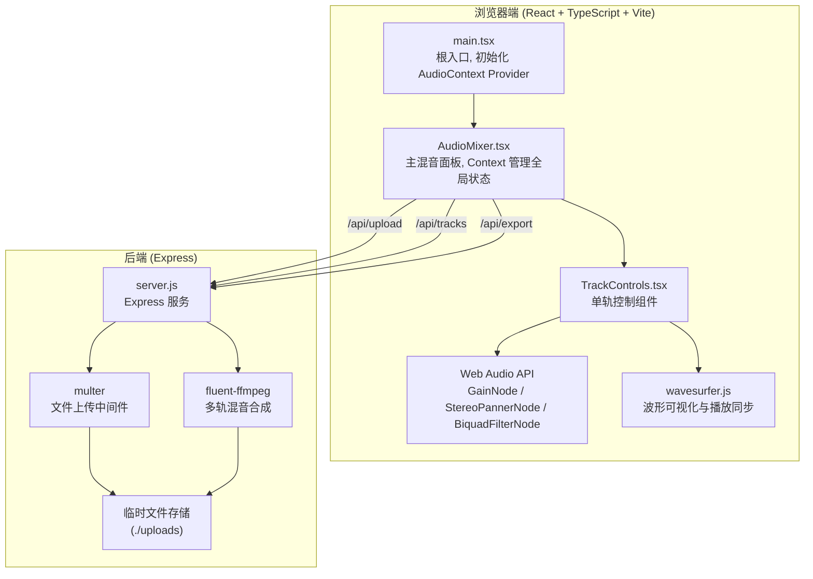
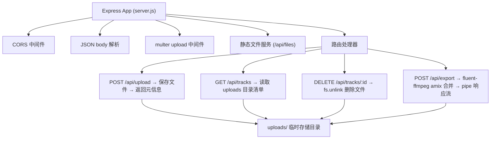
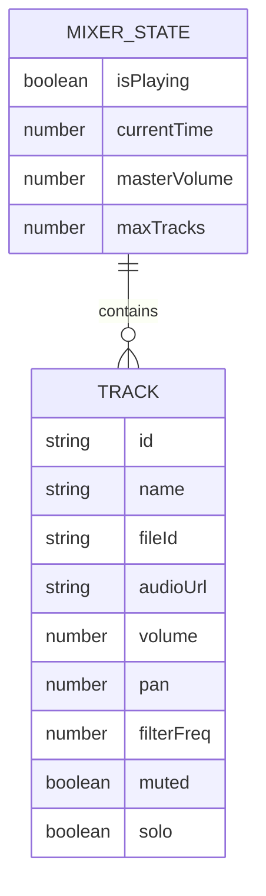

## 1. 架构设计



**文件调用关系与数据流向：**
- `index.html` → 加载 `src/main.tsx`
- `src/main.tsx` → 渲染 `<AudioMixer />` 并挂载至 `#root`
- `src/AudioMixer.tsx` → 创建 `AudioMixerContext`，维护 8-16 条轨道状态，将 dispatch 与各轨道数据通过 Context 下发给 `TrackControls`
- `src/TrackControls.tsx` → 接收单条轨道数据，用户操作触发 dispatch 更新 Context，同时直接操作 Web Audio API 节点（GainNode.gain、StereoPannerNode.pan、BiquadFilterNode.frequency）；文件上传时调用 `POST /api/upload`，删除文件调用 `DELETE /api/tracks/:id`
- `server.js` → `POST /api/upload` 经 multer 保存至 uploads 目录并返回 `{fileId, url}`；`GET /api/tracks` 返回当前文件列表；`DELETE /api/tracks/:id` 删除对应文件；`POST /api/export` 接收轨道参数数组，使用 fluent-ffmpeg 将各音频按音量/声相等参数混音合成后返回 .wav 流

## 2. 技术描述

- **前端框架**：React@18 + ReactDOM@18
- **构建工具**：Vite@5 + @vitejs/plugin-react
- **语言**：TypeScript@5（严格模式 strict: true）
- **音频可视化**：wavesurfer.js@7
- **样式方案**：原生 CSS（CSS Modules 风格内联 + 全局变量），避免引入额外 CSS 框架
- **状态管理**：React Context + useReducer（无需 Redux，规模适中）
- **后端**：Express@4
- **文件上传**：multer@1
- **跨域**：cors@2
- **唯一ID**：uuid@9
- **音频编码**：lamejs（前端编码备用）、fluent-ffmpeg@2（后端混音合成）
- **后端运行环境**：Node.js（需预装 ffmpeg 二进制或使用 ffmpeg-static）

## 3. 路由定义

| 路由 | 用途 |
|------|------|
| / | Vite SPA 入口，渲染混音台主页 |
| /api/upload | POST 上传单条音频文件 (.wav/.mp3) |
| /api/tracks | GET 获取已上传文件列表 |
| /api/tracks/:id | DELETE 删除指定音频文件 |
| /api/export | POST 按参数混音并下载 .wav 文件 |
| /api/files/:filename | GET 静态文件访问（uploads 目录） |

Vite dev server 通过 `vite.config.js` 的 proxy 配置将 `/api/*` 转发至 `http://localhost:3001`。

## 4. API 定义

### 4.1 POST /api/upload
- Request: `multipart/form-data`，字段名 `audio`
- Response `200`:
```typescript
interface UploadResponse {
  fileId: string;
  filename: string;
  url: string;        // /api/files/xxx.wav
  size: number;
  duration?: number;
}
```

### 4.2 GET /api/tracks
- Response `200`:
```typescript
interface TrackFileInfo {
  fileId: string;
  filename: string;
  url: string;
  size: number;
  uploadedAt: number;
}
type TrackListResponse = TrackFileInfo[];
```

### 4.3 DELETE /api/tracks/:id
- Response `200`: `{ success: true, fileId: string }`
- Response `404`: `{ error: "File not found" }`

### 4.4 POST /api/export
- Request:
```typescript
interface ExportTrack {
  fileId: string;
  volume: number;     // 0-100
  pan: number;        // -100 (L) 到 100 (R)
  filterFreq: number; // 20-20000 Hz
  muted: boolean;
}
interface ExportRequest {
  tracks: ExportTrack[];
  masterVolume: number; // 0-100
  format: "wav";
}
```
- Response `200`: `Content-Type: audio/wav`，二进制流，`Content-Disposition: attachment; filename="mix.wav"`

## 5. 服务端架构



## 6. 数据模型

### 6.1 前端状态模型（React Context）



### 6.2 前端 Context 类型定义

```typescript
interface Track {
  id: string;
  name: string;
  fileId: string | null;
  audioUrl: string | null;
  volume: number;        // 0-100
  pan: number;           // -100 ~ 100
  filterFreq: number;    // 20-20000
  muted: boolean;
  solo: boolean;
  nodes?: {
    source: MediaElementAudioSourceNode;
    gain: GainNode;
    pan: StereoPannerNode;
    filter: BiquadFilterNode;
  } | null;
  wavesurfer?: WaveSurfer | null;
}

interface MixerState {
  tracks: Track[];
  isPlaying: boolean;
  masterVolume: number;
}

type MixerAction =
  | { type: "ADD_TRACK" }
  | { type: "REMOVE_TRACK"; payload: string }
  | { type: "UPDATE_TRACK"; payload: Partial<Track> & { id: string } }
  | { type: "SET_TRACK_NODES"; payload: { id: string; nodes: Track["nodes"] } }
  | { type: "SET_WAVESURFER"; payload: { id: string; wavesurfer: WaveSurfer | null } }
  | { type: "SET_PLAYING"; payload: boolean }
  | { type: "SET_MASTER_VOLUME"; payload: number };
```
