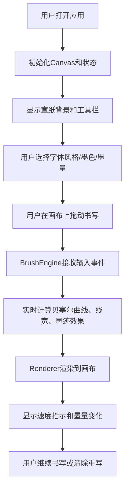

## 1. 产品概述

交互式水墨书法应用，模拟传统毛笔在宣纸上的书写体验，解决书法爱好者在数字设备上无法体验传统毛笔力道、速度和墨量对笔画形态影响的沉浸感问题。

- 目标用户：书法爱好者、数字艺术创作者、文化教育工作者
- 市场价值：在数字时代传承和弘扬中华书法文化，提供低成本、高沉浸感的书法练习工具

## 2. 核心功能

### 2.1 功能模块
1. **笔触引擎模块**：实时计算贝塞尔曲线路径、动态线宽变化、墨迹扩散和纹理叠加
2. **渲染模块**：宣纸背景、装裱边框、墨渍残留效果、笔画渲染
3. **UI控制模块**：字体风格切换、墨色选择、墨量调节、宣纸纹理开关、响应式布局

### 2.2 页面详情
| 页面名称 | 模块名称 | 功能描述 |
|---------|---------|---------|
| 主页面 | 工具栏（左侧竖向/底部横向） | 字体风格切换按钮（楷书/行书/草书）、墨色选择器（5种传统墨色）、墨量滑块（0~100）、宣纸纹理开关 |
| 主页面 | 书写画布区域 | 宣纸质感背景、实时笔触渲染、墨渍残留效果、速度指示条、墨量百分比显示、多点触控支持 |

## 3. 核心流程

## 4. 用户界面设计

### 4.1 设计风格
- **主色调**：深棕色（#5C4033，仿古木质）、金色（#D4AF37，文字）、米黄色（#F5F0E1，宣纸底色）、暗红色（#8B0000，装裱边框）
- **按钮风格**：仿古木质纹理背景，点击时0.1秒凹陷动画
- **字体**：手写体（Brush Script MT或类似），金色文字
- **布局风格**：工具栏（左/底部）+ 主画布（右/上部），仿古装裱织锦边框（回纹几何纹样）
- **质感**：宣纸纤维纹理、墨迹扩散润染、木质纹理按钮

### 4.2 页面设计概览
| 页面名称 | 模块名称 | UI元素 |
|---------|---------|--------|
| 主页面 | 工具栏 | 竖向80px宽（移动端底部80px高），木质纹理背景，金色手写体文字，图标+文字按钮 |
| 主页面 | 墨色选择器 | 半透明浮层色块展示，点击选中高亮 |
| 主页面 | 墨量滑块 | 带数值标签，弹性回弹动画 |
| 主页面 | 书写画布 | 米黄宣纸底色，纤维线纹噪点，暗红色回纹边框，实时墨渍残留 |
| 主页面 | 状态指示 | 书写速度指示条、墨量剩余百分比 |

### 4.3 响应式设计
- 桌面端（≥768px）：竖向工具栏在左侧，宽度80px，画布自适应右侧
- 移动端（<768px）：横向工具栏固定在底部，高度80px，画布自适应上部
- 触控优化：支持多点触控（至少两指同时书写），触控区域足够大

## 5. 性能需求
- 笔画生成延迟 ≤ 100ms（从输入到渲染）
- 连续高速书写帧率 ≥ 30fps
- 笔画路径点超过1000个时自动清除最早部分释放内存
