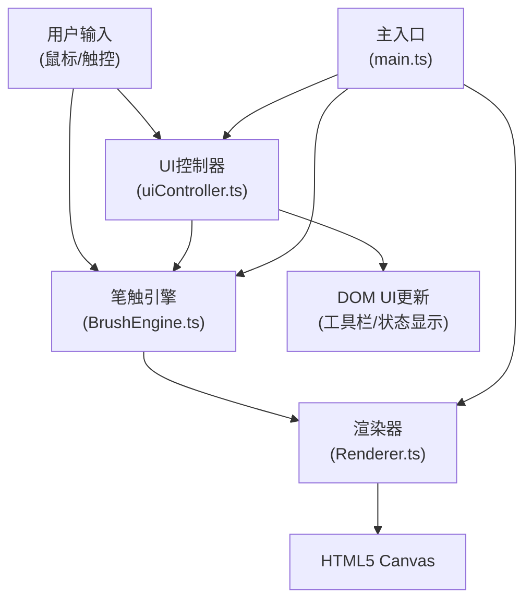

## 1. 架构设计



## 2. 技术说明
- **前端技术栈**：TypeScript + HTML5 Canvas + Vite
- **初始化工具**：Vite
- **后端**：无（纯前端应用）
- **数据库**：无

## 3. 模块职责

### 3.1 BrushEngine.ts（笔触引擎）
- 接收鼠标/触控事件（mousedown/mousemove/mouseup, touchstart/touchmove/touchend）
- 实时计算书写速度、压力（用速度模拟）
- 根据字体风格调整贝塞尔曲线曲率、顿笔频率、连笔倾向
- 根据墨量计算干枯程度和墨迹扩散
- 维护笔画路径点队列（超过1000点自动清理最早数据）
- 输出渲染指令（路径点、线宽、墨色、透明度等）

### 3.2 Renderer.ts（渲染器）
- 渲染宣纸背景（米黄底色 + 纤维线纹 + 噪点）
- 渲染装裱边框（暗红色回纹几何纹样）
- 根据BrushEngine指令渲染笔画（贝塞尔曲线、动态线宽、半透明纹理叠加）
- 渲染墨渍残留效果（半透明灰色圆环，随时间消退）
- 维护离屏Canvas优化渲染性能

### 3.3 uiController.ts（UI控制器）
- 管理工具栏控件状态（字体风格、墨色、墨量、纹理开关）
- 监听所有UI控件事件
- 响应式布局切换（桌面端/移动端）
- 实时更新速度指示条和墨量百分比显示
- 控件交互动画（按钮凹陷、滑块回弹、墨色浮层）

### 3.4 main.ts（主入口）
- 初始化全局状态管理
- 创建Canvas实例和DOM结构
- 加载和协调各模块
- 绑定全局事件（窗口resize等）
- 启动动画渲染循环

## 4. 核心数据结构

### 4.1 笔画路径点
```typescript
interface BrushPoint {
    x: number;
    y: number;
    speed: number;      // 书写速度 (px/ms)
    pressure: number;   // 压力模拟 (0~1)
    width: number;      // 计算后的线宽 (0.5~20)
    inkAmount: number;  // 当前墨量 (0~1)
    timestamp: number;  // 时间戳
}
```

### 4.2 字体风格配置
```typescript
interface FontStyle {
    name: string;
    curvature: number;      // 曲线曲率 (0~1)
    pauseFrequency: number; // 顿笔频率 (0~1)
    linkTendency: number;   // 连笔倾向 (0~1)
    minWidth: number;
    maxWidth: number;
}
```

### 4.3 全局状态
```typescript
interface AppState {
    currentStyle: FontStyle;
    inkColor: string;
    inkAmount: number;       // 0~100
    showTexture: boolean;
    currentSpeed: number;
    remainingInk: number;    // 0~100
    isDrawing: boolean;
}
```

## 5. 性能优化策略

1. **双缓冲渲染**：使用离屏Canvas预渲染静态元素（宣纸背景、边框）
2. **增量渲染**：每帧只渲染新增笔画，不重绘全图
3. **路径点清理**：超过1000个路径点时，移除最早的20%
4. **requestAnimationFrame**：使用浏览器原生动画帧调度
5. **触摸事件节流**：对高频touchmove事件适当节流，平衡流畅度和性能
6. **纹理缓存**：宣纸纤维纹理预先生成并缓存为ImageData
