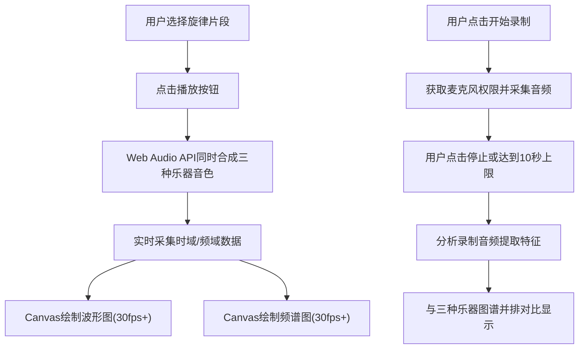

## 1. 产品概述

乐器音色波形频谱对比应用，帮助音乐爱好者和学生直观对比钢琴、小提琴、长笛三种乐器在时域（波形）和频域（频谱）上的音色差异，同时支持用户录制自己的演奏进行对比分析。

- 目标用户：音乐学生、音乐教师、乐器爱好者、声学学习者
- 核心价值：将抽象的音色差异转化为可视化的波形和频谱图，降低音色理解门槛

## 2. 核心功能

### 2.1 功能模块

1. **主应用页面**：乐器音色对比工作台，包含控制面板和可视化图表区域
2. **音频合成模块**：使用Web Audio API模拟钢琴、小提琴、长笛三种乐器音色
3. **波形图可视化**：实时绘制时域波形曲线，支持多乐器并排对比
4. **频谱图可视化**：实时绘制FFT频域柱状图，支持多乐器并排对比
5. **录制对比模块**：麦克风录制用户演奏，提取特征并与标准乐器对比

### 2.2 页面详情

| 页面名称 | 模块名称 | 功能描述 |
|---------|---------|---------|
| 主应用 | 旋律选择器 | 提供3段预设音乐片段（C大调音阶、旋律片段1、旋律片段2）供用户选择 |
| 主应用 | 播放/停止控制 | 同时以三种乐器音色播放选中旋律，实时更新波形和频谱图 |
| 主应用 | 录制控制 | 开始/停止麦克风录制，最长10秒，录制完成后自动绘制用户波形频谱 |
| 主应用 | 波形图区域 | 上层区域，占60%高度，显示三种乐器+用户录制的时域波形 |
| 主应用 | 频谱图区域 | 下层区域，占40%高度，显示三种乐器+用户录制的频域频谱 |

## 3. 核心流程

用户选择预设旋律 → 点击播放按钮 → Web Audio API合成三种乐器音色同时播放 → 实时获取时域/频域数据 → Canvas绘制波形图和频谱图（30fps+）

用户点击开始录制 → 获取麦克风权限 → 采集音频数据（最长10秒）→ 用户点击停止 → 分析录制数据 → 与三种乐器图谱并排显示对比

## 4. 用户界面设计

### 4.1 设计风格

- **深色实验室风格配色**：主背景#0A0E27，卡片背景#1A2040，文字#E0E7FF
- **乐器专属颜色**：钢琴#FF6B6B（红）、小提琴#4ECDC4（青）、长笛#FFE66D（黄）、用户录制#FFFFFF半透明
- **网格辅助线**：#2A3F5F 浅色网格
- **按钮交互**：悬停0.3秒渐变色过渡（#3B82F6→#6366F1），点击缩放回弹动画
- **字体**：现代无衬线字体，标题加粗，数据展示等宽字体

### 4.2 页面布局

| 区域 | 位置 | 尺寸 | UI元素 |
|-----|-----|-----|--------|
| 控制面板 | 左侧 | 固定300px宽 | 下拉选择器、播放/停止按钮、录制按钮组、图例说明 |
| 波形图区域 | 右侧上层 | 占右侧60%高度 | Canvas画布、浅色网格、时间轴标签、振幅轴标签、4条波形曲线 |
| 频谱图区域 | 右侧下层 | 占右侧40%高度 | Canvas画布、浅色网格、频率轴(0-8000Hz)、幅度轴、4组渐变柱状图 |

### 4.3 响应式设计

- 适配屏幕宽度：1024px - 1920px
- 桌面优先设计，在最小宽度1024px时布局不错乱、文字可读
- 控制面板固定宽度300px，右侧图表区域自适应填充剩余空间
- 图表Canvas随容器尺寸变化自动调整

### 4.4 交互动效

- 波形图：播放时线条从左到右平滑扫过，数据滚动更新
- 频谱图：柱状图高度随音乐频率强度动态变化，带渐变填充
- 按钮：悬停0.3s颜色渐变，点击0.1s缩放回弹（scale: 0.95→1）
- 页面加载：各区域淡入出现，带轻微错位动画
