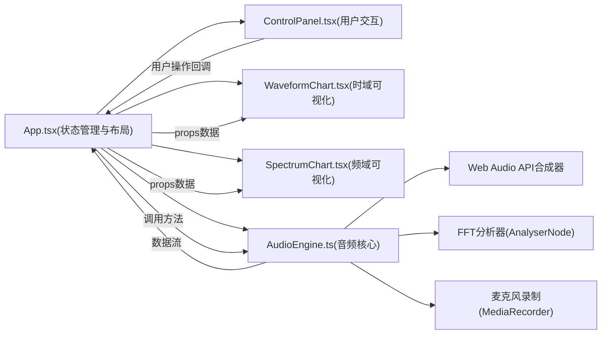

## 1. 架构设计



## 2. 技术描述

- **前端框架**：React 18 + TypeScript 5
- **构建工具**：Vite 5 + @vitejs/plugin-react
- **音频处理**：原生 Web Audio API（OscillatorNode、GainNode、AnalyserNode、BiquadFilterNode）
- **可视化方案**：HTML5 Canvas 2D Context 实时绘制
- **状态管理**：React useState / useRef（轻量级，无需全局状态库）
- **样式方案**：内联样式 + CSS变量（避免额外依赖）

## 3. 项目文件结构

```
.
├── package.json              # 依赖与启动脚本
├── vite.config.js            # Vite构建配置
├── tsconfig.json             # TypeScript配置
├── index.html                # 入口HTML
└── src/
    ├── main.tsx              # React入口
    ├── App.tsx               # 主应用组件
    └── components/
        ├── AudioEngine.ts    # 音频核心模块（类封装）
        ├── ControlPanel.tsx  # 控制面板组件
        ├── WaveformChart.tsx # 波形图组件
        └── SpectrumChart.tsx # 频谱图组件
```

## 4. 核心模块设计

### 4.1 AudioEngine 类

| 方法/属性 | 类型 | 描述 |
|----------|-----|------|
| `constructor()` | 构造函数 | 初始化AudioContext、三种乐器合成器通道 |
| `playMelody(melodyId: string)` | 方法 | 同时播放三种乐器的指定旋律 |
| `stopPlayback()` | 方法 | 停止所有正在播放的音频 |
| `startRecording()` | Promise方法 | 请求麦克风权限并开始录制 |
| `stopRecording()` | Promise方法 | 停止录制并返回录制的时域/频域数据 |
| `getWaveformData(instrument: InstrumentType)` | 方法 | 获取指定乐器当前时域数据Float32Array |
| `getSpectrumData(instrument: InstrumentType)` | 方法 | 获取指定乐器当前频域数据Uint8Array |
| `isPlaying` | 属性 | 播放状态 |
| `isRecording` | 属性 | 录制状态 |
| `onDataUpdate` | 事件回调 | 每帧数据更新时触发 |

**乐器音色模拟算法**：
- 钢琴：多个正弦波叠加（基频+泛音），快速起音(attack 5ms)，指数衰减
- 小提琴：锯齿波+带通滤波器，颤音(LFO调制频率)，较慢起音
- 长笛：正弦波+少量白噪声通过低通，柔和包络

### 4.2 WaveformChart 组件

- Props: `data: { piano: Float32Array, violin: Float32Array, flute: Float32Array, user?: Float32Array }`
- 使用 Canvas 2D 绘制：
  - 背景网格（#2A3F5F）
  - 4条不同颜色的连续波形曲线
  - 用户录制波形用虚线+半透明白色
  - 滚动式更新（从左到右平滑扫过）
- 性能优化：requestAnimationFrame驱动，复用离屏缓冲区

### 4.3 SpectrumChart 组件

- Props: `data: { piano: Uint8Array, violin: Uint8Array, flute: Uint8Array, user?: Uint8Array }`
- 使用 Canvas 2D 绘制：
  - 背景网格（#2A3F5F）
  - 4组并排的渐变柱状图（每组对应一个乐器）
  - X轴：0 - 8000Hz 对数刻度
  - Y轴：0 - 255 幅度值
  - 每帧重新计算柱宽和位置

### 4.4 ControlPanel 组件

- Props: 
  - `selectedMelody: string`
  - `onMelodyChange: (id: string) => void`
  - `isPlaying: boolean`
  - `onPlay: () => void`
  - `onStop: () => void`
  - `isRecording: boolean`
  - `onStartRecording: () => void`
  - `onStopRecording: () => void`
- 包含：
  - 下拉选择器（3段预设旋律）
  - 播放/停止按钮组
  - 开始录制/停止录制按钮组
  - 乐器颜色图例说明

## 5. 预设旋律数据

```typescript
type Note = { midi: number; duration: number }; // MIDI音高 + 时长(秒)

const MELODIES: Record<string, { name: string; notes: Note[] }> = {
  'c-major-scale': {
    name: 'C大调音阶',
    notes: [
      { midi: 60, duration: 0.4 }, { midi: 62, duration: 0.4 },
      { midi: 64, duration: 0.4 }, { midi: 65, duration: 0.4 },
      { midi: 67, duration: 0.4 }, { midi: 69, duration: 0.4 },
      { midi: 71, duration: 0.4 }, { midi: 72, duration: 0.8 },
    ]
  },
  'melody-1': {
    name: '欢乐颂片段',
    notes: [
      { midi: 64, duration: 0.4 }, { midi: 64, duration: 0.4 },
      { midi: 65, duration: 0.4 }, { midi: 67, duration: 0.4 },
      { midi: 67, duration: 0.4 }, { midi: 65, duration: 0.4 },
      { midi: 64, duration: 0.4 }, { midi: 62, duration: 0.4 },
    ]
  },
  'melody-2': {
    name: '小星星片段',
    notes: [
      { midi: 60, duration: 0.4 }, { midi: 60, duration: 0.4 },
      { midi: 67, duration: 0.4 }, { midi: 67, duration: 0.4 },
      { midi: 69, duration: 0.4 }, { midi: 69, duration: 0.4 },
      { midi: 67, duration: 0.8 },
    ]
  }
};
```

## 6. 性能指标保障

- **帧率30fps+**：使用requestAnimationFrame，每帧绘制耗时<16ms
- **音频延迟<50ms**：Web Audio API的AudioContext.currentTime精确调度
- **录制响应<200ms**：提前调用getUserMedia预热，点击时立即开始
- **内存优化**：Float32Array/Uint8Array复用，避免每帧创建新数组
