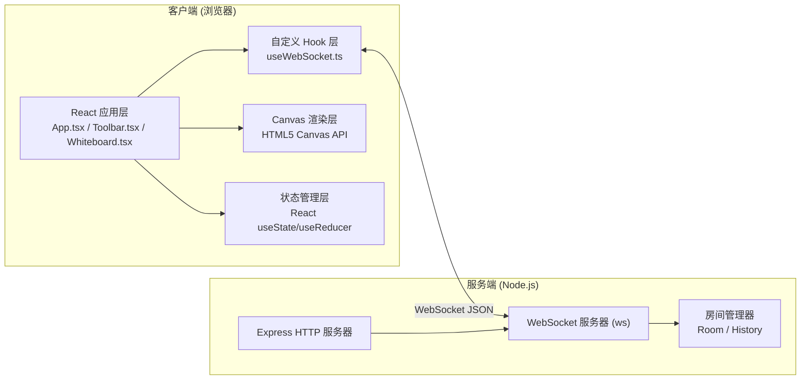
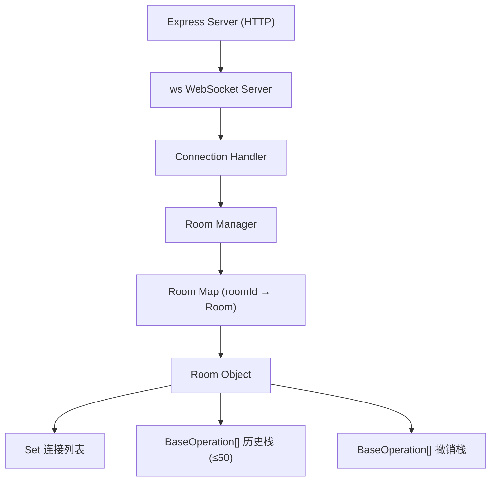

## 1. 架构设计



## 2. 技术说明

- **前端框架**：React 18 + TypeScript
- **构建工具**：Vite 5
- **后端服务**：Node.js + Express 4 + ws (WebSocket)
- **通信协议**：WebSocket，JSON 数据格式
- **渲染技术**：HTML5 Canvas 2D API + CSS Transform
- **唯一标识**：uuid
- **跨域处理**：cors
- **并发启动**：concurrently

## 3. 路由定义

| 路由 | 用途 |
|-------|---------|
| / | 白板主页（前端 Vite 托管） |
| /ws | WebSocket 连接端点（后端代理） |
| /api/health | 健康检查接口 |

## 4. WebSocket 消息协议

### 4.1 操作类型定义

```typescript
type OpType = 'draw' | 'text' | 'stickyNote' | 'delete' | 'undo' | 'redo' | 'clear' | 'sync' | 'hello' | 'users';

interface Point {
  x: number;
  y: number;
  pressure?: number;
}

interface BaseOperation {
  id: string;
  type: OpType;
  timestamp: number;
  userId: string;
  roomId: string;
}

interface DrawOperation extends BaseOperation {
  type: 'draw';
  color: string;
  strokeWidth: number;
  points: Point[];
}

interface TextOperation extends BaseOperation {
  type: 'text';
  elementId: string;
  x: number;
  y: number;
  text: string;
  fontSize: number;
  color: string;
}

interface StickyNoteOperation extends BaseOperation {
  type: 'stickyNote';
  elementId: string;
  x: number;
  y: number;
  text: string;
  color: string;
}

interface DeleteOperation extends BaseOperation {
  type: 'delete';
  elementId: string;
}

interface UndoOperation extends BaseOperation {
  type: 'undo';
}

interface RedoOperation extends BaseOperation {
  type: 'redo';
}

interface ClearOperation extends BaseOperation {
  type: 'clear';
}

interface SyncMessage {
  type: 'sync';
  operations: BaseOperation[];
}

interface HelloMessage {
  type: 'hello';
  userId: string;
  roomId: string;
}

interface UsersMessage {
  type: 'users';
  count: number;
  userIds: string[];
}

type WsMessage = BaseOperation | SyncMessage | HelloMessage | UsersMessage;
```

### 4.2 消息流转

1. 客户端连接 → 发送 `hello` 消息（携带 roomId）
2. 服务端响应 `sync` 消息（全量历史操作）+ `users` 消息（在线人数）
3. 客户端操作 → 发送操作消息（draw/text/stickyNote/delete/undo/redo/clear）
4. 服务端广播操作给房间内所有客户端
5. 用户加入/离开 → 服务端广播 `users` 消息

## 5. 服务器架构



### 5.1 服务端核心模块

| 模块 | 职责 |
|------|------|
| Express HTTP | 提供静态文件服务，健康检查 |
| ws Server | WebSocket 连接管理，消息路由 |
| RoomManager | 房间创建、查找、清理 |
| Room | 维护连接列表、操作历史栈、撤销栈、广播逻辑 |

### 5.2 历史记录管理

- **不可变操作栈**：每个房间维护 `operations: BaseOperation[]`（最多50条）
- **撤销栈**：`redoStack: BaseOperation[]`，undo 时从 operations pop 并压入 redoStack
- **清空**：执行 clear 操作时，operations 清空但保留一条 clear 操作记录用于同步
- **新用户同步**：发送完整 operations 数组给新连接的客户端

## 6. 数据模型

### 6.1 前端状态模型

```typescript
interface Viewport {
  offsetX: number;
  offsetY: number;
  scale: number;
}

interface ToolState {
  tool: 'pen' | 'text' | 'stickyNote' | 'select';
  color: string;
  strokeWidth: 2 | 6 | 12;
  fontSize: number;
}

interface CanvasElement {
  id: string;
  type: 'text' | 'stickyNote';
  x: number;
  y: number;
  text: string;
  fontSize?: number;
  color: string;
}

interface WhiteboardState {
  viewport: Viewport;
  tool: ToolState;
  drawOperations: DrawOperation[];
  elements: CanvasElement[];
  undoStack: BaseOperation[];
  redoStack: BaseOperation[];
  onlineUsers: number;
}
```

### 6.2 预设颜色盘

```typescript
const COLOR_PALETTE = [
  '#000000', '#EF4444', '#F97316', '#EAB308',
  '#22C55E', '#06B6D4', '#3B82F6', '#8B5CF6',
  '#EC4899', '#6B7280', '#FFFFFF', '#1F2937'
];
```

## 7. 性能优化策略

1. **Canvas 渲染优化**：
   - 使用 requestAnimationFrame 批量绘制
   - 离屏 Canvas 缓存静态内容
   - 仅重绘视口可见区域

2. **事件节流**：
   - mousemove/touchmove 使用 rAF 节流
   - 绘制点合并（距离过近的点跳过）

3. **内存管理**：
   - 操作历史限制 50 条
   - 离屏元素懒渲染
   - WebSocket 消息队列合并

4. **缩放策略**：
   - 使用 Canvas transform 而非重新栅格化
   - 线条基于矢量数据重绘保证清晰度
   - devicePixelRatio 适配高清屏
