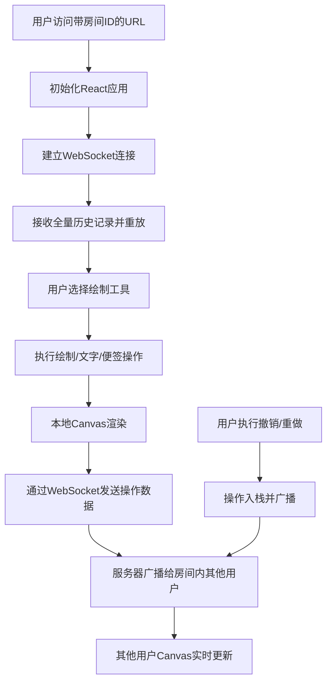

## 1. 产品概述

实时协作白板是一款面向团队的在线协作工具，让多人能够同时在虚拟白板上进行创意头脑风暴、方案讨论和视觉化表达。通过 WebSocket 实现毫秒级实时同步，支持无限画布、多种绘制工具和完整的历史记录管理。

- 目标用户：产品团队、设计团队、远程协作团队
- 核心价值：打破地理限制，提供沉浸式的协作体验
- 市场定位：轻量级、高性能、易部署的实时白板解决方案

## 2. 核心功能

### 2.1 用户角色

| 角色 | 注册方式 | 核心权限 |
|------|----------|----------|
| 协作者 | 通过房间ID加入 | 绘制、编辑、撤销/重做、清空白板 |

### 2.2 功能模块

1. **无限画布**：支持拖拽平移、滚轮缩放、平滑动画
2. **绘制工具**：画笔（自由绘制）、文字（文本框）、便签（黄色便签）
3. **实时同步**：WebSocket 双向通信，房间级广播
4. **历史记录**：50步撤销/重做，新用户全量同步
5. **响应式界面**：桌面侧边栏、移动端底部工具栏

### 2.3 页面详情

| 页面名称 | 模块名称 | 功能描述 |
|-----------|-------------|---------------------|
| 白板主页 | 顶部导航栏 | 显示房间ID、在线人数、半透明暗色背景 |
| 白板主页 | 左侧工具栏 | 工具切换、颜色选择、笔触调节、清空按钮 |
| 白板主页 | 中心画布区 | 无限Canvas、绘制操作、缩放平移 |
| 白板主页 | 文字输入弹窗 | 点击白板弹出输入框，生成可拖拽文本 |
| 白板主页 | 便签编辑 | 点击生成200x200黄色便签，支持输入和删除 |

## 3. 核心流程

用户通过 URL 中的房间 ID 加入白板 → 连接 WebSocket 并获取历史记录 → 选择工具进行绘制/文字/便签操作 → 操作实时广播给其他协作者 → 支持撤销/重做恢复状态 → 新用户加入时自动重放所有历史操作

## 4. 用户界面设计

### 4.1 设计风格

- **主色调**：纯白背景 #FFFFFF，深灰工具栏 #2D3748，暗色导航栏 #1A202C（80%透明度）
- **强调色**：黄色便签 #FEF08A，12色预设色盘
- **按钮样式**：圆角方形，白色单色 SVG 图标，hover 时轻微高亮
- **字体**：无衬线体 (system-ui, sans-serif)，字号 16-32px
- **布局风格**：极简风格，固定左侧工具栏 + 顶部导航栏 + 全屏画布
- **阴影效果**：box-shadow: 0 2px 8px rgba(0,0,0,0.15)
- **图标风格**：白色单色 SVG，简洁线条风格

### 4.2 页面设计概览

| 页面名称 | 模块名称 | UI元素 |
|-----------|-------------|-------------|
| 白板主页 | 顶部导航栏 | 半透明暗色背景、房间ID标签、在线人数指示器、柔和阴影 |
| 白板主页 | 左侧工具栏 | 深灰背景、工具图标组、12色盘、3档笔触按钮、颜色/笔触指示器、清空按钮、白色SVG图标 |
| 白板主页 | 中心画布 | 纯白背景、Canvas层、文字/便签HTML覆盖层、支持缩放和平移 |
| 白板主页 | 文字输入框 | 居中弹窗、无衬线字体、字号调节滑块、确认/取消按钮 |
| 白板主页 | 便签 | 200x200黄色背景、文本输入区、删除按钮、拖拽句柄 |

### 4.3 响应式设计

- **桌面端 (>1024px)**：左侧固定工具栏（宽64px），顶部导航栏，全屏画布
- **平板端 (768-1024px)**：左侧工具栏收窄，触摸优化按钮尺寸
- **移动端 (<768px)**：工具栏折叠为底部弹出式，支持触摸绘制，手势缩放
- **触摸优化**：所有交互元素 ≥44x44px，支持单指绘制、双指缩放平移

### 4.4 动效设计

- 缩放动画：使用 CSS transform / Canvas transform 实现，帧率 ≥30fps
- 线条效果：落笔/抬笔缓入缓出，两端自然变细
- 工具栏交互：hover 状态平滑过渡（150ms ease）
- 便签拖拽：带轻微的吸附和缓动效果
