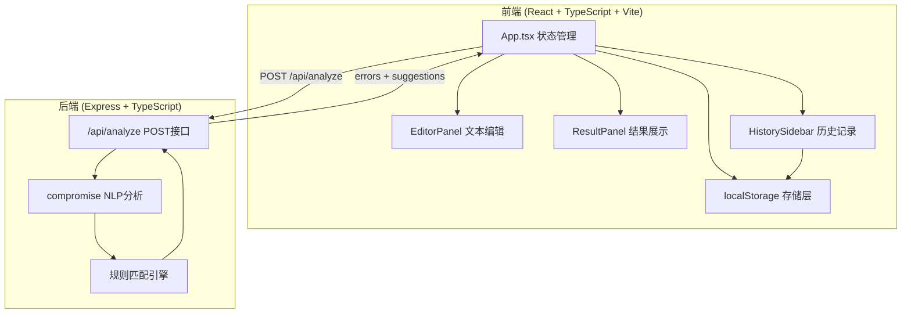
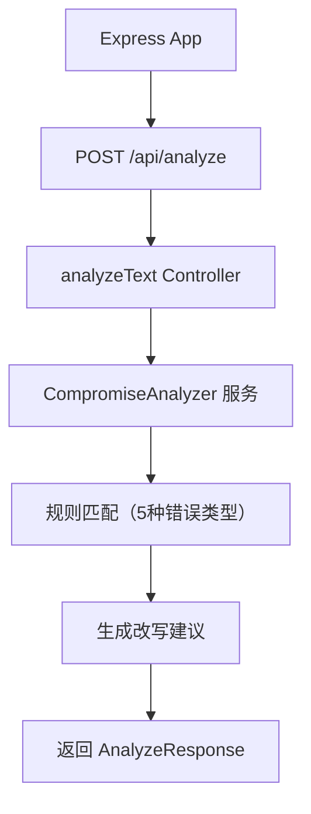

## 1. 架构设计



## 2. 技术描述

- **前端**：React@18 + TypeScript@5 + Vite@5
- **后端**：Express@4 + TypeScript@5 + compromise@14（轻量NLP库）
- **状态管理**：React useState（轻量级应用，无需额外状态库）
- **数据存储**：浏览器 localStorage
- **通信**：REST API + JSON
- **跨域**：cors 中间件 + Vite 开发代理
- **其他依赖**：uuid（历史记录ID生成）

## 3. 路由定义
| 路由 | 用途 |
|------|------|
| / | 主应用页面（单页应用） |
| POST /api/analyze | 语法分析接口 |

## 4. API 定义

### 请求体
```typescript
interface AnalyzeRequest {
  text: string;
}
```

### 响应体
```typescript
interface GrammarError {
  original: string;          // 原始错误文本
  position: {
    start: number;           // 起始位置（字符索引）
    length: number;          // 错误长度
  };
  type: string;              // 错误类型：subject-verb / tense / article / preposition / noun-count
  description: string;       // 错误描述
  suggestions: string[];     // 1-3条改写建议
}

interface AnalyzeResponse {
  errors: GrammarError[];
}
```

### 历史记录数据结构
```typescript
interface HistoryRecord {
  id: string;                // uuid
  timestamp: number;         // 时间戳
  text: string;              // 当时的输入文本
  errors: GrammarError[];    // 当时的错误列表
  appliedCorrections: {      // 用户采纳的修改
    original: string;
    replacement: string;
    position: { start: number; length: number };
  }[];
}
```

## 5. 服务器架构



## 6. 项目文件结构

```
auto60/
├── package.json
├── vite.config.js
├── tsconfig.json
├── index.html
├── src/
│   ├── main.tsx            # React入口
│   ├── App.tsx             # 主组件，状态管理
│   ├── types/
│   │   └── index.ts        # 类型定义
│   ├── components/
│   │   ├── EditorPanel.tsx      # 编辑器组件
│   │   ├── ResultPanel.tsx      # 结果展示组件
│   │   └── HistorySidebar.tsx   # 历史侧边栏
│   ├── hooks/
│   │   └── useHistory.ts        # 历史记录hook
│   └── utils/
│       └── api.ts               # API调用封装
└── server/
    ├── index.ts             # Express服务入口
    ├── analyzer/
    │   └── grammarAnalyzer.ts  # 语法分析核心逻辑
    └── rules/
        ├── subjectVerb.ts      # 主谓一致规则
        ├── tense.ts            # 时态规则
        ├── article.ts          # 冠词规则
        ├── preposition.ts      # 介词规则
        └── nounCount.ts        # 名词数规则
```

## 7. 数据流向

### 分析流程
1. 用户在 `EditorPanel` 输入文本 → `onChange` → `App.state.inputText`
2. 点击"分析" → `App.handleAnalyze()` → `POST /api/analyze`
3. 后端 `grammarAnalyzer` 使用 compromise 解析 + 规则匹配 → 返回 `AnalyzeResponse`
4. `App.state.errors` 更新 → `ResultPanel` 渲染错误卡片

### 替换流程
1. 用户在 `ResultPanel` 点击建议的"替换"按钮 → `App.handleApplyCorrection()`
2. 根据 position 计算位置，替换 `inputText` 中对应片段
3. 更新 `App.state.inputText` → `EditorPanel` 刷新
4. 记录到 `appliedCorrections`

### 历史流程
1. 点击"保存历史" → `useHistory.save()` → `localStorage.setItem('grammar_history', ...)`
2. `HistorySidebar` 从 `useHistory` 获取列表，时间倒序渲染
3. 点击历史记录 → `useHistory.load(id)` → 回填 `inputText` 和 `errors`
