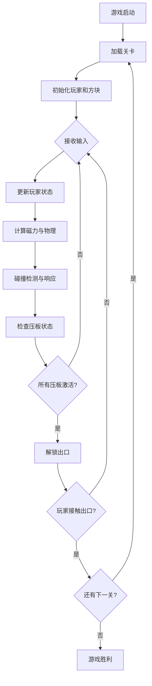

## 1. 产品概述

磁力谜题（Magnetic Puzzle）是一款 2D 俯视角物理解谜游戏，玩家通过切换自身磁极（N极/S极）吸引或排斥场景中的金属方块，利用物理碰撞解决谜题并到达出口。目标用户为独立游戏爱好者和休闲解谜玩家，产品价值在于提供富有创意的磁力物理交互体验。

## 2. 核心功能

### 2.1 功能模块

1. **玩家控制模块**：键盘输入、磁极切换、角色移动、跳跃
2. **物理引擎模块**：磁力计算、重力系统、碰撞检测、方块运动
3. **关卡系统模块**：关卡数据加载、压板检测、出口解锁、关卡重置、关卡切换
4. **渲染模块**：角色渲染、方块渲染、磁力特效、粒子动画、UI覆盖层
5. **游戏主循环**：状态管理、帧调度、子系统协调

### 2.2 功能详情

| 模块名称 | 功能名称 | 功能描述 |
|----------|----------|----------|
| 玩家控制 | 移动控制 | A/D键左右移动，速度300px/s |
| 玩家控制 | 跳跃控制 | W键跳跃，初速度-400px/s，重力800px/s² |
| 玩家控制 | 磁极切换 | 空格键切换N/S极，0.3秒冷却CD |
| 物理引擎 | 磁力计算 | 力与距离平方成反比，最大作用半径200px，N极排斥/S极吸引 |
| 物理引擎 | 拖拽吸附 | 方块距离玩家≤30px时随玩家移动 |
| 物理引擎 | 碰撞检测 | 方块之间、方块与平台、玩家与平台的碰撞响应 |
| 关卡系统 | 压板检测 | 方块压在压板上时压板变亮绿色 |
| 关卡系统 | 出口解锁 | 所有压板激活后出口变为金色闪烁 |
| 关卡系统 | 时间限制 | 第3关60秒倒计时，超时重置 |
| 关卡系统 | 移动平台 | 第2关平台沿固定路径滑动，速度100px/s |
| 渲染 | 角色渲染 | 三角形，N极红色带白光晕，S极蓝色带青光晕 |
| 渲染 | 方块渲染 | 金属灰色，受力时流动光粒效果 |
| 渲染 | 粒子特效 | 出口金色粒子闪烁，磁极切换脉冲光圈 |
| 渲染 | UI覆盖层 | 白色文字、计时器、关卡提示 |

## 3. 核心流程

玩家启动游戏后加载第1关，通过A/D移动、W跳跃、空格切换磁极，利用磁力将方块推到对应压板上，所有压板激活后出口解锁，接触出口进入下一关。第2关加入移动平台，第3关加入60秒时间限制。超时或失败可重置关卡。

## 4. 用户界面设计

### 4.1 设计风格

- **主色调**：深空蓝黑色 #0B0E14（背景），金属灰 #8B8B8B（方块），红色 #FF3333（N极），蓝色 #3333FF（S极），金色 #FFD700（出口/粒子），亮绿 #00FF00（激活压板）
- **辅助色**：暗红 #8B0000（未激活压板），半透明网格 #1A2750（地面），白色 #EEEEEE（文字）
- **字体**：使用 monospace 等宽字体增强科幻感，标题 24px，正文 16px，提示 14px
- **视觉效果**：所有发光元素使用 Canvas shadowBlur 实现光晕，粒子系统实现流动和闪烁效果
- **布局**：全屏Canvas自适应，游戏元素居中，UI元素（计时器、提示）贴边显示

### 4.2 页面设计

| 元素名称 | UI组件 | 视觉描述 |
|----------|--------|----------|
| 游戏主画面 | 全屏Canvas | 深空背景 + 半透明网格地面 |
| 玩家角色 | 三角形 | 边长30px，N极红/ S极蓝，边缘光晕 |
| 金属方块 | 正方形 | 边长35px，金属灰带高光条纹，受力时光粒流动 |
| 压板 | 矩形 | 暗红色→亮绿色渐变，激活时发光 |
| 出口 | 矩形 | 50x50px，灰色半透明→金色闪烁粒子 |
| 磁极CD指示 | 脉冲光圈 | 角色周围渐变脉冲，CD期间显示 |
| 顶部UI | 文字覆盖 | 关卡名称、操作提示，左上/右上角 |
| 倒计时 | 数字显示 | 第3关右上角60秒倒计时 |

### 4.3 响应式

采用桌面优先设计，Canvas基于视口宽度比例缩放（800px-1600px区间），保持游戏世界坐标不变，仅渲染时应用缩放因子。所有UI文字大小随缩放因子同步调整。

### 4.4 动画与特效

- **磁极切换**：角色周围脉冲光圈由内向外扩散渐变，持续0.3秒
- **磁力作用**：方块表面光粒沿磁力方向流动，颜色随磁极变化
- **出口解锁**：金色粒子（2-4px）随机闪烁（0.5-1.5Hz）
- **压板激活**：颜色从暗红平滑过渡到亮绿，伴随发光增强
- **角色移动**：三角形朝向移动方向倾斜，产生动感
