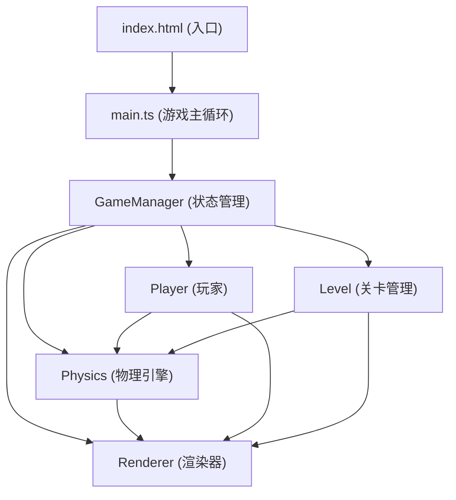

## 1. 架构设计



**数据流向**：
- 键盘事件 → main.ts → Player 更新位置/磁极
- Player 状态 + Level 方块数据 → Physics 计算力与碰撞 → 更新方块速度/位置
- Physics 结果 → GameManager 检查压板/出口状态
- 所有游戏状态 → Renderer 绘制到 Canvas

## 2. 技术说明

- **构建工具**：Vite@5 + TypeScript@5（严格模式）
- **渲染**：HTML5 Canvas 2D Context
- **状态管理**：GameManager 类统一管理游戏状态
- **无后端**：纯前端游戏，关卡数据内嵌于 TypeScript 模块

## 3. 文件结构

```
auto63/
├── index.html                  # 入口页面，全屏Canvas
├── package.json                # vite + typescript 依赖
├── vite.config.js              # Vite 构建配置
├── tsconfig.json               # TypeScript 严格模式配置
└── src/
    ├── main.ts                 # 主入口，游戏循环，初始化各系统
    ├── types.ts                # 共享类型定义
    ├── Player.ts               # 玩家类：输入、移动、磁极
    ├── Physics.ts              # 物理引擎：磁力、重力、碰撞
    ├── Level.ts                # 关卡数据：地图、方块、压板、出口
    ├── Renderer.ts             # 渲染器：绘制所有可视元素
    ├── GameManager.ts          # 游戏管理器：状态调度、关卡流程
    └── levels/                 # 关卡数据目录
        ├── level1.ts
        ├── level2.ts
        └── level3.ts
```

**文件调用关系**：
1. [main.ts](file:///e:/solo/VersionFast/tasks/auto63/src/main.ts) 导入并实例化 GameManager、Player、Level、Physics、Renderer
2. [GameManager.ts](file:///e:/solo/VersionFast/tasks/auto63/src/GameManager.ts) 持有 Player、Physics、Level、Renderer 引用，协调 update 顺序
3. [Player.ts](file:///e:/solo/VersionFast/tasks/auto63/src/Player.ts) 输出 {x, y, vx, vy, pole, poleCooldown} 给 Physics 和 Renderer
4. [Physics.ts](file:///e:/solo/VersionFast/tasks/auto63/src/Physics.ts) 接收玩家状态和 Level.blocks[]，更新方块的位置速度
5. [Level.ts](file:///e:/solo/VersionFast/tasks/auto63/src/Level.ts) 提供方块、压板、出口、平台数据，支持 load/reset
6. [Renderer.ts](file:///e:/solo/VersionFast/tasks/auto63/src/Renderer.ts) 从 GameManager 获取所有状态进行绘制

## 4. 核心数据模型

```typescript
// types.ts
export type Pole = 'N' | 'S';

export interface Vector2 {
  x: number;
  y: number;
}

export interface PlayerState {
  position: Vector2;
  velocity: Vector2;
  pole: Pole;
  poleCooldown: number;     // 0~1，0表示就绪，1表示刚切换
  onGround: boolean;
}

export interface Block {
  id: number;
  position: Vector2;
  velocity: Vector2;
  mass: number;            // 1~3
  size: number;            // 35px
  attachedToPlayer: boolean;
  magneticParticles: Particle[];
}

export interface PressurePlate {
  id: number;
  position: Vector2;
  size: Vector2;           // width, height
  activated: boolean;
  targetBlockId: number;
}

export interface ExitZone {
  position: Vector2;
  size: Vector2;           // 50x50
  unlocked: boolean;
  particles: Particle[];
}

export interface Platform {
  id: number;
  position: Vector2;
  size: Vector2;
  path?: Vector2[];        // 移动路径点
  pathSpeed?: number;      // 100 px/s
  pathIndex?: number;
}

export interface Particle {
  position: Vector2;
  velocity: Vector2;
  size: number;
  color: string;
  life: number;
  maxLife: number;
}

export interface LevelData {
  name: string;
  playerStart: Vector2;
  blocks: Omit<Block, 'velocity' | 'attachedToPlayer' | 'magneticParticles'>[];
  plates: PressurePlate[];
  exit: ExitZone;
  platforms: Platform[];
  timeLimit?: number;      // 秒，仅第3关
  gravity: number;         // 800 px/s²
}
```

## 5. 物理算法

### 5.1 磁力计算
```
距离 d = |player.pos - block.pos|
若 d > 200px: 力 F = 0
若 d ≤ 30px: 方块进入拖拽模式，跟随玩家移动
否则:
  方向向量 dir = normalize(block.pos - player.pos)
  力大小 F = k / d²  （k 为磁力常数，经验值 50000）
  N极（排斥）: block.force = dir × F / block.mass
  S极（吸引）: block.force = -dir × F / block.mass
```

### 5.2 碰撞检测（AABB）
```
两个矩形 A, B 发生碰撞当且仅当:
  A.x < B.x + B.width  AND
  A.x + A.width > B.x  AND
  A.y < B.y + B.height AND
  A.y + A.height > B.y
碰撞响应：沿重叠最小轴分离，速度乘以恢复系数（0.3）
```

### 5.3 性能约束
- 固定时间步长：使用 requestAnimationFrame + deltaTime 累积
- 物理更新每帧 ≤ 10ms（目标 50 个对象以内）
- 粒子对象复用对象池，避免频繁 GC

## 6. 性能优化策略

1. **空间分区**：使用简单网格将场景分块，磁力计算仅遍历玩家周围 200px 半径内的方块
2. **脏矩形渲染**：若未来需要优化，可跟踪变化区域仅重绘局部
3. **粒子池化**：Particle 对象预先分配，active/inactive 状态切换
4. **数学运算**：距离平方比较替代开方，向量运算内联减少函数调用
