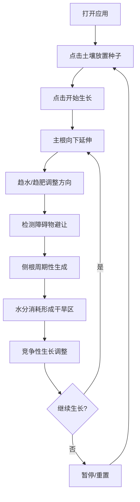

## 1. 产品概述

植物根系生长模拟器是一个基于浏览器的交互式2D模拟应用，帮助用户直观理解植物根系在土壤中的自适应生长机制（趋水性、趋肥性、避障性）。通过可视化展示根系分支策略与环境因素（水分梯度、养分分布、障碍物）的动态交互，解决教学和科普中难以直观呈现根系生长原理的问题。

- 核心功能：实时模拟根系在可变土壤环境中的生长过程，支持用户交互控制环境参数
- 目标用户：生物学学习者、教育工作者、植物学爱好者

## 2. 核心功能

### 2.1 用户角色
无用户角色区分，所有用户享有完整功能权限。

### 2.2 功能模块
1. **主模拟区域**：800x600像素土壤画布，展示根系生长、湿度热力图、养分分布图
2. **控制面板**：环境参数调节（湿度种子、养分种子、水分消耗速率、侧根间隔）
3. **操作按钮**：开始/暂停生长、重置实验
4. **状态栏**：实时显示根总长度、分支数、水分消耗统计

### 2.3 页面详情
| 页面名称 | 模块名称 | 功能描述 |
|-----------|-------------|---------------------|
| 主页面 | 土壤模拟画布 | 点击放置种子，实时渲染根系、热力图、养分点 |
| 主页面 | 控制面板 | 四个滑动条实时调节环境参数，数值即时显示 |
| 主页面 | 操作按钮区 | 开始/暂停切换、重置实验功能 |
| 主页面 | 底部状态栏 | 实时显示生长统计数据 |

## 3. 核心流程

用户打开页面 → 点击土壤区域放置种子 → 点击"开始生长" → 根系向下生长并响应环境 → 通过控制面板调节参数观察变化 → 点击"重置实验"重新开始

## 4. 用户界面设计

### 4.1 设计风格
- **主色调**：米色背景 #F5E6CA（羊皮纸质感），深棕土壤 #3E2723，主青色 #00BCD4
- **辅助色**：棕褐色 #5D4037、嫩绿色 #8BC34A、浅棕色 #A1887F、亮青色 #26C6DA
- **按钮样式**：圆角8-12px，悬停变亮，点击缩放 transform: scale(0.95)
- **字体**：无衬线字体，状态栏14px #E0E0E0
- **布局**：左侧主画布 + 右侧200px控制面板 + 底部状态栏
- **质感效果**：羊皮纸噪点纹理 filter: url(#noise)、毛玻璃 backdrop-filter: blur(6px)、根尖白色光晕

### 4.2 页面设计概述
| 页面名称 | 模块名称 | UI元素 |
|-----------|-------------|-------------|
| 主页面 | 土壤画布 | 800x600矩形、深棕背景、湿度热力图(青蓝半透明)、养分点(黄色半透明)、根系渐变线段、根尖发光点 |
| 主页面 | 控制面板 | 深色半透明 #1E3A5F、圆角8px、毛玻璃、4个亮青色轨道滑动条、白色滑块、实时数值显示 |
| 主页面 | 操作按钮 | 主青色按钮、圆角、悬停/点击动效 |
| 主页面 | 状态栏 | 左对齐、14px #E0E0E0文字 |

### 4.3 响应性
桌面端优先设计，固定画布尺寸800x600，控制面板固定宽度200px，整体布局居中。

### 4.4 动画与交互
- 根系生长：每帧更新，平滑过渡
- 根尖光晕：半径2px白色发光效果 box-shadow: 0 0 4px #FFFFFF
- 热力图更新：水分消耗后0.1秒内刷新
- 按钮交互：悬停变亮、点击缩放
