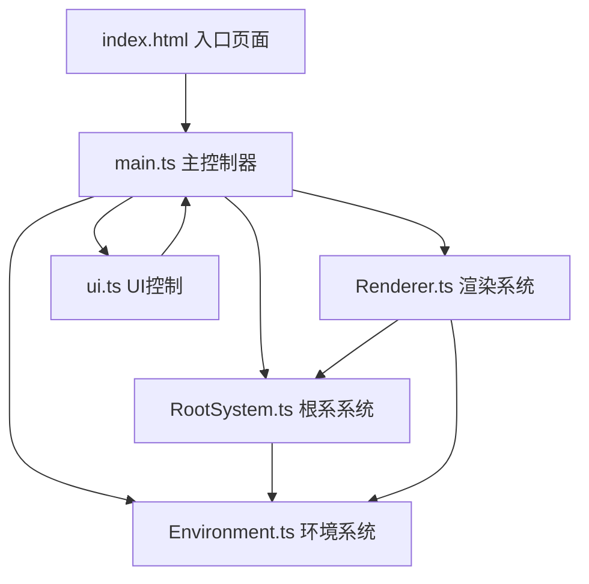

## 1. 架构设计



## 2. 技术描述

- **前端框架**：原生 TypeScript + HTML5 Canvas（无React/Vue，按需求定制）
- **构建工具**：Vite 5.x
- **编程语言**：TypeScript（严格模式）
- **渲染方式**：Canvas 2D Context，每帧清空重绘
- **动画循环**：requestAnimationFrame，目标30fps
- **样式方案**：内联CSS + HTML内联style，无Tailwind（按需求纯HTML实现）

## 3. 文件结构

```
auto65/
├── index.html                    # 入口页面，含Canvas和侧边栏DOM
├── vite.config.js                # Vite构建配置
├── tsconfig.json                 # TypeScript严格模式配置
├── package.json                  # 项目依赖和脚本
└── src/
    ├── main.ts                   # 初始化、主循环、事件绑定
    ├── RootSystem.ts             # 根系数据结构、生长算法、趋化性、避障
    ├── Environment.ts            # 湿度/养分场、障碍物、碰撞检测
    ├── Renderer.ts               # Canvas绘制：背景、热力图、根系、光晕
    └── ui.ts                     # 控制面板DOM、滑动条、状态栏更新
```

## 4. 核心数据模型

### 4.1 根系节点 (RootNode)
```typescript
interface RootNode {
  x: number;           // 节点X坐标
  y: number;           // 节点Y坐标
  angle: number;       // 当前生长方向(弧度)
  isMain: boolean;     // 是否为主根
  parentIndex: number; // 父节点索引(-1为主根起点)
  depth: number;       // 从种子开始的累计深度
  growthRemaining: number; // 本节点待生长量
}
```

### 4.2 根系系统 (RootSystem)
```typescript
class RootSystem {
  nodes: RootNode[];               // 所有根系节点
  totalLength: number;             // 根总长度
  branchCount: number;             // 分支数
  seeded: boolean;                 // 是否已放置种子
  seedX: number;                   // 种子X坐标
  seedY: number;                   // 种子Y坐标
  
  grow(env: Environment, params: GrowthParams): void;
  addBranch(node: RootNode, angle: number): void;
  getTipIndices(): number[];       // 获取所有根尖索引
}
```

### 4.3 环境系统 (Environment)
```typescript
class Environment {
  width: number;                   // 画布宽度
  height: number;                  // 画布高度
  moistureGrid: Float32Array;      // 湿度场(网格化存储)
  nutrientPoints: NutrientPoint[]; // 养分点
  obstacles: Obstacle[];           // 障碍物列表
  
  generateMoisture(seed: number): void;
  generateNutrients(seed: number): void;
  generateObstacles(count: number): void;
  getMoistureAt(x: number, y: number): number;
  getNutrientAt(x: number, y: number): number;
  findNearestObstacle(x: number, y: number): Obstacle | null;
  consumeMoisture(x: number, y: number, radius: number, amount: number): void;
}
```

### 4.4 渲染系统 (Renderer)
```typescript
class Renderer {
  ctx: CanvasRenderingContext2D;
  
  clear(): void;
  drawSoilBackground(): void;
  drawMoistureHeatmap(moistureGrid: Float32Array): void;
  drawNutrientPoints(points: NutrientPoint[]): void;
  drawRoots(nodes: RootNode[]): void;
  drawRootTips(nodes: RootNode[]): void;
}
```

## 5. 生长算法说明

### 5.1 趋化性计算
- 在根尖周围采样8个方向（间隔45度），距离10像素
- 计算每个方向的综合得分：`0.6 * moisture + 0.4 * nutrient - obstaclePenalty`
- 选择得分最高的方向，限制最大偏转角 ±30度

### 5.2 避障逻辑
- 每帧检测根尖与所有障碍物的距离
- 距离障碍物边缘 < 5像素时触发避让
- 主根偏转 40-60度，侧根偏转 20-30度
- 避让时速度降至50%，20帧后逐渐恢复

### 5.3 侧根生成
- 主根长度超过20像素后开始检测
- 每累计生长60-80像素（可配置）生成一个侧根
- 侧根角度 45-135度（相对于主根方向，±90度范围）
- 侧根初始速度为主根的70%

### 5.4 水分消耗与竞争
- 每个根尖每秒消耗周围10像素半径内湿度值0.05（可配置）
- 消耗采用高斯衰减，距离越近消耗越多
- 形成的局部干旱区降低后续根系在该方向的吸引力
