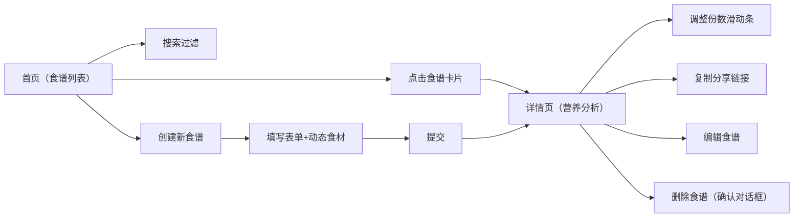

## 1. 产品概述

在线食谱管理与营养分析应用，用户可创建、编辑和分享食谱，系统自动计算营养成分并生成可视化分析图表。

- 核心价值：帮助用户管理食谱并直观了解营养构成，支持健康饮食决策
- 目标用户：关注健康饮食、需要营养管理的普通用户和健身爱好者

## 2. 核心功能

### 2.1 功能模块
1. **食谱列表页**：卡片网格展示、实时搜索过滤、营养小条预览
2. **食谱详情页**：食谱信息展示、NutritionCard 营养分析、份数调节、分享链接
3. **食谱创建/编辑页**：动态食材表格、自动补全、营养预览

### 2.2 页面详情

| 页面名称 | 模块名称 | 功能描述 |
|----------|----------|----------|
| 食谱列表页 | 搜索栏 | 实时模糊搜索（debounce 300ms），按名称和描述匹配 |
| 食谱列表页 | 卡片网格 | 响应式3/2/1列布局，悬浮上浮动画 |
| 食谱列表页 | 营养小条 | 四个彩色矩形代表热量/蛋白/脂肪/碳水 |
| 食谱详情页 | 头部信息 | 名称、描述、烹饪时间 |
| 食谱详情页 | NutritionCard | 柱状图 + 雷达图 + 份数调节滑动条 |
| 食谱详情页 | 食材列表 | 完整食材表格（名称、数量、每100g营养） |
| 创建/编辑页 | 基本信息表单 | 名称、描述、时间、份数 |
| 创建/编辑页 | 动态食材表格 | 增删行、自动补全、营养预览 |
| 创建/编辑页 | 删除确认对话框 | 二次确认删除操作 |

## 3. 核心流程

用户打开首页浏览食谱卡片 → 搜索过滤或点击卡片 → 进入详情页查看营养分析 → 调整份数查看变化 → 复制链接分享 / 点击编辑修改 / 点击删除确认 → 或点击创建新食谱 → 填写表单并动态添加食材 → 提交后跳转详情页

## 4. 用户界面设计

### 4.1 设计风格
- **主题**：暗色主题，背景渐变 `#1A1A2E → #16213E`
- **卡片效果**：半透明磨砂玻璃 `rgba(255,255,255,0.05)` + `backdrop-filter: blur(10px)` + 边框 `rgba(255,255,255,0.1)`
- **主色**：按钮 `#E94560`（悬停 `#FF6B81`，按下 `#C62828`）
- **图表色**：热量 `#FF6B6B`、蛋白质 `#4ECDC4`、脂肪 `#FFD93D`、碳水 `#6BCB77`
- **雷达图**：填充 `rgba(138,43,226,0.2)`，线条 `#8A2BE2`
- **圆角**：输入框/按钮 8px
- **动画**：过渡 0.2s，按钮涟漪效果，输入框聚焦发光

### 4.2 页面设计概览

| 页面名称 | 模块名称 | UI 元素 |
|----------|----------|---------|
| 食谱列表页 | 搜索栏 | 顶部搜索框 + 标题堆叠（移动端），聚焦发光边框 |
| 食谱列表页 | 卡片网格 | 每行3列/2列/1列响应式，卡片 hover 上浮 translateY(-4px) + 阴影过渡 0.3s |
| 食谱详情页 | NutritionCard | 左：推荐值百分比竖排；中：水平柱状图（800ms easeOutCubic 动画，柱顶数值标签）；右：雷达图；底部：份数滑动条 |
| 创建/编辑页 | 表单布局 | 桌面两列网格，左：基本信息；右：食材表格；平板/手机单列 |
| 创建/编辑页 | 自动补全 | 下拉框跟随输入框，背景 `#2A2A3E`，悬停 `#3D3D5E` |

### 4.3 响应式
- 桌面端（≥1024px）：3列卡片 + 两列表单
- 平板端（768-1023px）：2列卡片 + 单列表单
- 手机端（<768px）：1列卡片 + 单列表单 + 搜索框与标题堆叠
- 图表自动响应重绘（responsive + maintainAspectRatio）

### 4.4 过渡动画
- 页面切换：淡入淡出（opacity + transform，300ms）
- 删除卡片：向左滑动缩回 + opacity 0（400ms）
- 柱状图：从底部升起（800ms easeOutCubic）
- 微交互：按钮涟漪、输入框聚焦发光、卡片 hover 上浮
