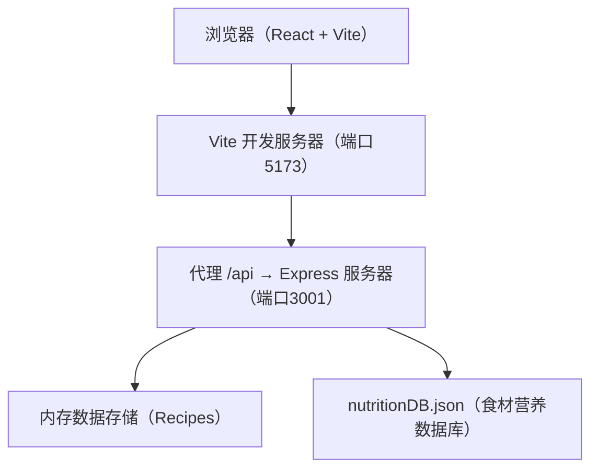
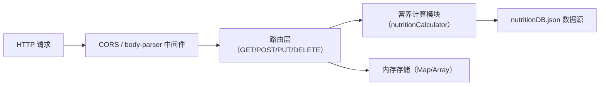
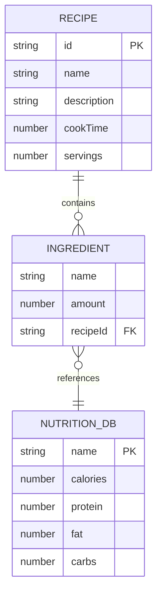

## 1. 架构设计



## 2. 技术栈

- **前端**：React 18 + TypeScript + Vite + React Router v6
- **图表**：Chart.js + react-chartjs-2
- **后端**：Express 4 + CORS + body-parser
- **状态管理**：React Hooks（useState、useMemo、useCallback、useEffect）
- **样式**：原生 CSS（CSS 变量 + 响应式媒体查询）

## 3. 路由定义

| 路由 | 用途 |
|------|------|
| `/` | 食谱列表页 |
| `/recipe/:id` | 食谱详情页 |
| `/create` | 创建新食谱 |
| `/edit/:id` | 编辑现有食谱 |

## 4. API 定义

### TypeScript 类型

```typescript
interface Ingredient {
  name: string;
  amount: number; // 克
}

interface Nutrition {
  calories: number;    // 千卡
  protein: number;     // 克
  fat: number;         // 克
  carbs: number;       // 克
}

interface Recipe {
  id: string;
  name: string;
  description: string;
  cookTime: number;    // 分钟
  servings: number;
  ingredients: Ingredient[];
  nutritionPerServing: Nutrition;
}

interface NutritionDBItem {
  name: string;
  calories: number;   // 每100g
  protein: number;    // 每100g
  fat: number;        // 每100g
  carbs: number;      // 每100g
}
```

### REST API

| 方法 | 路径 | 请求 | 响应 |
|------|------|------|------|
| GET | `/api/recipes` | - | `Recipe[]` |
| POST | `/api/recipes` | `Omit<Recipe, 'id' \| 'nutritionPerServing'>` | `Recipe` |
| PUT | `/api/recipes/:id` | `Omit<Recipe, 'id' \| 'nutritionPerServing'>` | `Recipe` |
| DELETE | `/api/recipes/:id` | - | `{ success: true }` |
| GET | `/api/ingredients` | - | `NutritionDBItem[]` |
| GET | `/api/ingredients/search?q=xxx` | query | `NutritionDBItem[]`（前5条匹配） |

## 5. 服务器架构



## 6. 数据模型

### 6.1 ER 图



### 6.2 每日推荐值参考

| 营养成分 | 推荐值 |
|----------|--------|
| 热量 | 2000 千卡 |
| 蛋白质 | 60 克 |
| 脂肪 | 65 克 |
| 碳水化合物 | 300 克 |

## 7. 项目文件结构

```
├── package.json
├── index.html
├── vite.config.js
├── tsconfig.json
├── src/
│   ├── main.tsx
│   ├── App.tsx
│   ├── types.ts
│   ├── pages/
│   │   ├── RecipeList.tsx
│   │   ├── RecipeDetail.tsx
│   │   └── RecipeForm.tsx
│   ├── components/
│   │   ├── NutritionCard.tsx
│   │   ├── RecipeCard.tsx
│   │   ├── IngredientAutocomplete.tsx
│   │   └── ConfirmDialog.tsx
│   ├── utils/
│   │   └── nutritionCalculator.ts
│   ├── hooks/
│   │   └── useDebounce.ts
│   └── index.css
└── server/
    ├── index.ts
    └── nutritionDB.json
```
