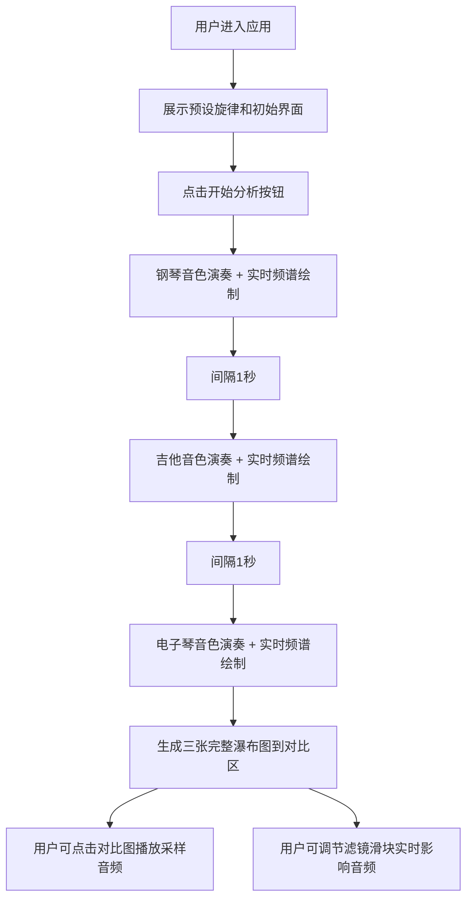

## 1. 产品概述
乐器频谱分析可视化应用，帮助音乐爱好者直观对比不同乐器（钢琴、吉他、电子琴）音色在时域和频域上的差异。通过内置音频合成器演奏预设旋律，实时生成频谱瀑布图，支持交互式对比和滤镜调节。

- 主要目的：解决音乐爱好者难以直观对比不同乐器音色差异的问题
- 目标用户：音乐爱好者、音乐学习者、音频技术爱好者
- 产品价值：提供可视化的音色分析工具，让抽象的音色差异变得具象可感知

## 2. 核心功能

### 2.1 用户角色
无角色区分，所有用户拥有完整功能权限。

### 2.2 功能模块
1. **主界面**：乐器选择区、瀑布图展示区、对比区、滤镜控制面板
2. **音频合成与播放**：三种乐器音色合成器，依次演奏预设旋律
3. **频谱可视化**：实时瀑布图绘制，时间轴滚动，对数频率坐标
4. **对比交互**：点击对比图时间点播放音频片段，放大镜动画
5. **实时滤镜**：低通、高通、混响参数调节，实时应用到音频链

### 2.3 页面详情
| 页面名称 | 模块名称 | 功能描述 |
|-----------|-------------|---------------------|
| 主页面 | 顶部控制区 | 预设旋律展示、开始分析按钮、演奏进度指示 |
| 主页面 | 乐器选择区 | 三个圆形乐器按钮（钢琴/吉他/电子琴），带高亮外发光 |
| 主页面 | 瀑布图展示区 | Canvas实时绘制频谱瀑布图，时间轴自动滚动 |
| 主页面 | 对比区 | 三种乐器完整瀑布图垂直排列，支持点击播放采样 |
| 主页面 | 滤镜控制面板 | 低通/高通/混响三个滑块，实时调节音频效果 |

## 3. 核心流程
用户打开应用后，默认展示预设的C大调音阶旋律。点击"开始分析"按钮后，应用按顺序使用钢琴→吉他→电子琴三种音色演奏该旋律（每次间隔1秒）。演奏过程中，右侧瀑布图实时滚动生成频谱图。三种乐器全部演奏完毕后，下方对比区展示三张完整瀑布图。用户可点击对比图上任意时间点播放0.3秒音频片段，也可通过右侧滤镜面板实时调节音频参数。

## 4. 用户界面设计

### 4.1 设计风格
- **主色调**：深色科技风，背景#1A1A2E，瀑布图背景#0D0D2B
- **辅助色**：文字#E0E0E0，网格线#2A2A4A，高亮色#00D2FF
- **颜色映射**：频谱幅度从深蓝（-80dB）到亮红（0dB）渐变
- **按钮风格**：圆形按钮（直径60px），默认透明度0.6，高亮时1.0带外发光动画
- **字体**：使用等宽技术感字体，标题与正文形成层次
- **布局**：三栏布局（左乐器选择、中瀑布图、右滤镜面板），底部对比区
- **面板效果**：滤镜面板采用半透明毛玻璃效果（backdrop-filter: blur(10px)）

### 4.2 页面设计概览
| 页面名称 | 模块名称 | UI元素 |
|-----------|-------------|-------------|
| 主页面 | 顶部控制区 | 旋律音符标签、开始按钮（发光悬停）、进度条 |
| 主页面 | 乐器选择区 | 三个圆形乐器图标按钮（Font Awesome）、外发光高亮动画 |
| 主页面 | 瀑布图展示区 | Canvas画布、对数频率刻度网格、时间轴滚动指示器 |
| 主页面 | 对比区 | 三张300x200px小图、点击放大镜动画（0.2s放大1.5倍恢复） |
| 主页面 | 滤镜控制面板 | 三个滑块（带数值标签）、毛玻璃背景、实时响应 |

### 4.3 响应式设计
- 桌面优先，瀑布图尺寸随窗口宽度在400-800px间弹性变化
- 移动端按钮触摸反馈：0.2s ease-out transform: scale(0.95)
- 小屏幕下滤镜面板可折叠，对比区改为垂直滚动

### 4.4 动效设计
- 瀑布图频谱更新：平滑淡入淡出（旧数据透明度-0.1/帧，新数据+0.1/帧）
- 乐器按钮高亮：#00D2FF外发光呼吸动画
- 点击对比图：0.2秒放大镜效果（scale 1→1.5→1）
- 滑块调节：旋钮位置平滑过渡
- 按钮按下：transform: scale(0.95)触摸反馈
