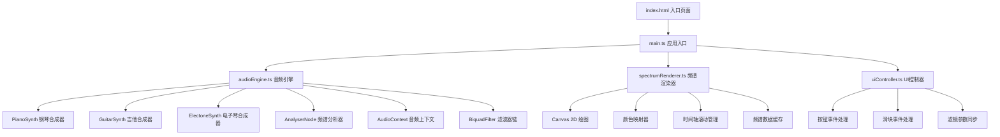

## 1. 架构设计



## 2. 技术描述
- **前端框架**：原生 TypeScript + Vite（无React/Vue框架，直接操作DOM和Canvas）
- **音频技术**：Web Audio API（OscillatorNode、AnalyserNode、BiquadFilterNode、ConvolverNode）
- **图形渲染**：HTML5 Canvas 2D API
- **构建工具**：Vite 5.x
- **类型系统**：TypeScript 5.x 严格模式
- **图标库**：Font Awesome 6.x（CDN引入）
- **样式**：原生CSS（CSS变量、backdrop-filter、CSS动画）

## 3. 项目文件结构

| 文件路径 | 职责描述 |
|----------|----------|
| `package.json` | 项目依赖配置（typescript、vite），启动脚本 |
| `vite.config.js` | Vite构建配置，入口指向index.html |
| `tsconfig.json` | TypeScript严格模式配置 |
| `index.html` | 入口页面，布局结构、Canvas元素、Font Awesome引入 |
| `src/main.ts` | 应用入口，初始化AudioContext、各模块，管理全局状态和演奏流程 |
| `src/audioEngine.ts` | 音频合成核心：三种乐器合成器类、AnalyserNode管理、滤波器链、混响 |
| `src/spectrumRenderer.ts` | 瀑布图绘制：Canvas渲染、颜色映射、时间轴滚动、对比图生成 |
| `src/uiController.ts` | UI交互：按钮回调、滑块事件、滤镜实时应用、点击播放采样 |

## 4. 核心类型定义

```typescript
// 乐器类型
type InstrumentType = 'piano' | 'guitar' | 'electone';

// 音符定义
interface Note {
  frequency: number;
  duration: number;
  name: string;
}

// 滤镜参数
interface FilterParams {
  lowPassFreq: number;    // 100-5000Hz, 默认2000
  highPassFreq: number;   // 20-1000Hz, 默认50
  reverbSize: number;     // 0-1, 默认0.3
}

// 合成器接口
interface ISynthesizer {
  playNote(note: Note, startTime: number): AudioNode;
  connect(destination: AudioNode): void;
  disconnect(): void;
}

// 频谱渲染器配置
interface RendererConfig {
  minFreq: number;        // 100Hz
  maxFreq: number;        // 4000Hz
  minDb: number;          // -80dB
  maxDb: number;          // 0dB
  fftSize: number;        // 2048
  pixelsPerSecond: number; // 10px/s
  fadeRate: number;       // 0.1 per frame
}
```

## 5. 音频链路设计

```
OscillatorNode (音色波形)
    ↓
ADSR GainNode (包络)
    ↓
音色效果 (低通/颤音/混响)
    ↓
HighPass BiquadFilter (可调节)
    ↓
LowPass BiquadFilter (可调节)
    ↓
ConvolverNode (混响，可调节)
    ↓
AnalyserNode (FFT 2048)
    ↓
AudioDestination (输出)
```

各乐器音色实现：
- **钢琴**：锯齿波 + 低通滤波（截止2000Hz）+ ADSR包络（快速attack，指数decay）
- **吉他**：三角波 + LFO颤音（5Hz深度）+ ADSR包络（中等attack，长release）
- **电子琴**：方波 + Convolver混响（0.5s）+ ADSR包络（快速attack，线性release）

## 6. 性能优化策略

1. **帧率保障**：使用requestAnimationFrame驱动，目标30fps+
2. **音频延迟**：AudioContext缓冲区大小设为128
3. **频谱处理**：每帧只取最新256个FFT数据点，避免内存泄漏
4. **Canvas优化**：使用getImageData/putImageData批量绘制，避免逐像素fillRect
5. **内存管理**：频谱数据使用固定长度环形缓冲区，旧数据自动覆盖
6. **对比图缓存**：演奏完成后保存完整频谱数据快照，避免重复计算

## 7. 初始化与启动流程

1. `index.html` 加载完成 → 引入 `src/main.ts`
2. `main.ts` 初始化：
   - 创建AudioContext（用户首次交互后resume）
   - 实例化AudioEngine、SpectrumRenderer、UIController
   - 生成预设C大调音阶（上行下行各8个音符）
   - 绑定各UI事件回调
3. 用户点击"开始分析"：
   - 依次调度三种乐器演奏（间隔1秒）
   - 每帧从AnalyserNode获取频谱数据
   - SpectrumRenderer实时更新Canvas
4. 演奏完成后：
   - 生成三张对比图（300x200px）
   - 绑定点击事件播放采样片段
