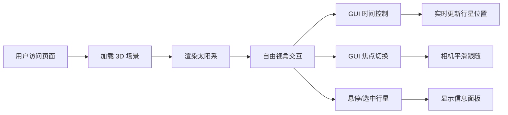

## 1. 产品概述

三维太阳系模拟可视化工具，面向天文学爱好者和教育工作者，提供直观的行星公转、自转、相对大小和轨道倾角交互式探索体验。用户可通过时间加速观察行星运动规律，悬停或选中行星获取详细天文数据。

- 目标用户：天文学爱好者、学生、教师
- 核心价值：以沉浸式 3D 方式直观理解太阳系结构与运动

## 2. 核心功能

### 2.1 用户角色
无需注册，所有用户拥有完整功能权限。

### 2.2 功能模块
1. **三维场景渲染**：太阳、八大行星、轨道线、星空背景、太阳光晕粒子
2. **视角控制**：OrbitControls 鼠标旋转、滚轮缩放、相机自动跟随行星
3. **时间控制**：时间倍率调节（0.1x-100x）、暂停/恢复、高速轨道颜色警告
4. **行星信息面板**：悬停/选中显示行星详细参数（公转周期、自转周期、距离、温度）
5. **响应式界面**：桌面端右侧控制面板，移动端底部抽屉

### 2.3 功能详情
| 功能模块 | 子功能 | 详细描述 |
|---------|--------|---------|
| 三维场景渲染 | 太阳渲染 | 自发光材质 #FDB813，半径 5，300 颗粒子光晕环 |
| 三维场景渲染 | 行星渲染 | 八大行星按比例（水星 0.3 ~ 木星 2.5），真实颜色，自转轴倾斜 |
| 三维场景渲染 | 轨道线 | 白色半透明环线（透明度 0.2），>50x 时渐变为橙红警告色 |
| 三维场景渲染 | 星空背景 | 10000 随机星点，颜色白色，大小 0.1-0.5 |
| 视角控制 | 自由视角 | 鼠标拖拽旋转，滚轮缩放（距离 1-200） |
| 视角控制 | 焦点跟随 | 选择行星后相机 0.5s 平滑过渡跟随 |
| 时间控制 | 倍率调节 | 滑条 0.1x-100x，对数刻度，0.3s ease-out 过渡 |
| 时间控制 | 暂停/恢复 | 按钮切换，状态图标反馈 |
| 行星信息 | 悬停显示 | CSS2DRenderer 右上角面板，显示名称/周期/距离/温度 |
| 行星信息 | 选中锁定 | 点击行星后信息面板常驻 |

## 3. 核心流程

用户打开页面 → 场景自动加载（太阳、行星、星空背景）→ 默认自由视角 →
鼠标拖拽旋转 / 滚轮缩放 → GUI 面板调节时间倍率或切换焦点 →
悬停/点击行星查看信息 → 响应式适配窗口尺寸

## 4. 用户界面设计

### 4.1 设计风格
- 主题：深空赛博朋克
- 主色：`#1A1A2E`（深空深蓝）、`#00D4FF`（赛博青）
- 点缀色：`#FDB813`（太阳金）、`#FF7043`（高速警告橙红）
- 字体：`monospace`（等宽赛博朋克风格）
- UI 容器：半透明深色（`#1A1A2E` 85% 透明度），圆角 8px
- 过渡动画：所有交互 0.3s ease-out 缓动

### 4.2 页面设计概述
| 区域 | 模块 | UI 元素 |
|------|------|---------|
| 全屏 | 3D 场景画布 | Three.js WebGL 渲染，深空星空背景 |
| 右上角 | 信息面板 | CSS2DRenderer 覆盖层，标题 + 参数列表 |
| 右侧（桌面） | GUI 控制面板 | dat.gui 面板：时间倍率滑条、暂停按钮、焦点下拉 |
| 底部（移动） | 抽屉面板 | 可展开/收起的控制抽屉 |

### 4.3 响应式设计
- Desktop-first：窗口宽度 ≥ 768px，GUI 面板固定右侧
- Mobile：< 768px，GUI 折叠为底部可展开抽屉
- 触控设备：支持双指缩放、单指拖拽旋转

### 4.4 3D 场景设计
- 环境：纯黑背景 + 10000 星点粒子，模拟深空
- 光照：点光源（太阳位置）+ 环境光（微弱补光）
- 相机：PerspectiveCamera，初始距离 80，fov 60°
- 合成：太阳自发光 + 光晕粒子环（#FFE082 → #FF7043 → 透明渐变）
- 性能预算：顶点 < 20 万，每帧 CPU < 15ms，帧率 ≥ 45fps
