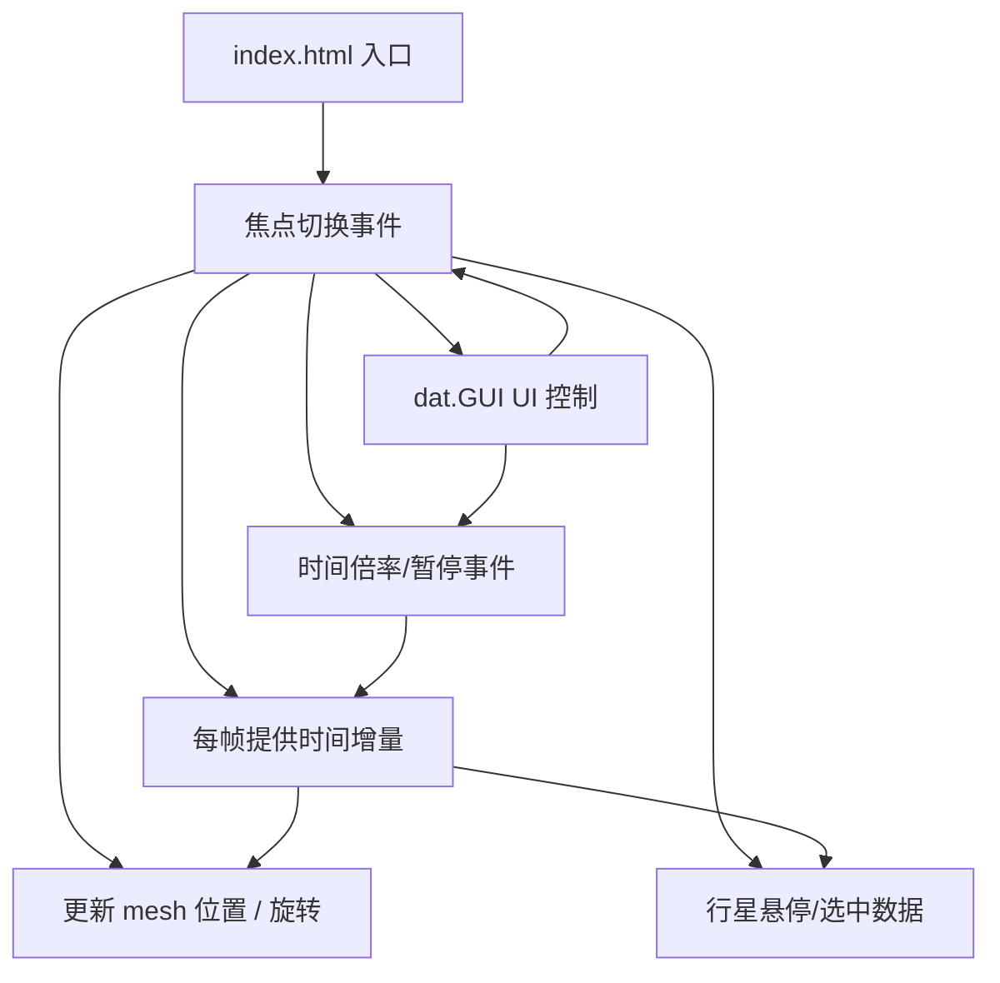

## 1. 架构设计



数据流向：
1. GUI 事件 → timeKeeper 更新时间倍率 → 每帧返回 deltaTime
2. deltaTime → planet.update() 计算公转角度 → 更新 position
3. 射线检测 → 命中行星 → CSS2DRenderer 渲染信息面板
4. GUI 焦点切换 → 相机 lerp 平滑过渡到目标行星

## 2. 技术描述

- 前端框架：**TypeScript 5** + **Vite 5**（原生 Three.js，无需 React/Vue）
- 3D 引擎：**three** @ ^0.160.0 + **@types/three**
- UI 控制：**dat.gui** @ ^0.7.9 + **@types/dat.gui**
- 标签渲染：Three.js 内置 `CSS2DRenderer`
- 构建工具：Vite（严格模式，入口 index.html）
- 包管理：npm

## 3. 文件结构

| 文件路径 | 职责 |
|---------|------|
| `package.json` | 依赖声明、启动脚本 `npm run dev` |
| `vite.config.js` | Vite 构建配置，严格模式，入口 index.html |
| `tsconfig.json` | TypeScript 严格模式配置 |
| `index.html` | HTML 入口：#app 渲染容器、#ui 叠加层 |
| `src/main.ts` | 场景初始化入口，协调所有模块 |
| `src/planet.ts` | Planet 类：属性、公转/自转动画、轨道线 |
| `src/timeKeeper.ts` | TimeKeeper 单例：时间倍率、暂停、帧时间计算 |
| `src/style.css` | 全局样式：深空主题、UI 面板、响应式 |

## 4. 核心数据模型

### 4.1 行星数据结构
```typescript
interface PlanetData {
  name: string;
  nameCN: string;
  radius: number;           // 行星半径（相对单位）
  color: number;            // 表面颜色十六进制
  orbitRadius: number;      // 公转轨道半径
  orbitPeriod: number;      // 公转周期（地球日）
  rotationPeriod: number;   // 自转周期（小时）
  axialTilt: number;        // 自转轴倾角（度）
  distanceAU: number;       // 与太阳距离（天文单位）
  tempRange: [number, number]; // 表面温度范围（°C）
  hasRing?: boolean;        // 是否有环（土星）
}
```

### 4.2 TimeKeeper 单例
```typescript
class TimeKeeper {
  speed: number;           // 时间倍率 0.1 ~ 100
  paused: boolean;
  getTime(): number;       // 返回累计虚拟时间
  getDelta(): number;      // 返回上一帧虚拟时间增量
  setSpeed(v: number): void;
  togglePause(): void;
}
```

### 4.3 Planet 类
```typescript
class Planet {
  mesh: THREE.Mesh;
  orbitLine: THREE.Line;
  pivot: THREE.Group;       // 承载自转轴倾角
  update(virtualTime: number): void;
}
```

## 5. 性能优化策略

- **轨道线几何复用**：所有轨道共享 CircleGeometry 实例，仅缩放 matrix
- **星点粒子批处理**：单个 Points + BufferGeometry 承载 10000 星点
- **光晕粒子**：单个 Points 300 粒子，环形分布，ShaderMaterial 渐变
- **每帧计算优化**：仅更新 position/rotation，避免重建几何
- **Raycaster 节流**：鼠标移动时每 100ms 检测一次，避免频繁计算
- **CSS2DRenderer 按需更新**：仅悬停/选中目标变化时重绘标签
