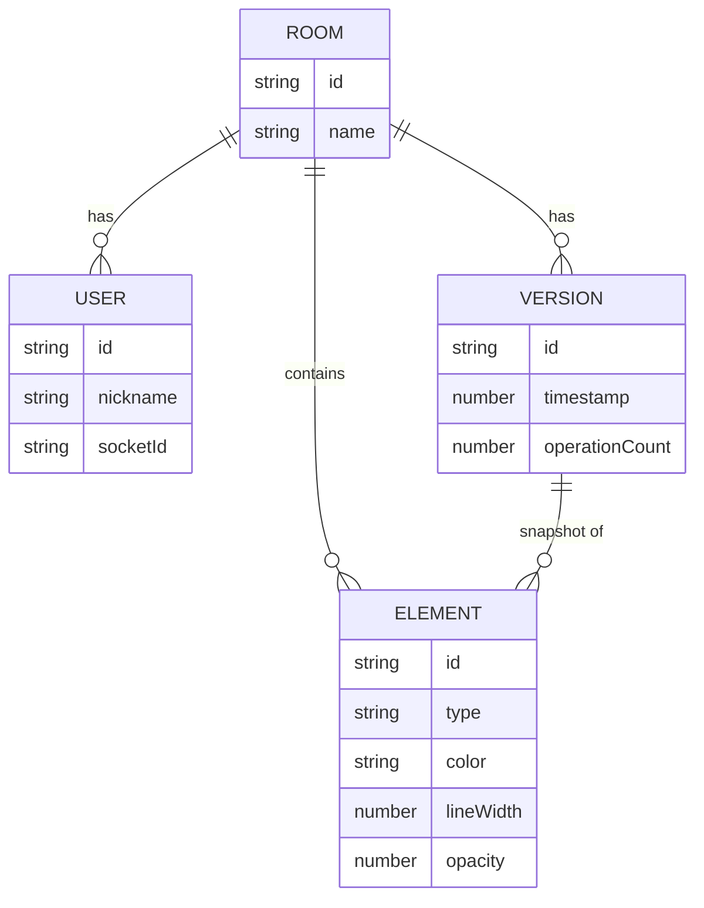

## 1. 架构设计

```mermaid
flowchart TD
    "Frontend [React + TS + Vite]" --> "Canvas Layer [绘图渲染]"
    "Frontend [React + TS + Vite]" --> "Drawing Engine [图形/选择/缩放]"
    "Frontend [React + TS + Vite]" --> "Collaboration Client [Socket.IO]"
    "Collaboration Client [Socket.IO]" <-->|"WebSocket"| "Backend [Express + Socket.IO]"
    "Backend [Express + Socket.IO]" --> "Room Manager [房间/用户管理]"
    "Backend [Express + Socket.IO]" --> "OT Engine [操作转换]"
    "Backend [Express + Socket.IO]" --> "Version Manager [快照存储]"
    "Version Manager [快照存储]" --> "In-Memory Store [内存存储]"
```

## 2. 技术说明
- 前端：React 18 + TypeScript + Vite
- 后端：Express 4 + Socket.IO
- 实时通信：Socket.IO（WebSocket + 长轮询降级）
- 操作转换：自定义OT引擎处理并发操作
- 版本存储：内存存储（最多保留50个版本快照）
- 构建工具：Vite，代理 /api 和 /socket.io 到后端

## 3. 路由定义
| 路由 | 用途 |
|------|------|
| / | 主页面（房间入口 + 白板） |
| /api/rooms/:roomId/versions | 获取房间版本列表 |
| /api/rooms/:roomId/versions/:versionId | 获取指定版本快照 |
| /socket.io | Socket.IO 端点 |

## 4. API 与 Socket 事件定义

### Socket 事件
| 事件名 | 方向 | 数据类型 | 说明 |
|--------|------|----------|------|
| join-room | Client→Server | { roomId, nickname } | 加入房间 |
| room-state | Server→Client | { users, elements, version } | 房间当前状态 |
| user-joined | Server→Client | { userId, nickname } | 用户加入通知 |
| user-left | Server→Client | { userId } | 用户离开通知 |
| draw-operation | Client→Server | Operation | 发送绘图操作 |
| remote-operation | Server→Client | Operation | 广播远程操作 |
| get-versions | Client→Server | { roomId } | 请求版本列表 |
| versions-list | Server→Client | Version[] | 返回版本列表 |
| restore-version | Client→Server | { roomId, versionId } | 恢复到指定版本 |
| version-restored | Server→Client | { elements, version } | 版本恢复成功 |

### 类型定义
```typescript
type ToolType = 'pen' | 'rect' | 'circle' | 'text' | 'eraser' | 'select';

interface Point {
  x: number;
  y: number;
}

interface BaseElement {
  id: string;
  type: 'pen' | 'rect' | 'circle' | 'text';
  color: string;
  lineWidth: number;
  opacity: number;
  createdAt: number;
}

interface PenElement extends BaseElement {
  type: 'pen';
  points: Point[];
}

interface RectElement extends BaseElement {
  type: 'rect';
  x: number;
  y: number;
  width: number;
  height: number;
}

interface CircleElement extends BaseElement {
  type: 'circle';
  cx: number;
  cy: number;
  r: number;
}

interface TextElement extends BaseElement {
  type: 'text';
  x: number;
  y: number;
  text: string;
  fontSize: number;
}

type DrawElement = PenElement | RectElement | CircleElement | TextElement;

type OperationType = 'add' | 'modify' | 'delete' | 'move';

interface Operation {
  id: string;
  type: OperationType;
  userId: string;
  timestamp: number;
  element?: DrawElement;
  elementId?: string;
  modifications?: Partial<DrawElement>;
}

interface Version {
  id: string;
  timestamp: number;
  elements: DrawElement[];
  operationCount: number;
}

interface RoomUser {
  id: string;
  nickname: string;
  socketId: string;
}
```

## 5. 服务器架构图

```mermaid
flowchart TD
    "Socket.IO Handler" --> "RoomManager"
    "Socket.IO Handler" --> "OTEngine"
    "Socket.IO Handler" --> "VersionManager"
    "RoomManager" --> "rooms: Map<string, RoomState>"
    "OTEngine" --> "transform(op1, op2)"
    "VersionManager" --> "versions: Map<string, Version[]>"
    "VersionManager" --> "30s Snapshot Timer"
```

## 6. 数据模型

### 6.1 数据模型定义



### 6.2 内存数据结构
```typescript
interface RoomState {
  id: string;
  users: RoomUser[];
  elements: DrawElement[];
  versions: Version[];
  lastSnapshotTime: number;
  operationCountSinceSnapshot: number;
}
```
