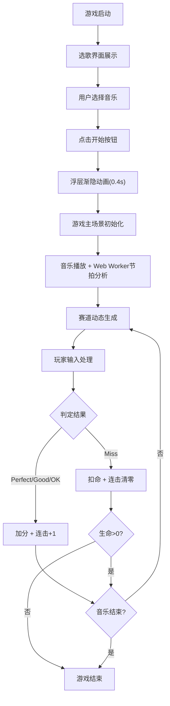

## 1. 产品概述
赛博朋克风格的节奏跑酷游戏，玩家控制发光小球在音乐节拍生成的动态赛道上奔跑，通过精准按键踩中节拍点获取分数，同时躲避障碍物收集奖励。
- 核心目标：融合音游精准判定与跑酷玩法，提供沉浸式节奏感游戏体验
- 目标用户：音乐游戏爱好者、休闲玩家

## 2. 核心功能

### 2.1 功能模块
1. **选歌界面**：音乐列表展示、难度标识、开始游戏入口
2. **游戏主场景**：动态赛道生成、节拍平台、障碍物系统、金币收集
3. **玩家控制系统**：节拍踩点判定、跳跃躲避、角色动画反馈
4. **HUD信息系统**：得分显示、连击计数、生命值管理
5. **音频引擎**：音乐播放、节拍点提取、能量分析、Web Worker异步处理

### 2.2 页面详情
| 页面名称 | 模块名称 | 功能描述 |
|---------|---------|---------|
| 选歌界面 | 音乐列表 | 展示3首预设音乐（曲名、时长、难度星级），选中高亮 |
| 选歌界面 | 开始按钮 | 触发游戏启动，浮层渐隐过渡动画 |
| 游戏主场景 | 动态赛道 | 六边形网格赛道，颜色随节拍能量动态变化 |
| 游戏主场景 | 节拍平台 | 金色半透明平台，需在节拍点精准踩中 |
| 游戏主场景 | 障碍物系统 | 红色尖刺方块，需跳跃躲避 |
| 游戏主场景 | 奖励系统 | 金色星星收集，额外加分 |
| 游戏主场景 | 判定系统 | Perfect/Good/OK/Miss四档判定，计分与扣命 |
| HUD信息层 | 得分显示 | 实时分数展示 |
| HUD信息层 | 连击计数 | 连击>10时闪烁动画 |
| HUD信息层 | 生命值 | 3颗红心，失去时渐变灰色 |

## 3. 核心流程
用户进入游戏 → 选歌界面展示音乐列表 → 用户选择音乐并点击开始 → 浮层渐隐消失 → 游戏主场景启动，音乐播放 → 赛道自动延伸，节拍平台生成 → 玩家按空格键踩节拍、按↑键跳跃躲避 → 实时显示得分、连击、生命值 → 生命值耗尽或音乐结束 → 游戏结束

## 4. 用户界面设计

### 4.1 设计风格
- 主色调：#0F0C29（深紫黑）、#302B63（深蓝紫）
- 辅助色：#FF6B6B（珊瑚红）、#00F5FF（霓虹青）、#FFD700（金色）
- 字体：Consolas（数字显示）、系统默认（UI文本）
- 圆角规范：4px-24px，按钮圆角24px
- 过渡动画：0.2s-0.4s缓动过渡
- 整体风格：深色赛博朋克，霓虹发光效果，动态渐变背景

### 4.2 页面设计概述
| 页面名称 | 模块名称 | UI元素 |
|---------|---------|-------|
| 选歌界面 | 浮层背景 | #1A1A2E深色半透明，透明度0.85 |
| 选歌界面 | 音乐项 | 高40px，选中边框#FF6B6B高亮，滑动切换动画0.3s |
| 选歌界面 | 开始按钮 | 宽160px高48px，背景#FF6B6B，圆角24px，hover亮度+10%，白色16px文字 |
| 游戏主场景 | 背景 | 深蓝紫渐变#0F0C29到#302B63 |
| 游戏主场景 | 赛道 | 居中80%宽度，六边形网格，颜色随能量#4B3B47→#FF6B6B过渡0.2s |
| 游戏主场景 | 节拍平台 | 金色半透明，宽40px高20px，圆角4px |
| 游戏主场景 | 玩家角色 | 发光小球半径12px，#00F5FF，外发光20px透明度0.6 |
| 游戏主场景 | 障碍物 | 红色尖刺20×20px，#FF3366，旋转±10°循环0.3s |
| 游戏主场景 | 奖励星星 | 金色直径12px，向上飘散速度2px/帧 |
| HUD信息层 | 顶部条 | 高40px半透明黑色，透明度0.5 |
| HUD信息层 | 得分 | 白色20px Consolas字体 |
| HUD信息层 | 连击 | 绿色#00FF88，>10时0.5s闪烁 |
| HUD信息层 | 生命 | 红心18×16px，失去时渐变灰色 |

### 4.3 响应式设计
- Canvas自适应窗口宽度，保持16:9比例
- 最小宽度800px，低于此宽度出现横向滚动
- 触摸设备支持：点击屏幕替代空格键踩节拍

### 4.4 特效动画
- 完美判定：画面底部淡蓝色闪光，透明度0.2，持续0.15s
- 玩家落地：缩放0.8 + 圆形波纹，半径30px，透明度0.3→0，持续0.2s
- 完美踩中：小球白色闪光，持续0.1s
- 浮层过渡：渐隐消失，过渡0.4s
